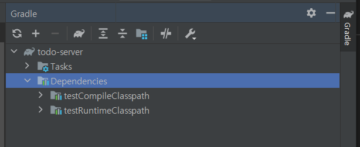
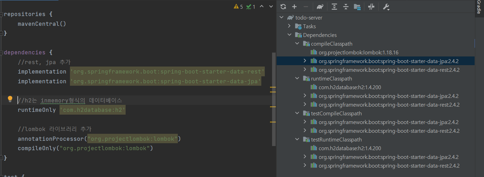
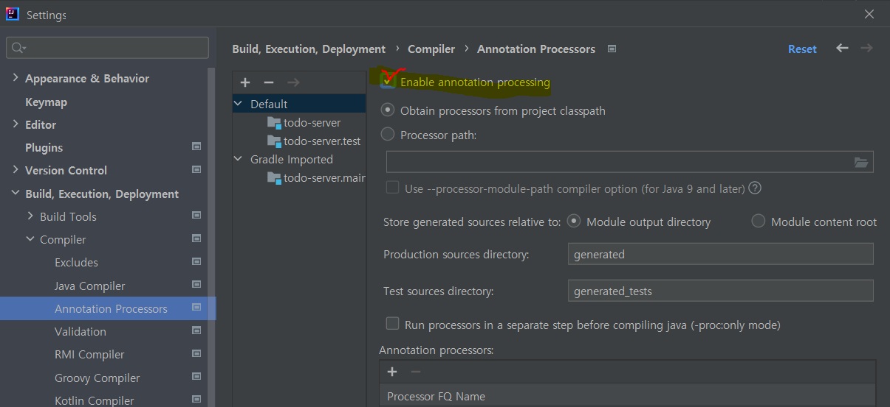
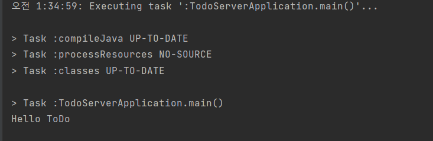

# Spring-Boot
[패스트캠퍼스] JAVA,Spring 올인원 강의 요약

#IntelliJ 강의 
<br>

# 인텔리제이 설치하기

cf) Mac과 Windows 버전의 설치, 단축키가 상이하지만 이번 정리에서는 Windows의 설치와 단축키를 다룬다.
<br><br>

## 목차

- <a href="#install"> 설치</a>
- <a href="#key">단축키 가이드 </a>
- <a href="#todolist">ToDoList API 구성</a>
  
  <br/><br/>


# <div id="install">IntelliJ 설치하기</div>
## 통합개발환경(IDE)를 써야 하는 이유

- 메모장만과 cmd를 통해서 java 프로그램을 작성하고 실행할 수 있다.
- 클래스 파일 관리, 코드 작성에 효율성을 높이기 위해 IDE를 사용

-종류 
Eclipse , Visual Studio Code, IntelliJ <br/><br/>

IntelliJ의 장점 : 다양한 단축키 제공, 디버깅 편리, 개발자 친화적인 자동완성 등 , 형상관리도구 GIT과 기능연동 편리

회사마다 사용하는 IDE가 다양하므로 JAVA의 대표적인 인텔리제이와 이클립스 모두 알아두자!
<br/><br/><br/>


<a href="https://www.jetbrains.com/idea/"> Install - IntelliJ </a> 인텔리제이 사이트 (설치) -> 운영체제 선택, 버전 선택
- Ultimate 버전 : 유료 버전, 더 다양한 기능 제공 (웹 및 엔터프라이즈 개발용)
- Commmunity 버전 : 무료 버전, 오픈 소스 (JVM 및 Android 개발용)


설치 참고 ) https://goddaehee.tistory.com/195?category=395441

<br>

# <div id="key">IntelliJ 단축키</div>
단축키 활용에 따라 생산성에 차이가 나고, <br>
자주 쓰이는 일부 단축키를 알고 있으면 훨씬 편하게 코딩이 가능합니다.
<br>


- 프로젝트 창 포커스 : Alt + 1
    - editor 창 등 다른 창에서 project 창( Eclpise : Package Exploer ) 으로 포커스를 옮기는 방법
    - 다시 Alt + 1을 누르게 되면 editor 창으로 돌아올 수 있다.
    - 프로젝트 창에 포커스가 있는 상태라면 방향키로 위 아래 이동이 가능합니다.
- 에디터 창으로 돌아오기 : ESC
  - Alt + 1 을 누르면 다시 포커스가 이동하지만 project 창을 그대로 켜둔 채로 넘어오고 싶을 때 사용
- 프로젝트 창 미리보기 : space
  - 클래스 파일에 포커스가 위차한 상태에서 그 파일을 editor 창으로 열기 전에 파일을 미리볼 수 있는 방법
  - 이 창을 나가기 위해서 ESC를 누른다.
- 에디터 창 키우기 : ctrl + shift + F12
  - 다양한 창을 열고 사용하게 된다면 에디터 창이 작아지게 된다. 이 단축키를 사용하면 에디터 창을 제외한 창들이 최소화 된다
  - 다시 이 단축키를 사용하면 최소화된 창이 다시 화면에 보여진다.
- 에디터 창 이동 : ctrl + tab
  - 에디터 창에서 다양한 파일이 열려 있을 때 현재 파일에서 다른 에디터 창으로 이동하는 방법
  - ctrl 키는 누른 상태로 유지 tab으로 이동 -> 원하는 파일에 위차할때 ctrl 키에서 손을 뗀다.
- 새 파일 생성 (2가지)
  - editor 창 - ctrl + alt +Insert (에디터 창에서 현재 위치에 새 파일 생성)
  - project 창 - alt+ Insert (프로젝트 창에서 원하는 위치에 파일을 생성)
- 커서 이동  
  - Ctrl+ 방향키 : 방향키만 사용하여 이동시 한글자씩 이동, ctrl과 함께 방향키 로 이동하면 단어 단위로 이동
  - Home , end : 라인 시작/끝 이동
  - page up , page down : 페이지 위/아래
- 드래그 선택 영역 확장 / 축소 : ctrl + W , ctrl + shift + W
- 주석 처리 
  -  한 줄 주석 : ctrl + /  (드래그 후 사용시 드래그 영역만큼 주석처리 된다.)
  -  블록 주석 : ctrl + shift + / 
  -  다시 단축키 사용시 주석 해제
- 인덴트 (들여쓰기) : tab 
- 인덴트 취소 : Shift + tab
- 자동 인덴트 : 원하는 영역( 전체 선택시 Ctrl + a )만큼 선택 -> ctrl + alt + I 
- 사용처 찾기 (현재 코드가 사용되는 위치 찾기) : alt + F7 (상세한 내용, 미리보기 제공)
- 사용처 찾기 (빠른 찾기) : ctrl + B (ctrl 클릭해도 이동 가능 -> 코드 타고 들어가기 유용)
- 파일 검색 : ctrl + F
- 파일 검색 후 찾은 결과로 이동 : F3 , shift + F3
- 모든 경로의 파일에서 (다른 패키지, 열지 않은 프로젝트 내 파일들에서도) 검색 : ctrl + shift + F
- IntelliJ 모든 범위내에서 검색 (파일 뿐만 아니라 IntelliJ가 포함하는 모든 기능도 함께 검색) : shift 2번
- 최근 파일 열기 : ctrl + E


<br/><br><br>
2편
- Live templete 도움말 : ctrl + J 
  - main() : psvm
  - System.out.println() : sout
- 퀵픽스 (import error 등 에러 발생상황에서 해당 에러를 고칠 수 있는 다양한 방법들을 보여준다.): alt + enter
- 코드 이슈 별로 이동(여러군데 에러가 발생했을 때 다음에러로 건너뛰기) : F2(다음) , Shift + F2 (이전)
- Import 최적화 (필요없는 Import 제거) : ctrl + alt + O
- 코드 생성(ex-getter,setter) : alt + Ins
- 메소드 자동 완성
  - override : ctrl + o
  - implement : ctrl + I
- IntelliJ에서 제공하는 터미널창 오픈 : alt + F12
- 구문 완성 : shift + ctrl + enter
- 키워드 대체하기 
  - 파일 내 대체 : ctrl + R (replace 클릭시 하나만 대체, replace All 클릭시 전체가 대체됨)
  - 경로(전체 패키지) 내 대체 : ctrl + shift + R
- Run anything (실행) : ctrl 두번
  - 에디터 창 실행 (현재 위치 - 메소드) : ctrl + shift + F10
  - 저장된 가장 최근에 실행된 메소드에서 실행 : shift + F10
- 종료 : ctrl + F2
- 라인 수정
  - 라인 복사 : ctrl + D
  - 라인 삭제 : ctrl + y
- 파라미터 정보 보기 (type): ctrl + P
- Quick Difinition (선언부 미리보기) : ctrl + shift + I
- Quick Document (어떤 메소드인지 설명 보기) : ctrl + Q

- Java Doc : 자바에서 Api문서를 주석으로 설명하는 것 
  -  메소드 위 /** + enter : 자동으로 java Doc 문서 양식이 관례에 맞춰 생성됨
- 기능(action) 찾기 (replace, serch 등등 제공) : shift + ctrl + A
- help의 KeyMap reference에서 IntelliJ 주요 단축키 일부를 확인할 수 있다.

<br><br>

# <div id="todolist"> ToDoList API 구성 실습 </div>

기능 요구사항
<ol>
    <li> TodoList 목록에 아이템을 추가  </li>
    <li> TodoList 목록 중 특정 아이템 조회  </li>
    <li> TodoList 전체 목록 조회 </li>
    <li> TodoList 목록 중 특정 아이템을 수정  </li>
    <li> TodoList 목록 중 특정 아이템을 삭제 </li>
    <li> TodoList 전체 목록을 삭제 </li>
</ol>

<br><br>

Memo. 프론트엔드와 백엔드의 협업
- TIP1 . api 스펙에 method(POST,GET,Patch 등), Request, Respose 등 협업에 필요한 내용을 기술하여 이를 바탕으로 구현
- TIP2 . 필요한 요구사항을 각자 나누어 할당!

<br><br>

### Chapter1 . 환경설정 및 프로젝트 생성

- IntelliJ -> New project -> 다양한 옵션들 중 Gradle을 사용하겠다!
  - cf) Gradle 과 Maven 은 프로젝트 Bulid 관리 Tool이다.
  - 사용하는 목적은 비슷하지만 사용성, 성능에 차이가 있다.
  - Gradle이 Maven보다 나중에 등장하며 Maven의 단점을 보완했다.
  - Gradle을 사용하지 못하는 환경
- 생성된 폴더중 build.gradle은 build에 필요한 옵션들을 정의해준다.
- gradle view에서 Dependecise 통해 추가된 의존성을 볼 수 있다. 
  - 프로젝트 생성 후 기본으로 추가되어 있는 jupiter 관련 의존성을 확인할 수 있다.
  - 
- plugin에 spring boot와 spring dependency를 사용하기 위한 코드를 추가한다.
  - cf) MVNrepository : https://mvnrepository.com/artifact/org.springframework.boot/spring-boot-starter-web/2.4.3

- dependencies에 필요한 의존성 라이브러리를 추가한다.
     - 
     - Project 창의 External Libraries를 통해 추가된 라이브러리를 확인할 수 있고 클래스 구현부 확인도 가능하다.
     - lombok 라이브러리는 의존성 추가 후 바로 사용이 불가능하고 IntelliJ에 추가적인 설정이 필요하다.
       - lommbok plugin 설치 
       - cf)Eclipse의 preference는 IntelliJ에서 settings이다. (File-> settings : 단축키 - ctrl + alt+ s)
        1. preference의 plugin 선택 or shift 2번 단축키 -> plugin 검색)
        2. plugins에서 lombok 검색 후 설치
        3. IntelliJ 껐다 키기.
        4. Settings->Build,Execution, Deployment -> Compiler -> Annotation Processors enable annotation processing 체크하기 


<br><br>
- 첫 패키지, 클래스 생성하기
```java
package org.example;

public class TodoServerApplication {
    public static void main(String[] args) {
        System.out.println("Hello ToDo");
    }
}

```
<br>

- 결과 <br>

 
