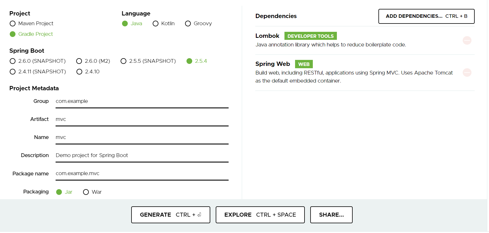
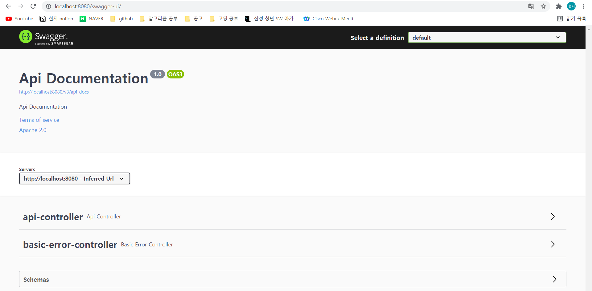
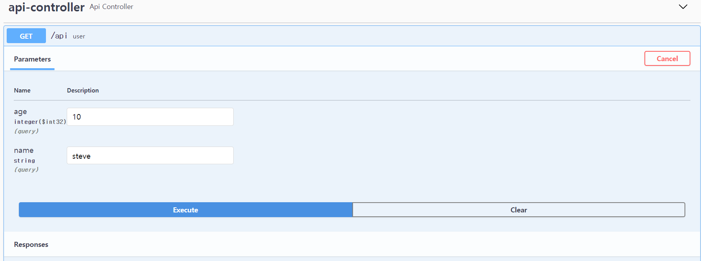
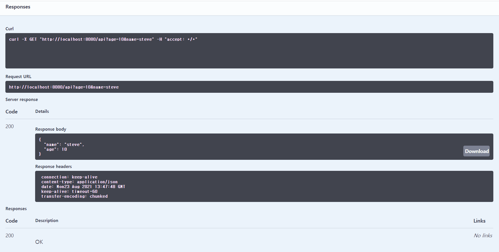

# 개발환경 설치

이번 공부에서 사용할 개발환경과 스펙에 대해 간단히 기술해보겠습니다.
- OS : Windows
- IDE : IntelliJ (Community 버전)
  - 문제 : IntelliJ의 Ultimate 버전 사용 시 다양한 기능, plugin이 추가 제공되는데 이전에 설치한 Community버전을 사용할 때 Ultimate버전에서만 사용되는 Spring Initialiazer를 사용할 수 없다
    - 자세한 내용은 intelliJ 확인 요망 
  - 우선 Gradle을 이용하여 프로젝트를 만들고 Spring Boot 관련 plugin을 설치하는 방법으로 개선한다.
    - https://start.spring.io/ 웹사이트에 접속하여 필요한 옵션에 맞춰서 Spring 프로젝트를 생성할 수 있다.
    - 
    - generate 클릭시 zip 압축파일이 다운로드 된다. 
    - explore를 통해 미리 설치될 환경을 볼 수 있다.( 이 내용을 copy해서 사용할 수 있다.)
    - share로 공유해서 사용도 가능하다.
    - 해당 파일을 원하는 폴더에 위치시킨 후 IntelliJ를 통해 open할 수 있다.
  - cf > Ultimate 버전에서는 기본 main 메소드 또한 지정한 옵션에 맞춰 자동 생성하여 프로젝트가 실행된다.
- JDK : Jdk ver14.0.2 (강의는 11버전 - 타입 추론을 위해 / 이미 14버전이 설치되어 있으며 강의를 따라가는데 문제가 없으므로 기존 jdk ver.14를 사용)
- 설치가 잘 완료되었는지 확인
  - maven repository - springfox boot starter (gradle) 의존성 추가
  - 참고 : https://mvnrepository.com/artifact/io.springfox/springfox-boot-starter/3.0.0
  - 확인을 위한 controller , dto 생성
  - http://localhost:8080/swagger-ui/ (반드시 / 를 해야한다.) 를 통해 요청과 응답이 정상인지 확인
  - 
  - 만들어진 api controller를 통해 나이, 이름을 입력하여 Execute 클릭
  - 
  - -> 정상실행시 response 응답
  - 
