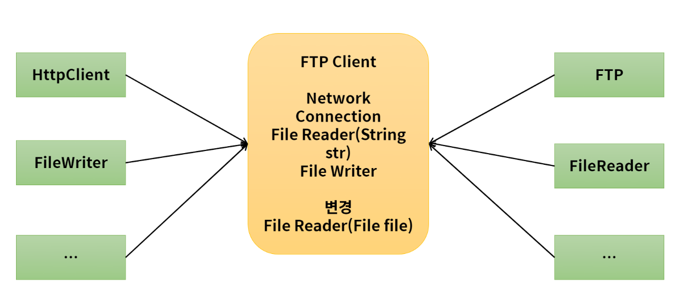
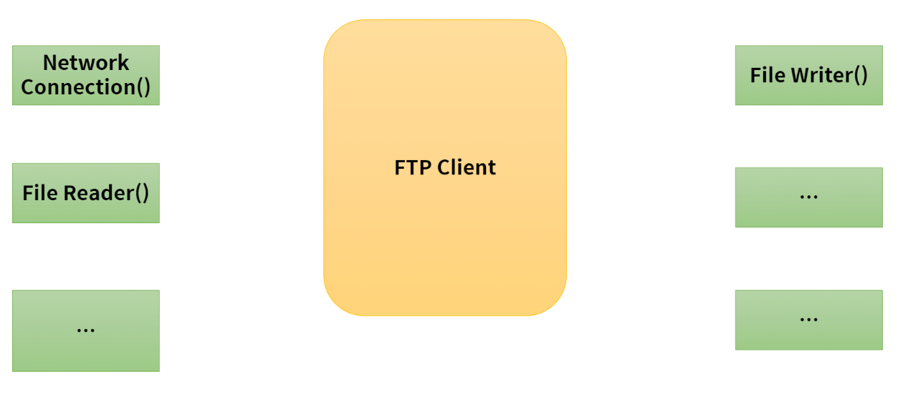
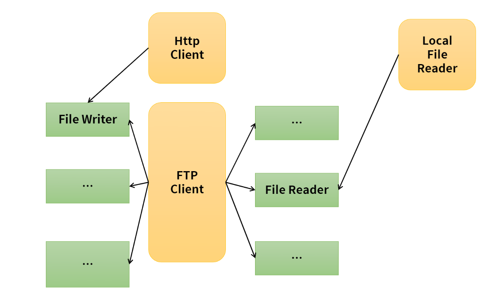
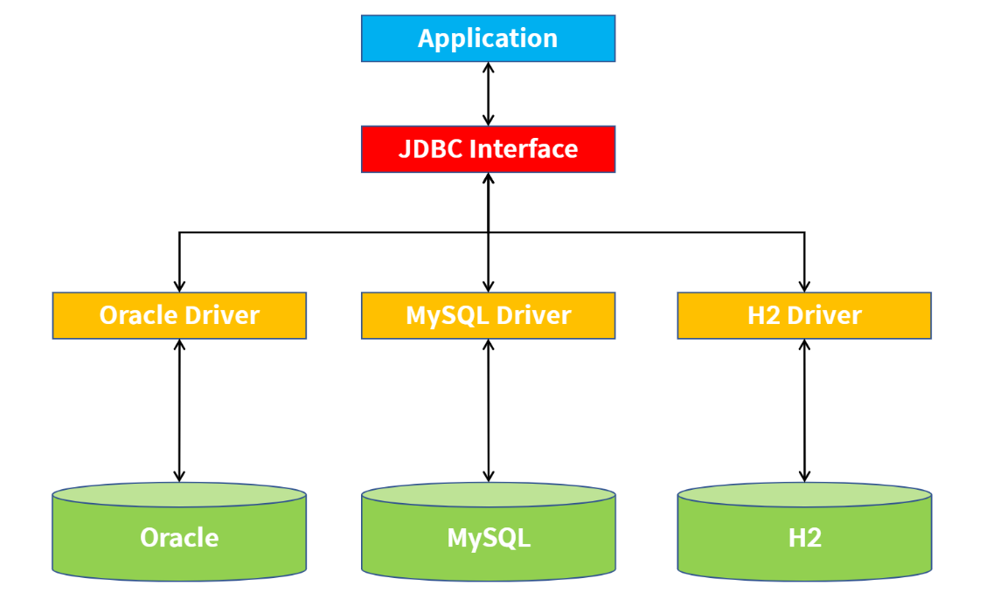
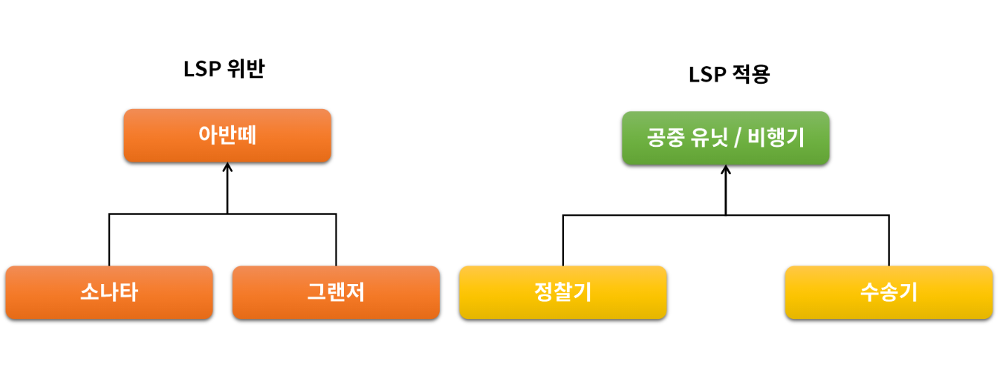
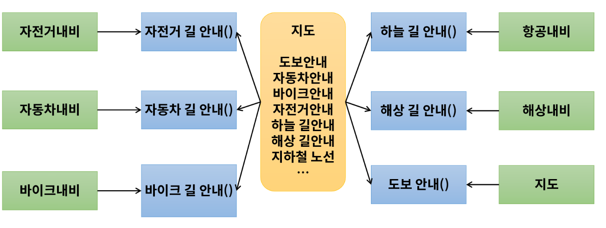
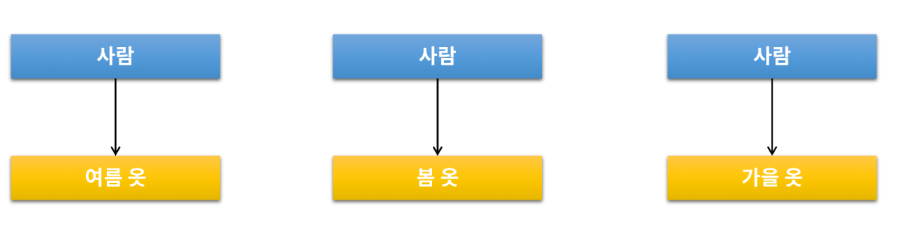
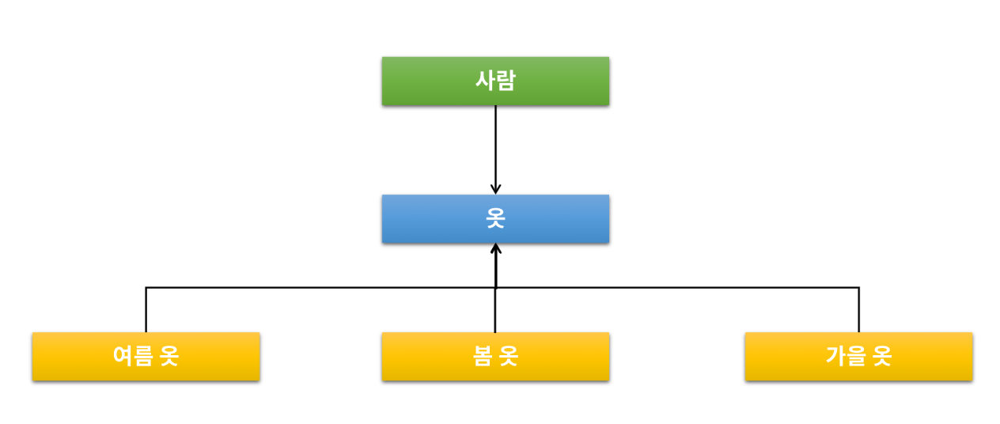

# 객체지향 설계 5원칙 <SOLID>

### 응집도와 결합도
좋은 SW 설계를 위해서는 결합도(coupling)는 낮추고 응집도(cohesion)는 높여야 한다.

- 결합도 : 모듈간의  상호 의존 정도를 나타내는 지표
- 응집도 : 하나의 모듈 내부에 존재하는 구성 요소들의 기능적 독립성

  

## SRP(Single Respinsivillity Principle) : 단일 책임 원칙
어떠한 클래스를 변경해야 하는 이유는 한가지 뿐이여야 한다.

위 그림처럼 FTP Client 클래스가 다양한 기능을 가지고 있을 때 외부에서 다양한 클래스가 각 기능을 참조하고 있을 때 File Reader(String str)의 파일을 읽는 기능이 File Reader(File file)의 파일을 읽는 형태로 변경되어야 한다면 FTP Client와 FileReader 클래스를 모두 수정해주어야 정상적으로 동작하게 됩니다.  

->  단일 책임의 원칙에 따라 FTP Client의 다양한 기능을 기능적으로 분리합니다 (응집도 향상)

-> 그림과 같이 Local File Reader를 만든다고 할때 기존에 파일ㅇ르 읽는 기능을 하고 있는 File Reader는 단일의 책임을 가지고 있기 때문에 파일에서 읽어오는 응집도가 높은 기능만 가지고 있고 이 기능을 Local File Reader에서 상속받아 사용할 수 있고 기존의 FTP Client의 변경이 필요없는 유지보수 향상의 효과를 볼 수 있습니다.
  
**즉, 다른 모듈이 추가되더라도 응집도가 높은 자신의 기능에 대해서 충실하게 실행하는 모듈은 재사용에도 유리하고 결합도도 낮추는 효과를 볼 수 있습니다.**

  

## OCP(Open Closed Principle) : 개방 폐쇄 원칙
자신의 확장에는 열려 있고, 주변의 변화에 대해서는 닫혀 있어야 한다. 
- 상위 클래스 또는 인터페이스를 중간에 둠으로써, 자신의 변화에 대해서는 폐쇄적이지만 인터페이스는 외부의 변화에 대해서 확장을 개방해줄 수 있다.
- EX) JDBC , MyBatis , Hibernate , JAVA의 InputStream/OutputStream 등

-> Application 입장에서 외부에 다양한 DB가 있을 수 있다. 
-> 직접 연결을 한다면 DB가 늘어날수록 Application은 추가된 내용에 대한 로직이 추가되어야 한다. 
-> 이를 방지하기 위해서 중간에 JDBC Iterface를 위치시켜 어떠한 DataBase가 추가되는 것에 상관없이 내부적으론 하나의 폐쇄적인 통 로를 두고 바깥쪽으로는 N개의 확장가능한 통로가 있게 한다.

  

## LSP(Liskov Substitution Principle) : 리스코프 치환 원칙
서브 타입은 언제나 자신의 기반(상위) 타입으로 교체할 수 있어야 한다.

- LSP 위반 예 (오른쪽 그림) 
  - 아반떼를 만든 후 기능을 조금 변경시켜 소나타를 만들고, 기능을 조금 추가시켜서 그랜저를 만들었다고 가정한다.
  - 이 관계에서 소나타는 아반떼라고 할 수 없고, 그랜저는 아반떼라고 할 수 없다
  - **즉 서브타입은 자신의 기반 타입으로 교체할 수 없기 때문에 LSP 원칙을 위반한 상황이다.**
- LSP 적용 예 (왼쪽 그림)
  - 정찰기는 공중유닛/비행기가 될 수 있고 수송기는 공중 유닛/비행기가 될 수 있다.
  - **이처럼 언제나 서브 타입(자식 타입)이 기반 타입(부모 타입)으로 교체될 수 있는 상황이 리스코프 치환 원칙을 잘 지킨 것이다**
  
  

## ISP(Interface Segregation Principle) : 인터페이스 분리 원칙
클라이언트는 자신이 사용하지 않는 Method에 의존 관계를 맺으면 안된다. 
-> 프로젝트 요구 사항과 설계에 따라 SRP 혹은 ISP를 선택하여 적용한다.

-> 위 그림에서 지도 객체는 여러 기능을 제공한다. 
-> 자전거내비 클래스를 만들기 위해 지도를 상속받는다면 불필요한 다른 기능을 사용하게 되는 관계가 만들어진다.  
-> 이를 해결하기 위해 인터페이스를 분리한다.  
-> 이를 통해 자전거내비는 지도를 상속받는 자전거길안내 인터페이스를 정의하므로써 자전거 길 안내에 대한 기능만을 갖을 수 있게 된다.

  

## DIP(Dependency Invesion Principle) : 의존 역전 원칙
자신보다 변하기 쉬운 것에 의존하지 말아야 한다.

사람은 옷에 의존한다고 할 때 옷은 여름 옷, 봄 옷, 가을 옷 등 사람보다 변하기 쉽다.

이것을 역전시켜 옷이라는 인터페이스를 사이에 두고 사람이 옷 인터페이스 하나에만 의존을 하고 여름 옷, 봄 옷, 가을 옷이 옷을 의존하게 되는 의존의 역전이 일어난다. 
cf) 이것은 객체지향의 5대 특성에 기반함으로써 개발 폐쇄 원칙과 유사한 부분이다.

