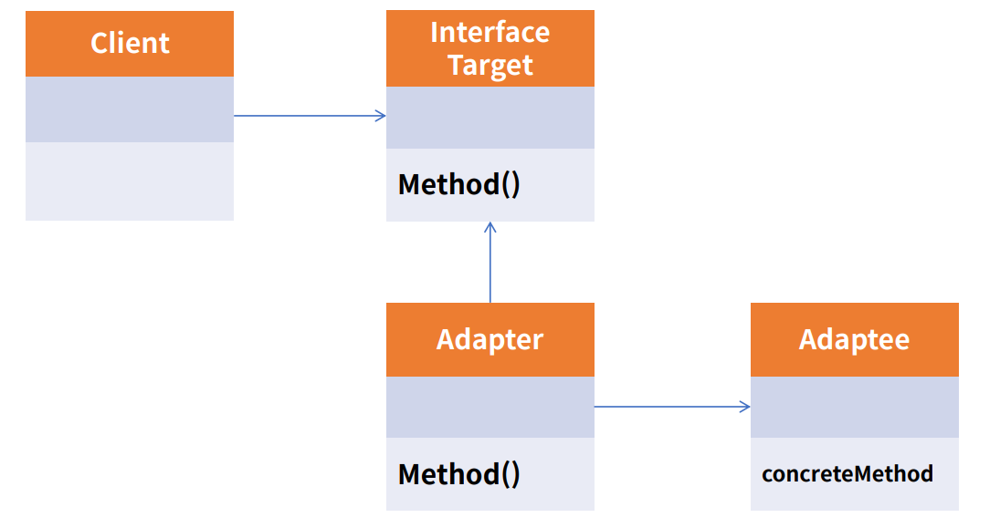
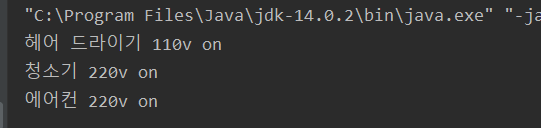

# Adapter pattern

Adapter의 실생활 예로는 변환기를 들수 있다.<br>
호환성이 없는 기존 클래스의 인터페이스를 변환하여 재사용할 수 있도록 한다.<br>
SOLID 원칙 중 개방폐쇄원칙(OCP)를 따른다.<br>




<br>


<br><br>

### 예제 코드
- 110V를 220V로 변경


- main Class 내용
```java
    //콘센트를 담당하는 함수
    public static void connect(Electronic110V electronic110V){
        electronic110V.powerOn();
    }
```
- main method 내용
- 110v HairDryer 연결
```java    
    HairDryer hairDryer =new HairDryer();
    connect(hairDryer);

    Cleaner cleaner=new Cleaner();
````
- 220v Cleaner 연결

```java
   Cleaner cleaner=new Cleaner();
    //connect(cleaner);
    // cleaner는 220v를 사용하는데 110v에 꽂아서 error 발생 
    // -> Adatper를 생성하여 연결
    Electronic110V adapter=new SocketAdapter(cleaner);
    connect(adapter);
```

위 코드처럼 adapter를 통해 중간에 자기자신의 상태는 변환시키지 않고 인터페이스 형태를 맞추는 것을 Adatper 패턴이라고 한다. <br>

인터페이스가 달라 맞춰지지 않을 때 중간에 Adapter class를 통해 연결시키는 것이다.

- 실행 결과


<br>

