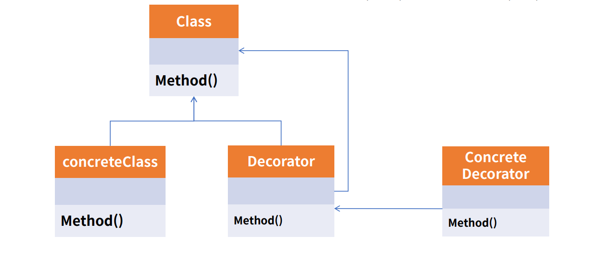
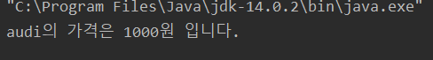
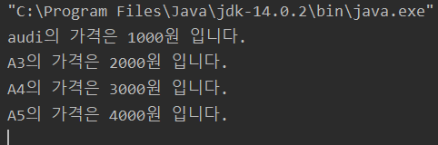

# Decorator pattern

데코레이터 패턴은 기존 뼈대(클래스)는 유지하되, 이후 필요한 형태로 꾸밀 때 사용한다.<br>
확장이 필요한 경우 상속이 대안으로도 활용한다. <br>
SOLID 중 개방폐쇄 원칙(OCP)와 의존 역전 원칙(DIP)를 따른다.<br>


<br><br>


<br>
예시로 에스프레소에 물을 넣으면 아이스아메리카노, 우유를 넣으면 카페라떼가 되는 것처럼!<br>
 빵에 초코를 넣으면 초코빵 딸기를 넣으면 딸기빵처럼! <br>
원본은 유지하되 어떤 것을 첨가하냐에 따라 다른형태로 확장되는 것을 데코레이터 패턴이라고 한다.

<br><br>

### 예제 코드
- 등급이 올라갈 때마다 가격이 올라가도록 설정

<br>

- Main method 부분 Audi 뼈대는 동일하지만 가격을 audi3,4,5 시리즈 별로 가격이 다르게 구현한다.
```java

    ICar audi=new Audi(1000);
    audi.showPrice();

    //a3
    ICar audi3=new A3(audi,"A3");
    audi3.showPrice();
    //a4
    ICar audi4=new A4(audi,"A4");
    audi4.showPrice();
    //a5
    ICar audi5=new A5(audi,"A5");
    audi5.showPrice();

```
<br>

- 데코레이터 패턴을 적용하기 전의 결과



<br><br>

- Decorator Pattern 에서 기본 뼈대가 되는 AudiDecorator Class
```java

public class AudiDecorator implements ICar{

    protected ICar audi;
    protected String modelName;
    protected int modelPrice;

    public AudiDecorator(ICar audi,String modelName,int modelPrice){
        this.audi=audi;
        this.modelName=modelName;
        this.modelPrice=modelPrice;
    }

    @Override
    public int getPrice() {
        return audi.getPrice()+modelPrice;
    }

    @Override
    public void showPrice() {
        System.out.println(modelName+"의 가격은 "+getPrice()+"원 입니다.");
    }
}

```

<br>

- A3,A4,A5 를 기본 뼈대에서 2000,3000,4000원씩 증가시키며 확장
- A3의 코드이며 A4,A5 또한 가격외의 기본골격은 동일하다.
```java
public class A3 extends AudiDecorator {

    public A3(ICar audi, String modelName) {
        super(audi, modelName,1000);
    }
}
```

<br>

- 데코레이터 패턴을 추가한 결과


<br>

