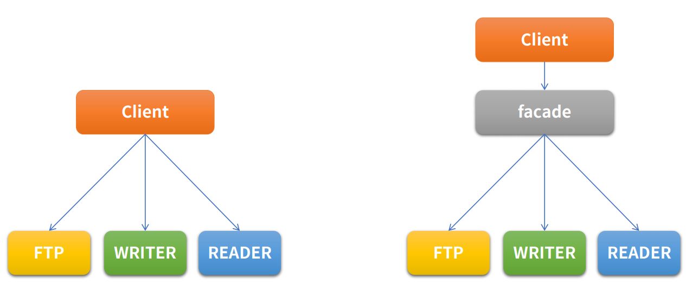

# Facade pattern

Facade는 건물의 앞쪽 정면이라는 뜻을 가진다. 즉, 건물의 뒤쪽에는 무엇이 있는지 모르는 형태이다.<br>
여러개의 객체와 실제 사용하는 서브 객체의 사이에 복잡한 의존관계가 있을 때, 중간에 facade라는 객체를 두고 여기서 제공하는 interface 만을 활용하여 기능을 사용하는 방식이다. <br>
Facade는 자신이 가지고 있는 각 클래스의 기능을 명확히 알아야 하고 어떠한 인터페이스를 제공하는지 정확히 알아야 한다.<br>
코딩할 때 자주 사용하며 주로 여러개의 객체를 합쳐서 기능을 만들 때 사용한다.<br>


<br><br>
예로 FTP Client가 있다. 
만약 직접 사용한다면 FTP 객체를 만들고 wirter,reader,close,connect 등 여러 메소드들이 혼재되어 있다.
이때 가운데 facade를 두고 이를 통해 간단히 메소드를 제공하고 기능을 활용할 수 있다.

<br>


<br><br>

### 예제 코드
- 위의 FTP Client 를 구현한다.

<br>

- Main method 부분
- facade 적용전
```java

        Ftp ftpClient=new Ftp("www.foo.co.kr",22,"home/etc");
        ftpClient.connect();
        ftpClient.moveDirectory();

        Writer writer=new Writer("text.tmp");
        writer.fileConnect();
        writer.write();

        Reader reader=new Reader("text.tmp");
        reader.fileConnect();
        reader.fileRead();

        reader.fileDisconnect();
        writer.fileDisConnect();
        ftpClient.disConnect();

```

<br>

- Facade 적용
```java
    SftpClient sftpClient=new SftpClient("www.foo.co.kr",22,"/home/etc","text.tmp");
    sftpClient.connect();
    sftpClient.write();
    sftpClient.read();
    sftpClient.disConnect();
```

- SftpClient Class : 여러 객체를 한번 감싸서 의존성을 sftpclint가 다 가져가고 새로운 인터페이스를 제공한다.
- 
```java
public class SftpClient {

    private Ftp ftp;
    private Reader reader;
    private Writer writer;

    public SftpClient(Ftp ftp,Reader reader,Writer writer){
        this.ftp=ftp;
        this.reader=reader;
        this.writer=writer;
    }

    public SftpClient(String host,int port, String path,String fileName){
        this.ftp=new Ftp(host,port,path);
        this.reader=new Reader(fileName);
        this.writer=new Writer(fileName);
    }

    public void connect(){
        ftp.connect();
        ftp.moveDirectory();
        writer.fileConnect();
        reader.fileConnect();
    }

    public void disConnect(){
        reader.fileDisconnect();
        writer.fileDisConnect();
        ftp.disConnect();
    }

    public void read(){
        reader.fileRead();
    }

    public void write(){
        writer.write();
    }

}
```
<br>

 - 이전 코드처럼 각각의 객체에 의존하는 거보다 facade 를 적용하여 전면만 바라볼 수 있는 객체를 통해 안에 있는 복잡한 여러 의존성을 갖은 것들은 새로운 인터페이스 형태로 제공한다.
 - Main 부분(바깥 부분)의 간략하게 코드를 줄일 수 있고 쉽게 사용할 수 있으며 기능 자체는 sftClient가 온전히 지원해준다.
- 이처럼 여러가지 객체의존성을 안쪽으로 숨겨주는 것을 facade 패턴이라고 한다.

