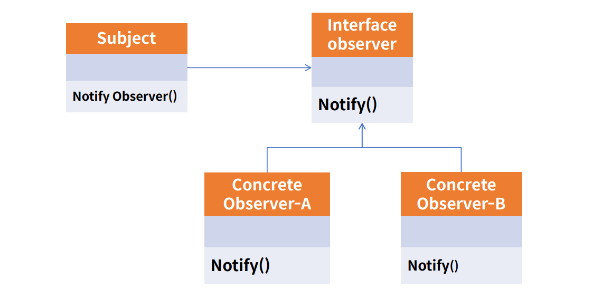
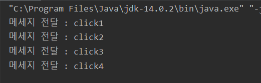

# Observer pattern

- 관찰자 패턴은 변화가 일어났을 때 미리 등록된 다른 클래스에 통보해주는 패턴을 구현한 것이다.<br>
- 주로 SWing 같은 java의 GUI 혹은 안드로이드 프로그래밍에서 Event Listener가 Observer 패턴의 대표적인 예이다. <br>
- 이 이벤트리스너가 obserber가 되고 event를 관찰하고 event 발생시 리스너를 통해 이벤트가 전달된다.<br>

<br><br>


<br>


<br><br>

### 예제 코드
- 버튼 클릭의 event listener 동작

<br>

- Main method 부분
- button의 addListener 함수를 호출할때 IbuttionListener를 익명함수로 추가한 것이다.
- 이벤트 발생시 Observer (관찰자)에 해당하는 Event Listener 'IbuttonListener'에 의해 이벤트를 감지하고 특정 이벤트를 전달한다.
```java

    //Obeserver 패턴
    Button button=new Button("버튼");

    button.addListener(new IButtonListener() {
        @Override
        public void clickEvent(String event) {
            System.out.println(event);
        }
    });
    
    button.click("메세지 전달 : click1");
    button.click("메세지 전달 : click2");
    button.click("메세지 전달 : click3");
    button.click("메세지 전달 : click4");

```

<br>

- 버튼 클래스는 이벤트리스너를 멤버로 가지고 있다.
```java
public class Button {
    private String name;
    private IButtonListener buttonListener;

    public Button(String name){
        this.name=name;
    }
    public void click(String message){
        buttonListener.clickEvent(message);
    }
    public void addListener(IButtonListener iButtonListener){
        this.buttonListener=iButtonListener;
    }
}
```

- 클릭 이벤트 리스너 인터페이스
```java
public interface IButtonListener {
    void clickEvent(String event);
}
```
<br>


- 소스코드 실행 결과


<br>

- 리스너를 통해 observer pattern은 특정 이벤트를 전달해준다.

