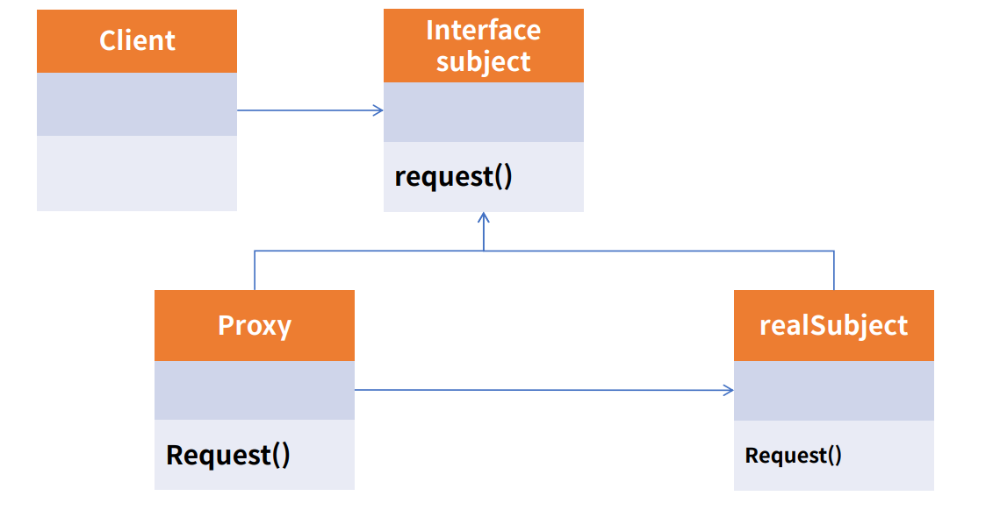
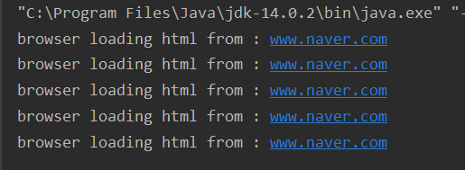
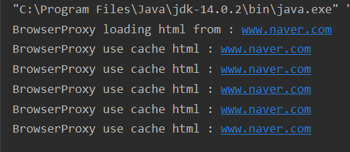
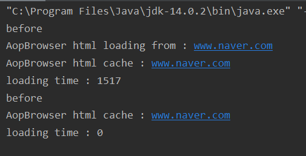

# Proxy pattern

Proxy는 대리인이라는 뜻으로써, 무언가를 대신해서 처리하는 것이다.<br>
Proxy Class를 통해서 대신 전달하는 형태로 설계되며, 실제 client는 Proxy로부터 결과를 받는다.
<br>
SOLID 원칙 중 개방폐쇄원칙(OCP)과 의존역전 원칙(DIP)를 따른다.<br>
Proxy 기능을 구현한 예로는 Cache, Spring AOP 이다.




<br>


<br><br>

### 예제 코드 1
- Cache 구현해보기
- 캐쉬를 가장 많이 활용 : 브라우저, 인터넷 통신에서 이미 받아둔 결과를 그대로 내려주거나 서버에서 자주 변경되지 않는 데이터를 메모리에 캐싱해서 같은 요청에 같은 결과를 전달. 


- main Class - Proxy를 사용하지 않을때
```java
    Browser browser=new Browser("www.naver.com");
    browser.show();
    browser.show();
    browser.show();
    browser.show();
    browser.show();
```

- cache 기능이 없는 실행 결과


<br>

매번 로딩이 일어난다.

<br>

- main Class - Proxy를 사용할 때
```java    
    IBrowser browser=new BrowserProxy("www.naver.com");
    browser.show();
    browser.show();
    browser.show();
    browser.show();
    browser.show();

````

- BrowserProxy class

```java
public class BrowserProxy implements IBrowser{

    private String url;
    // html을 캐싱할 것이다.
    private HTML html;

    public BrowserProxy(String url){
        this.url=url;
    }

    @Override
    public HTML show() {
        if(html==null){
            this.html=new HTML(url);
            System.out.println("BrowserProxy loading html from : "+url);
        }
        System.out.println("BrowserProxy use cache html : "+url);
        return html;
    }
}
```

- Proxy Pattern을 더한 cache 기능이 추가된 실행 결과




<br>

첫번째만 로딩, Proxy를 통해 cache 하고, 자신이 가지고 있는 html(다른 캐시가 될수 있는 것으로 대체될 수 있음) 이 캐싱된 결과만 리턴된다. 


<br><br>

구현체 자체 변경없이 cache 기능을 추가할 수 있다.<br>

마찬가지로, Spring의 AOP는 기능 전후로 원하는 메소드, 기능, 흩어진 기능들을 제공하는 기능을 Proxy를 통해 구현한다.

<br><br>

### 예제 코드 2
- AOP 구현해보기

AOP의 활용방법은 특정 메소드의 실행시간, 특정 패키지의 특정 메소드들의 실행시간, 혹은 전후로 작업하고 싶은 부분들, 또는 일괄적으로 특정 요청에 대해 request 정보를 남기는 것, response 정보를 남길 때 등 코드에 개별적으로 하는 것이 아니라 일괄적으로 특정 패키지에 있는 모든 메소드들 과 같은 형식으로 전후에 기능을 넣을 수 있는 것이다. 

<br>

- main class -main method
```java
    //시간측정 구현
    AtomicLong start=new AtomicLong();
    AtomicLong end=new AtomicLong();

    //before와 after는 lambda 식으로 구현
    IBrowser aopBrowser=new AopBrowser("www.naver.com",
            ()->{
                System.out.println("before");
                start.set(System.currentTimeMillis());
            },
            ()->{
                long now=System.currentTimeMillis();
                end.set(now-start.get());
            }
            );

    aopBrowser.show();
    System.out.println("loading time : "+end.get());

    aopBrowser.show();
    System.out.println("loading time : "+end.get());
```

- AOP 구현 AopBrowser 부분
```java
public class AopBrowser implements IBrowser {

    private String url;
    private HTML html;

    //functional interface의 종류 Runnable
    //argument 없고 반환 값 없는 run() 메소드를 가지고 있음.
    private Runnable before;
    private Runnable after;

    public AopBrowser(String url,Runnable before,Runnable after){
        this.url=url;
        this.before=before;
        this.after=after;
    }

    @Override
    public HTML show() {
        //AOP 구현 : before와 after를 통해 중간 로직 전후로 method 실행 시간 측정
        before.run();

        if(html==null){
            this.html=new HTML(url);
            System.out.println("AopBrowser html loading from : "+url);
            try {
                Thread.sleep(1500); //method 속도가 빠를 수 있기 때문에 1.5초 기다린다.
            } catch (InterruptedException e) {
                e.printStackTrace();
            }
        }

        after.run();

        System.out.println("AopBrowser html cache : "+url);
        return html;
    }
}

```

- main method 실행 결과



<br>

처음 호출시 1.5초 sleep 메소드로 인한 로딩시간이 걸린다.<br>

그 후 호출시 cache를 활용하기 때문에 0가 걸렸다.<br>

특정 메소드가 걸린시간이 cache를 통해 단축된 것을 확인할 수 있다.

<br><br>

이처럼 AOP는 Proxy 패턴을 활용했고 특정 메소드, 특정 기능의 앞,뒤로 원하는 기능 혹은 매개변수 조작 등 여러가지 공통기능을 묶어줄 수 있다. <br>

대표적인 예로  http client가 통신할 때 http client code가 흩어져 있거나 특정 rest client 서비스가 뭉쳐있을 때 메소드들의 시간을 측정하거나 트랜잭션에 시간관련 AOP를 사용하여 현재 시스템이 어떤 부분에서 느린지 확인하는 것을 위한 전처리, 후처리를 구현하고 활용할 수 있다.
