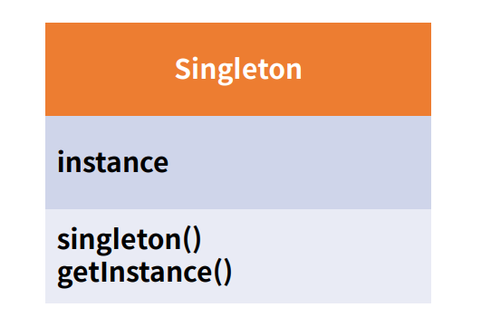
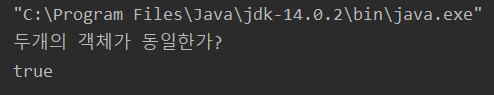
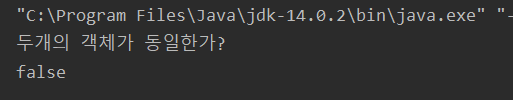

# Singleton pattern

- 싱글톤 패턴은 어떠한 클래스(객체)가 유일하게 1개만 존재할 때 사용한다.<br>
- 이를 주로 사용하는 곳은 서로 자원을 공유할 때 사용하는데, 실제세계에서는 프린터가 해당되며(여러 PC가 하나의 프린터에 연결되어 사용) <br>
- 실제 프로그래밍에서는 TCP Socket 통신(connect 1개와 연결)에서 서버와 연결된 connect 객체에 주로 사용한다.<br>
- Spring의 Bean이라고 부르는 클래스(객체)는 기본으로 Singleton을 통해 생성한다.

<br><br>


<br>

- 싱글톤은 default 생성자를 private으로 막고, getInstance를 통해 처음 한번만 객체를 생성하고 그후에는 생성된 객체를 가져와서 동일한 객체를 사용한다.

<br><br>

### 예제 코드

```java

    private static SocketClient socketClient=null;

    //기본생성자를 private으로 설정
    private SocketClient(){

    }

    //static 메소드이기 때문에 어떠한 클래스에서도 접근가능
    public static SocketClient getInstance(){
        //최초 한번만 객체생성
        if(socketClient==null){
            socketClient = new SocketClient();
        }
        return socketClient;
    }

```
<br>

- 싱글톤 패턴으로 구현했을 때의 결과



<br><br>

- 싱글톤 패턴으로 구현하지 않고 new 생성자를 통해 얻은 결과


<br>

