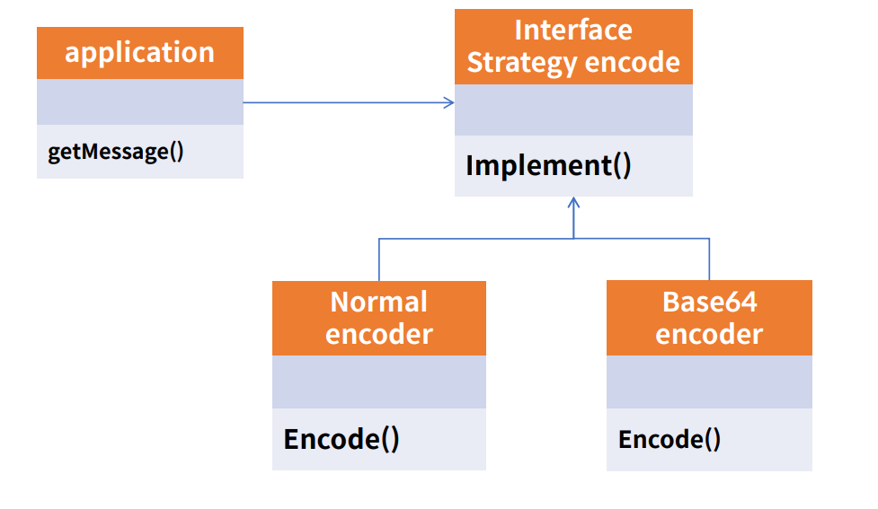
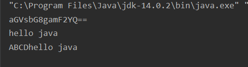

# Strategy pattern

- 전략 패턴으로 불리며 객체지향의 꽃이다.<br>
- 유사한 행위드르을 캡슐화 하여 객체의 행위를 바꾸고 싶은 경우 직접 변경하는 것이 아닌 전략만 변경하여 유연하게 확장하는 패턴 <br>
- SOLID 중에서 개방폐쇄 원칙(OCP)와 의존역전 원칙(DIP)를 따른다.<br>


<br><br>
### 인코딩 예제 >

예제 전략 메서드를 가진 전략 객체(Nomal Strategy, Base64 Strategy)<br>
- Nomal Strategy : 인코딩을 하지 않은 기본 Plain Text 전략
- Base64 Strategy : Base64 전략을 가진다.
<br>

전략 객체를 사용하는 컨텍스트 (Encoder)<br>
전략 객체를 생성해 컨텍스트에 주입하는 클라이언트<br>



- Encoder 자체는 그대로 있고 인코딩 전략을 nomal,base64,base32,암호화 적용 등 특정 텍스트에 변화를 주고자 할때 조건문으로 작성하지 않고 전략을 수정함으로써 결과를 동일하게 얻는 객체 패턴
<br>

  - 전략 메소드를 갖는 전략 객체(Nomal Strategy, Base64 Strategy, AppendStrategy) 
  - 전략 객체를 사용하는 컨텍스트 (Encoder)<br>
  - 전략 객체를 생성해 컨텍스트에 주입하는 클라이언트 (Main method)<br>

<br><br>

### 예제 코드
- encoder 라는 사용하기 위한 기본 객체에 전략을 각각 생성하고 어떠한 전략을 사용할지 설정(set)한다. <br>
- cf) base32, hashcode, 암호화 전략도 활용 가능 <br>
- 인코더 객체 자체는 변하지 않고 전략의 주입을 통해 결과가 달라지도록 설정

<br>


### 구현

- Main method 부분
- 전략 객체를 생성해 컨텍스트에 주입하는 클라이언트 (Main method)
```java
        //Strategy 패턴
        Encoder encoder=new Encoder();

        //base64
        EncodingStrategy base64=new Base64Strategy();

        //nomal
        EncodingStrategy normal=new NomalStrategy();

        String message="hello java";
        encoder.setEncodingStrategy(base64);
        String base64Result=encoder.getMessage(message);
        System.out.println(base64Result);

        encoder.setEncodingStrategy(normal);
        String normalResult=encoder.getMessage(message);
        System.out.println(normalResult);

        encoder.setEncodingStrategy(new AppendStrategy());
        String appendResult=encoder.getMessage(message);
        System.out.println(appendResult);
        ftpClient.disConnect();

```

<br>

- 전략 객체를 사용하는 컨텍스트 (Encoder)
```java
    public class Encoder {

    private EncodingStrategy encodingStrategy;

    public String getMessage(String messege){
        return this.encodingStrategy.encode(messege);
    }

    public void setEncodingStrategy(EncodingStrategy encodingStrategy) {
        this.encodingStrategy = encodingStrategy;
    }
}
```

<br>

- 전략 메소드를 갖는 전략 객체(Nomal Strategy, Base64 Strategy, AppendStrategy) 
<br>

- Nomal Strategy
```java
public class NomalStrategy implements EncodingStrategy{
    @Override
    public String encode(String text) {
        return text;
    }
}
```

- Base64 Strategy
```java
import java.util.Base64;

public class Base64Strategy implements EncodingStrategy{
    @Override
    public String encode(String text) {
        return Base64.getEncoder().encodeToString(text.getBytes());
    }
}
```

- Base64 Strategy
```java
public class AppendStrategy implements EncodingStrategy{
    @Override
    public String encode(String text) {
        return "ABCD"+text;
    }
}
```

<br><br>

### 결과

<br>


