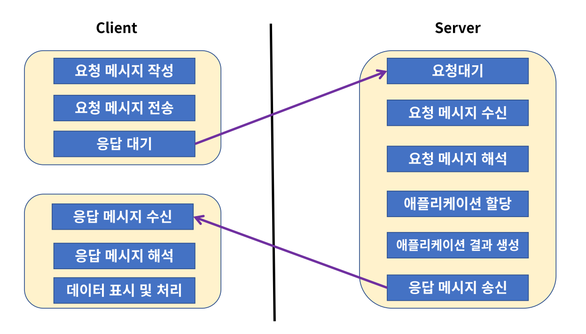
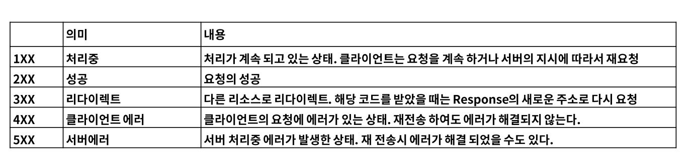
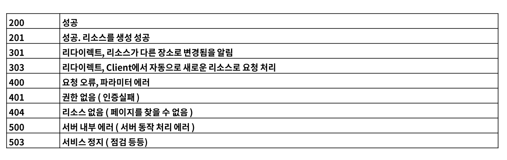

# HTTP Protocol
HTTP(Hyper Text Transfer Protocol)는 RFC 2616에서 규정된 Web에서 데이터를 주고받는 프로토콜
- 규칙에 맞추어 구현을 해야한다.
- 이름에는 하이퍼 텍스트 전송용 프로토콜로 정의되어 있지만 실제로 HTML,XML,JSON,Image,Voice,Video,JavaScript,PDF 등 다양한 컴퓨터에서 다룰 수 있는 것은 모두 전송할 수 있습니다.
- HTTP 는 TCP를 기반으로 한 REST의 특징을 모두 구현하고 있는 Web 기반의 프로토콜

 
 

HTTP는 메시지를 주고 받는 형태의 통신 방법이다.( Request & Response )

- Client에서 요청메시지를 작성하여 서버에 요청하고 난 뒤 반드시 대기한다.
- Server에서 요청에 따른 처리해야 하는 로직을 수행한 뒤 응답을 Client로 전송
- Client는 요청 후 응답이 오기 전까지 대기하게 된다.
- 수많은 요청이 생성된다고 할때 Server의 응답을 무한정 대기할 수 없기 때문에 ReadTimeOut, Connection TimeOut 값을 설정하여 Server가 일정 시간동안 응답을 주지 않으면 요청을 취소한다.
- 일정 시간 안에 응답을 받는다면 응답메시지를 해석하고 데이터를 표시 및 처리한다.
- 특정 웹 페이지에 사용자가 몰릴 경우 페이지가 열리지 않고 있다가 404 에러, 하얀 백지 화면 등의 경우가 응답을 받지 못하고 끊어진 형태이다.
  
   
 

## HTTP 요청 Method
HTTP의 요청을 특정하는 Method는 8가지가 있습니다.

- 특정 부분에는 GET에도 RequstBody(DataBody)를 넣을 수 있지만 표준은 아니다.
- 멱등성은 몇번의 요청에도 같은 응답이 오는 것을 의미한다.
- 안정성은 어떤 요청에 있어서 데이터 변화나 데이터 삭제 등의 위험이 없는 것을 의미한다.
- POST는 생성,추가에 관련이 있으므로 멱등성이 안된다. 다음 요청에서 3개의 데이터에서 한개를 추가하여 4개의 데이터로 변한 응답이 올 수 있기 때문이다.
- 세모는 사용할 수는 있지만 권장하지 않는 형태
- POST의 Query Parameter는 사용할 수 있지만 대부분 DataBody를 이용한다.
- PUT은 첫번째 요청에서는 생성을, 그 후 요청에서는 갱신을 수행하므로 POST처럼 데이터의 개수가 추가되지 않는다. 이때문에 멱등하다.
- PUT은 데이터가 갱신되므로 안정성은 보장하지 않는다.
- Delete는 데이터 삭제를 수행할 때 데이터가 있다면 삭제 후 삭제 되어서 데이터가 없다는 응답을, 데이터가 없다면 데이터가 없다는 응답을 마찬가지로 주기 때문에 멱등하다.
- Delete는 데이터를 삭제하므로 안정성은 보장하지 않는다. 
  
 
 

## HTTP Status Code
Server가 Client에 보내는 응답의 상태를 나타내는 코드

  

자주 사용되는 코드

