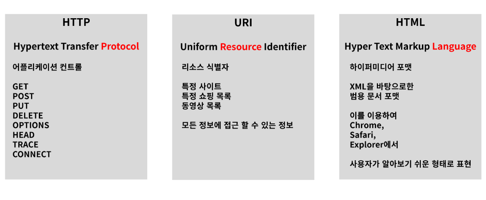

# Web 개론

## Web이란 무엇인가?

World Wide Web == WWW === W3
: 인터넷에 연결된 컴퓨터를 통해 사람들이 정보를 공유할 수 있는 전 세계적인 정보공간을 말한다.

 

## Web의 용도
 1. Web Site 
- google,naver,daum,facebook 등  HTML로 구성된 여러사이트들 
- 접근을 위해서는 http 프로토콜을 통해 html 문서를 받아서 user Interface 에 해당되는 브라우저를 통해 보여집니다.

 2. API (Application Programming Interface) *Web Service
- : KaKao Open API, Google Open API, Naver Open API 등

 3. User Interface
- Chrome, Safari, Esplorer, Smart Watch, IP TV 

## Web의 기본 3가지 요소

  

# REST API

