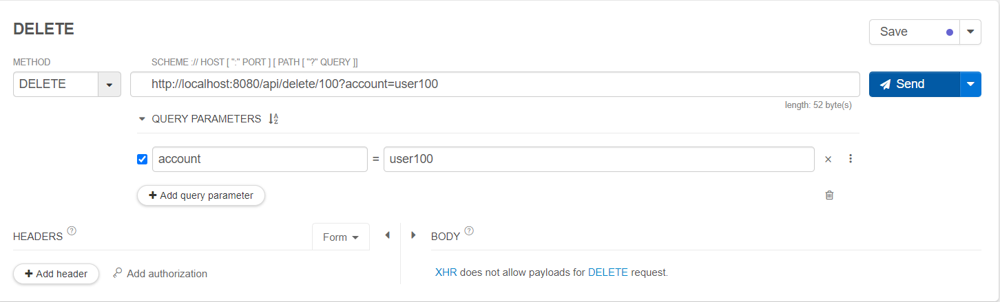
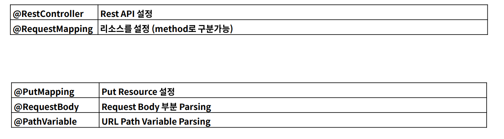

# DELETE API
- 리소스 삭제에 해당한다. (CRUD 중 D에 해당)
- 삭제되었던 데이터, 삭제되는 데이터 모두 데이터가 삭제되는 것이므로 멱등하다.
- 안정성을 가지고 있지 않다. ( 데이터의 삭제가 일어나므로 )
- path variable과 query parameter 를 사용한다.

<br><br>

## DELTE API - 리소스 삭제



<br>

- Controller
```java
@RestController
@RequestMapping("/api")
public class DeleteApiController {

    @DeleteMapping("/delete/{userId}")
    public void delete(@PathVariable String userId, @RequestParam String account){
        System.out.println(userId);
        System.out.println(account);
    }
}

```
- console 결과
```
100
user100
```

<br>

- 리소스가 없다는 값을 던질 필요가 없다. 
- delete -> 리소스 삭제이므로 있어서 삭제를 해서 없는 상태와 원래 없는 상태와 모두 삭제된 상태인 것으로 보아 200 code를 준다.

<br><br>

## Annotation Summary

