# GET API

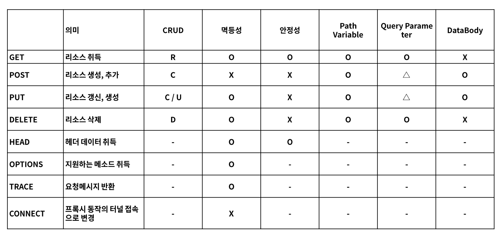

GET은 Path Variable, Query Parameter를 가질 수 있다.

IntelliJ-> GetMapping Annotation 추가 -> ctrl + 마우스 올려두기 -> 하이라이트 되면서 클릭할 수 있게된다 -> @interface로 이동하여 GetMapping에서 사용할 수 있는 옵션들을 확인할 수 있다.
- 주로 path()와 value()를 자주 사용할 것이다!
- 명시하지 않으면 기본값은 path()가 동작한다.

<br>

### GET API 실습

- Controller 지정 및 url 매핑
```java
@RestController
@RequestMapping("/api/get")
public class GetApiController {

}
```
- 이후 내용은 Controller 안의 내용입니다.
```java
    @GetMapping(path = "/hello") //http://localhost:8080/api/get/hello
    public String hello(){
        return "get Hello";
    }

   
    @RequestMapping(path="/hi",method = RequestMethod.GET) //http://localhost:8080/api/get/hi
    public String hi(){
        return "hi";
    }
```
- @RequestMapping("hi") //get/post/put/delete 모든 메소드가 매핑되어 동작한다. (옛날 방식)
- @RequestMapping(method=RequstMethod.GET)  == @GetMapping()

<br>

요청 >

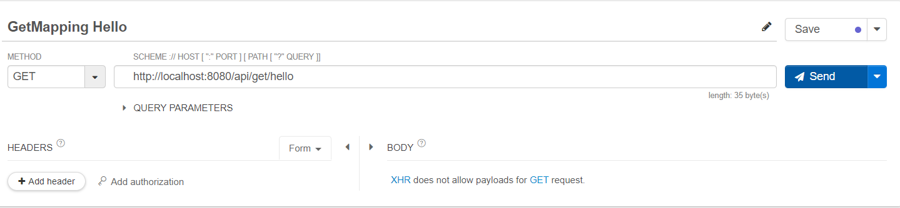

응답 >

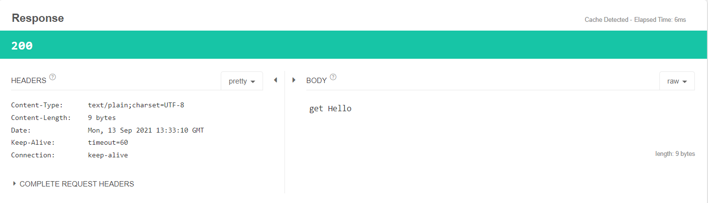

<br>
<br>

```java
    @GetMapping("/path-variable/{name}")
    public String pathVariable(@PathVariable(name="name") String pathName /*, String name*/){

        System.out.println("PathVariable : "+pathName);
        return pathName;
    }
```

- 변화하는 구간은 path variable로 받는다.
  - http://localhost:8080/api/get/path-variable/{name} -> name은 바뀌는 부분
  - http://localhost:8080/api/get/path-variable/{spring-boot}
  - http://localhost:8080/api/get/path-variable/{spring}
  - http://localhost:8080/api/get/path-variable/{java}
  - http://localhost:8080/api/get/path-variable/{jpa}
- 변수의 이름은 path-variable과 동일해야 한다.
  - http://localhost:8080/api/get/path-variable/{name} 일 경우
  - public String pathVariable(@PathVariable String name)
- 만약 path-variable로 받는 name이라는 이름과 함수가 받는 name이라는 이름이 같아야 한다면 @PathVariable에 name="name을 추가하여 작성하여 pathVarialbe name을 전달받는다고 지정해준다.
  - public String pathVariable(@PathVariable(name="name") String pathName , String name)

<br>

요청 :  http://localhost:8080/api/get/path-variable/java

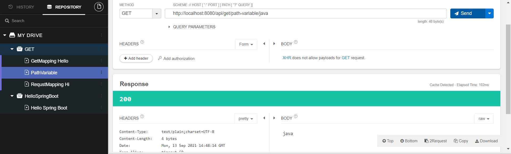

요청 :  http://localhost:8080/api/get/path-variable/spring-boot

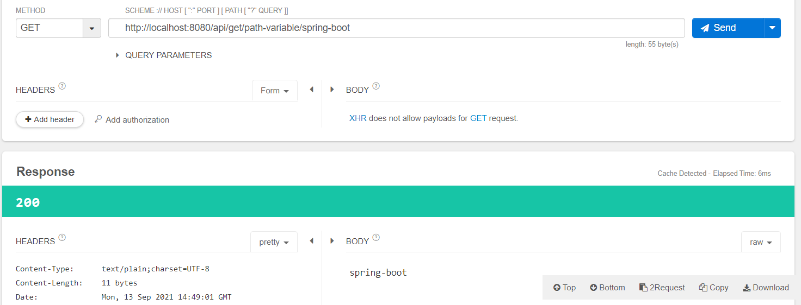

console 결과>

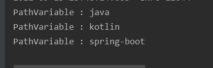


<br><br>


```java
    @GetMapping(path="query-param")
    public String queryParam(@RequestParam Map<String,String> queryParam){

        StringBuilder sb=new StringBuilder();

        queryParam.entrySet().forEach( entry->{
            System.out.println(entry.getKey());
            System.out.println(entry.getValue());
            System.out.println("\n");

            sb.append(entry.getKey()+"="+entry.getValue()+"\n");
        });

        return sb.toString();
    }
```
- query parameter
  - ?key=value&key2=value2
  - url(주소) 뒤 ? 부터 시작하여 key = value 형태로 오며, &로 key,value를 연결해준다.


<br>

요청 :  http://localhost:8080/api/get/query-param?user=steve&email=steve@gmail.com&age=30

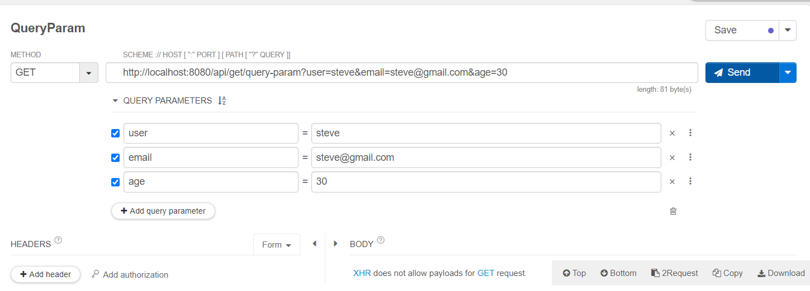

응답 >

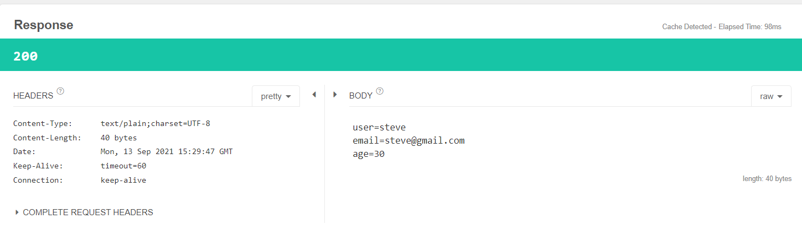

console 결과>

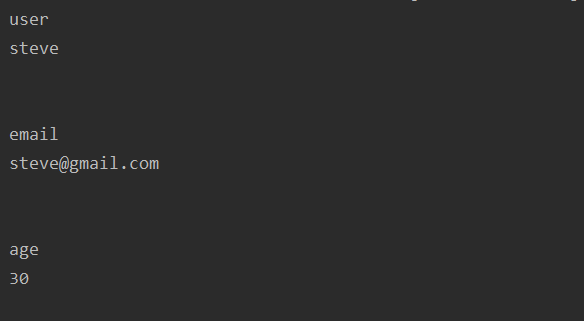


<br><br>


```java
    @GetMapping("query-param02")
    public String queryParam02(
            @RequestParam String name,
            @RequestParam String email,
            @RequestParam int age)
    {
        System.out.println(name);
        System.out.println(email);
        System.out.println(age);

        return name+" "+email+" "+age;
    }

```
- 명확하게 API를 지정하여 query parameter에 오는 값을 정확히 알수 있을 때 명시적으로 코딩
- 위의 queryParam처럼 작성하면 queryParam의 특정 key에 맞는 값을 가져오고 싶을 때 .get 등을 통해 각각 가져와야 한다.

<br>

Talend API TESTER 사용시 Add query Parameter 혹은 url 자체에서 query Parameter를 주는 방식으로 설정 가능하다.

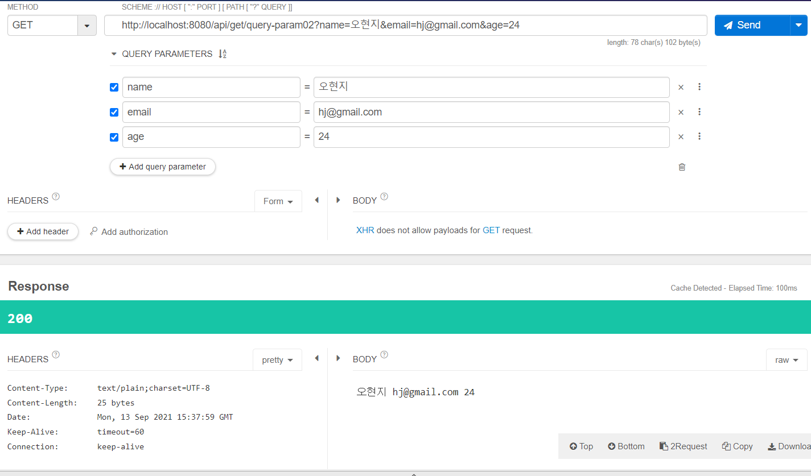

 <br>

- int 타입인 age에 String data가 입력된다면 400 error

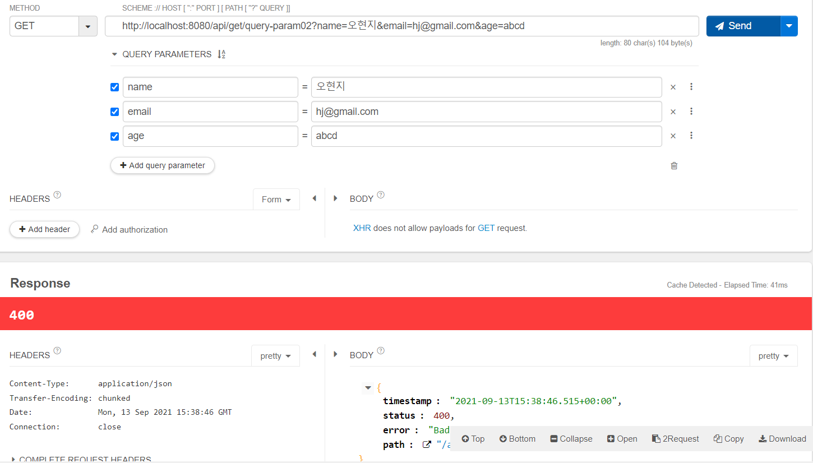

<br><br>

```java
    @GetMapping("query-param03")
    public String queryParam03(UserRequest userRequest)
    {
        System.out.println(userRequest.getName());
        System.out.println(userRequest.getEmail());
        System.out.println(userRequest.getAge());

        return userRequest.toString();
    }
```
- 02의 방식을 사용하면 만약 qeuryparam을 받아야하는 변수가 많아진다면 불편해진다.
- 이를 해결하기 위해 DTO를 만들어서 DTO의 객체형태로 받는다.
- RequestParam 어노테이션을 붙이지 않는다.
  - 객체를 받을 때 query parameter의 값을 스프링 부트가 판단한 후 key에 해당하는 이름을 해당 객체에서 변수와 이름으로 매칭한다.
  - 이것을 요청하는 값에 대한 검증으로도 활용할 수 있다.<br>
  - 만약 만들어놓은 DTO에 없는 값이 requestparam으로 들어온다면 parsing되지 않기 때문에 데이터가 누락될 수 있다.


<br>

>queryparameter 값이 적다고 하면 2방법을 써도 되고,
queryparameter 값이 무한정에 무엇이 들어오는지 모른다면 1방법을 써도 된다.
