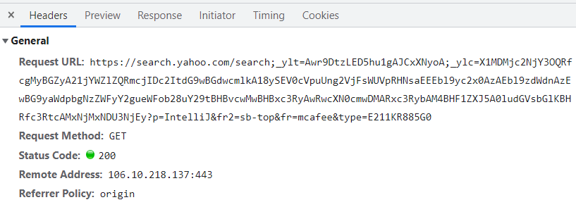
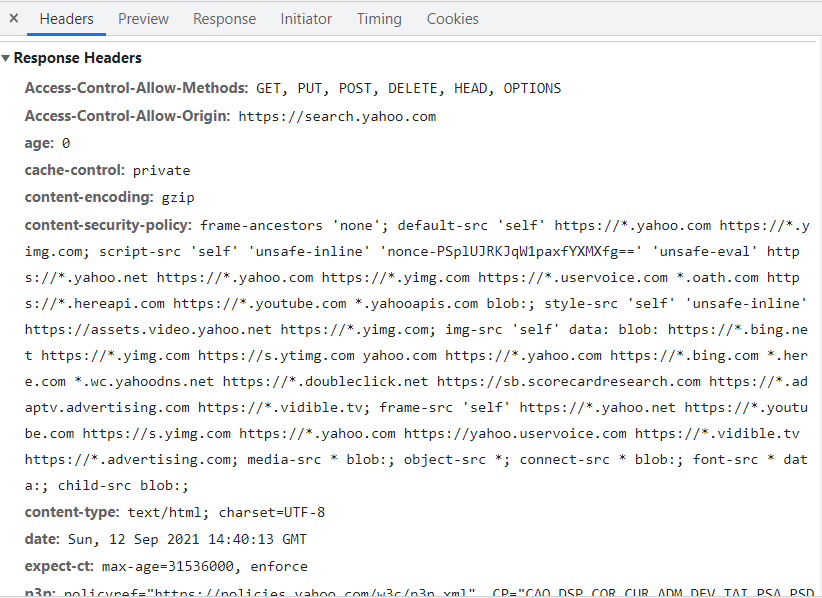
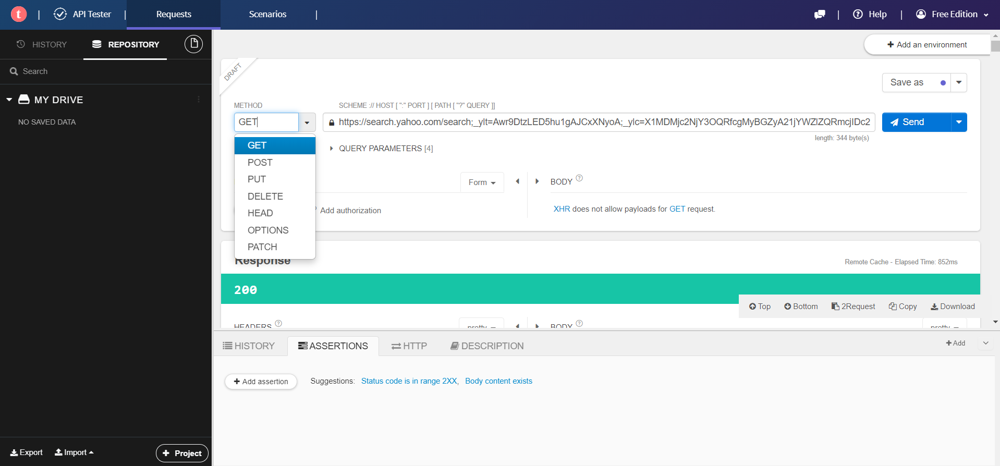
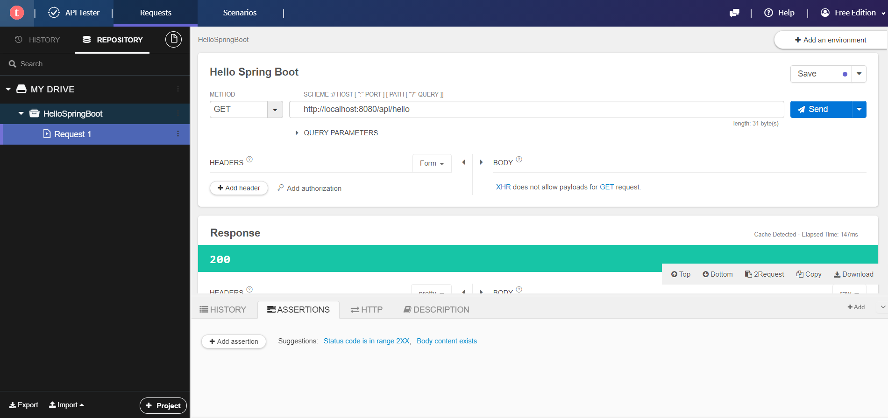
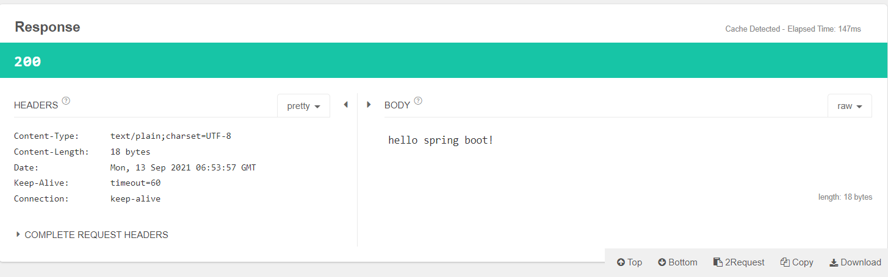
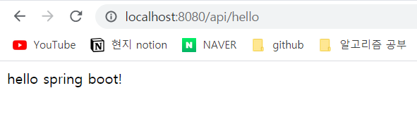

# Hello World API 제작

## Rest Client 설치하기
 
 test 하는 방법 중 브라우저 주소창에 url을 입력하는 것은 Get방식이다.<br>
 google, naver 검색도 get방식에 해당한다.



- Request Header
- Get 방식
- Status Code : 200 (정상)



- Response Header
- content-type : text/html; charset=UTF-8 (HTML 응답)

<br>

POST, PUT, DELTE 등 Http 메소드 테스트를 위해서 test tool을 제공한다.
- chrome 웹 스토어 -> Talend API Tester - Free Edition 
- Talend API Tester 설치 : https://chrome.google.com/webstore/detail/talend-api-tester-free-ed/aejoelaoggembcahagimdiliamlcdmfm?utm_source=chrome-ntp-icon
- project 생성 -> Add request -> open request
  



<br><br>

## Hello Spring Boot

- Spring Boot를 사용하여 문자 리턴해보기 예제
- 일반적으로 controller를 요청을 받는 부분으로 사용 


```java
@RestController
@RequestMapping("/api") //http://localhost:8080/api
public class ApiController {
    @GetMapping("/hello") //http://localhost:8080/api/hello
    public String hello(){
        return "hello spring boot!";
    }
}
```
- @RestController : Controller로써 동작하기 위해서 어노테이션을 지정 RestController의 역할 부여
- @RestController : 해당 class는 rest API를 처리하는 Controller (자동으로 Spring에서 인식)
- @RequestMapping("/api") : URI를 지정해주는 Annotation(주소 매핑)

<br>

### 요청



<br>

### 응답 



<br>

### url 확인



<br><br>

### Tomcat port 번호 바꾸기
- Tomcat 기본 port는 8080 이지만, 다른 어플리케이션에서 쓰고 있다면 해당 어플리케이션은 닫거나 내리고 사용할 수 있다.
- 다른 port 번호를 이용하고 싶다면 resource 폴더 하위의 application.properties(어플리케이션의 설정을 추가하는 부분) 파일에 server.port=바꾸고 싶은 번호로 바꿀 수 있다.