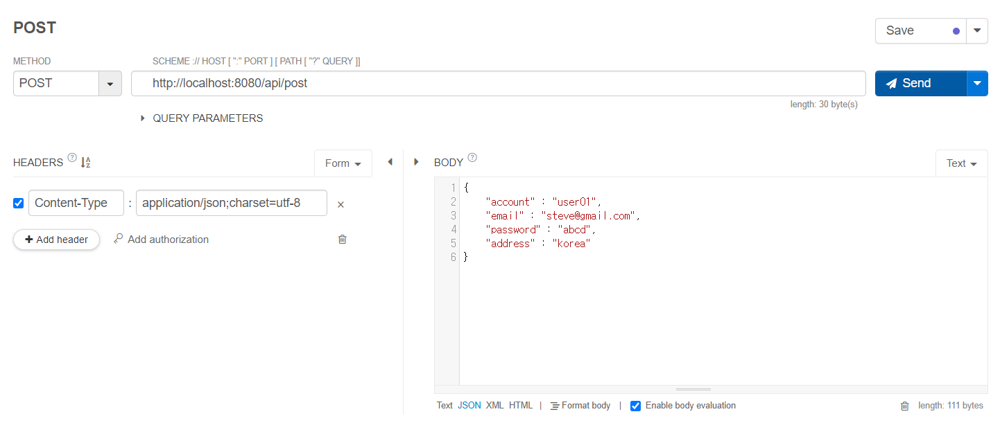
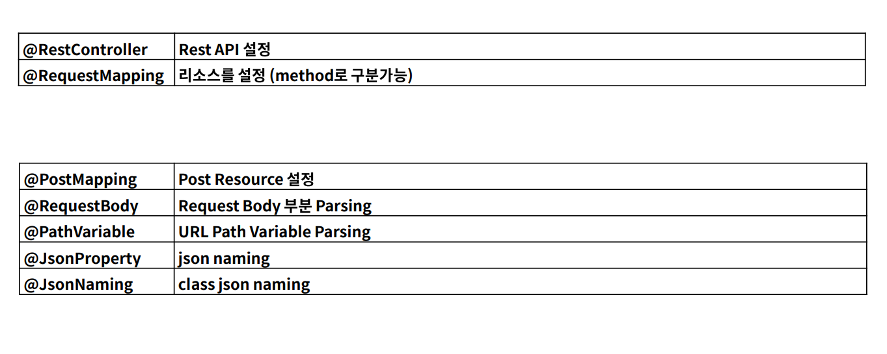

# POST API
- 리소스 생성, 추가에 해당한다. (CRUD 중 C에 해당)
- 멱등성,안정성을 가지고 있지 않다. ( 매번 데이터가 생성되므로 )
- path variable을 사용할 수 있고, data body에 data를 보내므로 query parameter 를 사용할 수는 있지만 사용하지 않는다.
- path variable은 get과 동일하게 사용
<br><br>

### JSON 설명
- 웹에서 주로 주고받는 형태의 데이터 : xml, json 
- JSON은 {} 로 감싸져 있고 ,"Key" : "Value" 의 형태를 갖는다.
  - value 에 올 수 있는 형태 : String, number, boolean, obeject{}, array[]
  - key:value 는 ,(콤마)로 구분한다.

<br>

### 예제 

```json
{
    "phone_number":"010-1111-2222"
    "age" : 10,
    "isAgree" : false,
    "account" : {
        "email" : "steve@gmail.com",
        "password" : "1234"
    }
}

//user 조회하는 경우 ( user 객체 배열 )
{
    "user_list" : [
        {
            "account" : "abcd",
            "password" : "1234"
        },
        {
            "account" : "aaaaa",
            "password" : "1111"
        },
        {
            "account" : "bbbbb",
            "password" : "2222"
        }
    ]
}

{
    "account" : "abcd",
    "password" : "1234"
}
```

<br>

JSON 규칙 
- 스네이크 케이스 (언더바를 사용하는 것) - 조금 더 많이 사용한다.
  - phone-number
- 카멜 케이스 (자바 변수 선언과 같음)
  - phoneNumber
- 프로젝트에서는 두가지 모두 API로 사용, 제공이 가능해야한다.

<br>

## POST API - JSON 데이터 받기
```json
{
    "account" : "user01",
    "email" : "steve@gmail.com",
    "password" : "abcd",
    "address" : "korea"
}
```



<br><br>

## POST를 통해 전달된 API를 MAP으로 받기

```java
@RestController
@RequestMapping("/api")
public class PostApiController {

    @PostMapping("/post")
    public void post(@RequestBody Map<String,Object> requestData){
        requestData.forEach((key, value) -> {
            System.out.println("key : " + key);
            System.out.println("value : " + value);
        });
    }
}

```

- console 결과
```
key : account
value : user01
key : email
value : steve@gmail.com
key : password
value : abcd
key : address
value : korea
```


## POST를 통해 전달된 API를 DTO로 받기
- Request를 위한 DTO 클래스 생성
- POST로 들어오는 request 데이터를 사용하기 위해서는 @RequestBody를 사용해야 한다.
-  DTO 객체를 통해 각각의 값에 접근한다. ex ) requestData.getAccount();

```java
    @PostMapping("/post")
    public void post(@RequestBody PostRequestDto requestData){
        System.out.println(requestData);
    }
```
- console 결과
```
PostRequestDto{account='user01', email='steve@gmail.com', address='korea', password='abcd'}
```

### json은 스네이크 케이스, 변수로는 카멜 케이스로 설정되었다면?

- DTO
  
```java
public class PostRequestDto {
    private String account;
    private String email;
    private String address;
    private String password;
    private String phoneNumber; //카멜 케이스

    //생략
}

```
- JSON
  
```json
{
    "account" : "user01",
    "email" : "steve@gmail.com",
    "password" : "abcd",
    "address" : "korea",
    "phone-number" : "010-1111-2222" //스네이크 케이스
}
```
- 결과

```
PostRequestDto{account='user01', email='steve@gmail.com', address='korea', password='abcd', phoneNumber='null'}
```

- null이 오게 된다. 
- Object Mapper를 통해 text 데이터를 Object로 바뀔 수 있다.
- 따로 이름을 지정하지 않는다면 스네이크 케이스를 찾으므로 카멜 케이스를 찾을 수 없다.
- 이를 해결하기 위해서는 @JsonProperty 어노테이션을 통해 이름을 지정하여 매핑할 수 있다.
- 하지만 변수마다 이름을 특정지어 매핑해야하는 불편이 따른다.
- @JsonNaming을 통해 일괄적으로 클래스에 카멜 케이스, 스네이크 케이스를 지정할 수 있다.
  
  
```java
public class PostRequestDto {
    private String account;
    private String email;
    private String address;
    private String password;

    @JsonProperty("phone_number")
    private String phoneNumber; //카멜 케이스

    //생략
}

```
- 결과
```
PostRequestDto{account='user01', email='steve@gmail.com', address='korea', password='abcd', phoneNumber='010-1111-2222'}
```

## Annotation Summary

