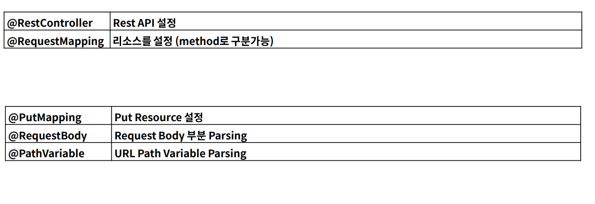

# PUT API
- 리소스 갱신 및 생성에 해당한다. (CRUD 중 C와 U에 해당)
- 리소스가 없다면 생성, 없다면 기존 리소스를 갱신하기 때문에 항상 데이터는 1이므로 멱등하다.
- 안정성을 가지고 있지 않다. ( 잘못된 데이터가 전송되더라도 업데이트 시키기 때문 )
- path variable을 사용할 수 있고, data body에 data를 보내므로 query parameter 를 사용할 수는 있지만 사용하지 않는다.
- path variable은 get과 동일하게 사용

<br><br>

## PUT API - JSON 데이터 받기
### json 데이터

```json
{
    "name" : "steve",
    "age" : 20,
    "car_list":[
        {
            "name" : "BMW",
            "car_number": "11가 1234"
        },
        {
            "name" : "A4",
            "car_number": "22가 3456"
        }

    ]
}
```


<br><br>

## PUT를 통해 전달된 API를 DTO으로 받기

- Controller
```java
@RestController
@RequestMapping("/api")
public class PutApiController {

    @PutMapping("/put")
    public void put(@RequestBody PutRequestDto requestDto){
        System.out.println(requestDto);
    }
}
```
- DTO 
```java
public class PutRequestDto {
    private String name;
    private int age;
    private List<PutCarDto> carList;
    //생략
}
```
- console 결과
```
PutRequestDto{name='steve', age=20, carList=null}
```

<br><br>

### json은 스네이크 케이스, 변수로는 카멜 케이스로 설정되었다면?
- null이 오게 된다. (car_list 와 carList이므로)
- Object Mapper를 통해 text 데이터를 Object로 바뀔 수 있다.
-  @JsonProperty 어노테이션을 통해 이름을 지정하여 매핑할 수 있지만 변수마다 이름을 특정지어 매핑해야하는 불편이 따른다.
- @JsonNaming을 통해 일괄적으로 클래스에 카멜 케이스, 스네이크 케이스를 지정할 수 있다.
  
```java
@JsonNaming(value = PropertyNamingStrategy.SnakeCaseStrategy.class)
public class PutRequestDto {
    private String name;
    private int age;
    private List<PutCarDto> carList;
}
```

- 결과
```
PutRequestDto{name='steve', age=20, carList=[PutCarDto{name='BMW', carNumber='11가 1234'}, PutCarDto{name='A4', carNumber='22가 3456'}]}
```

<br><br>

## Response (응답) 보내기

```java
@RestController
@RequestMapping("/api")
public class PutApiController {

    @PutMapping("/put")
    public PutRequestDto put(@RequestBody PutRequestDto requestDto){
        System.out.println(requestDto);
        return requestDto;
    }
}
```


- RestController인 경우 Object를 리턴할 때 스프링 부트 자체에서 Object Mapper를 통해 JSON으로 변환시킨다.

<br><br>


## Path Variable 예시 코드

```java
@RestController
@RequestMapping("/api")
public class PutApiController {

    @PutMapping("/put/{userId}")
    public PutRequestDto put(@RequestBody PutRequestDto requestDto, @PathVariable(name="userId") Long id){
        System.out.println(requestDto);
        System.out.println(id);
        return requestDto;
    }
}
```

<br><br>

## Annotation Summary

