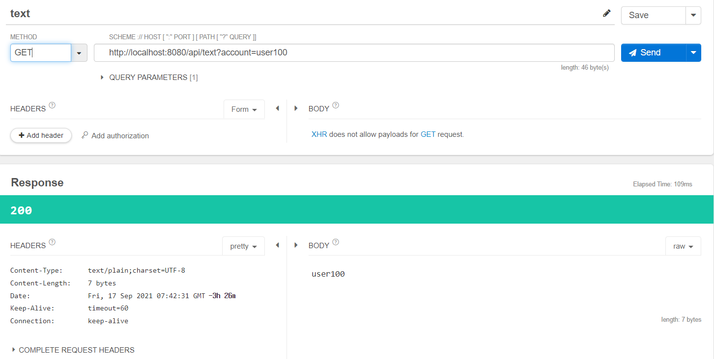
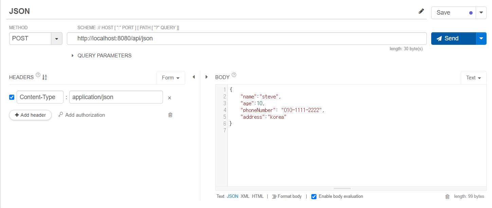
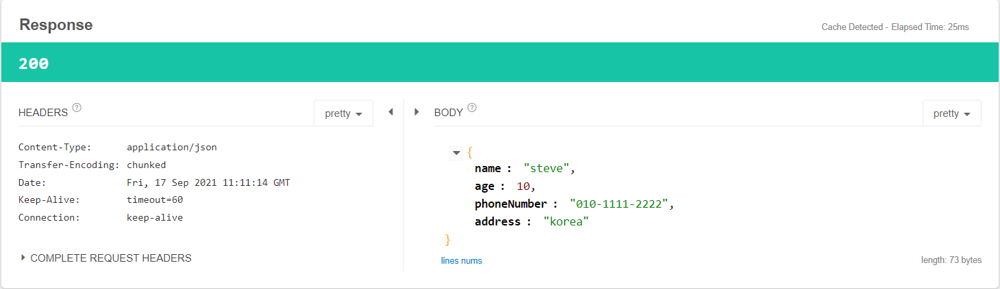
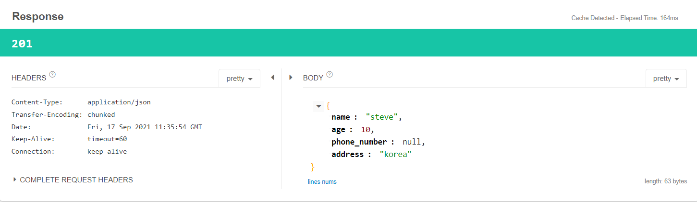
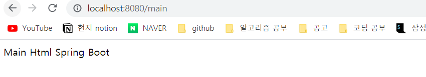
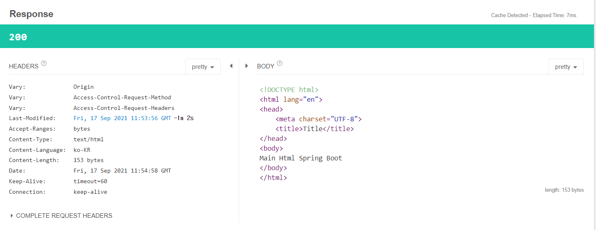
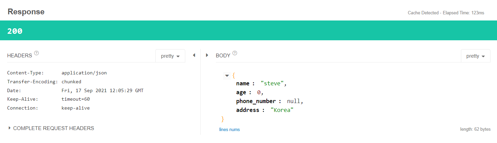
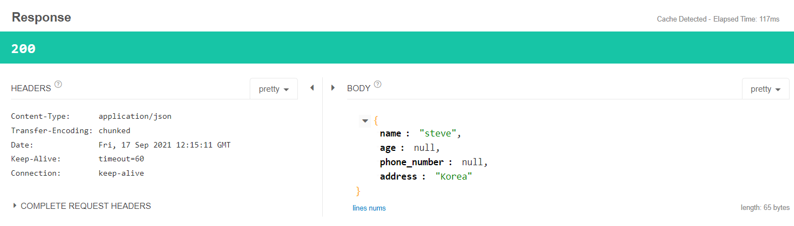
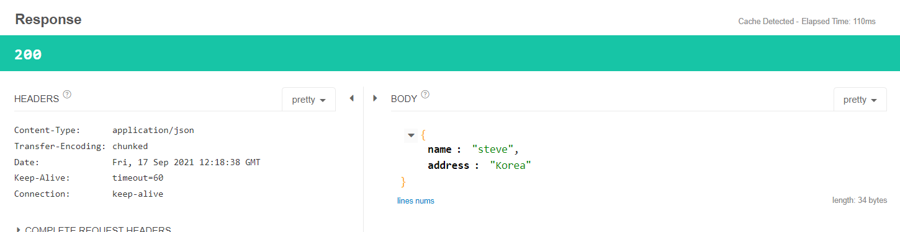
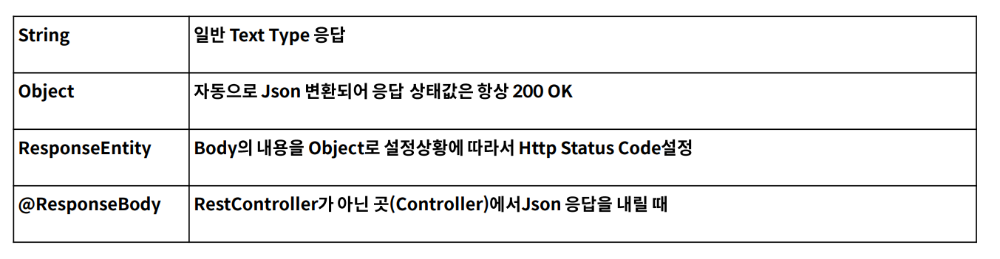

# Response 내려주기 및 모범사례

- Spring에서는 응답을 내려주는 방법이 다양하게 있다.
- 가장 좋은 방법은 무엇일까?

## Text 데이터 응답

- `http://localhost:8080/api/text`  요청

```java
@RestController
@RequestMapping("/api")
public class ApiController {
    //TEXT Response
    @GetMapping("/text")
    public String text(@RequestParam String account){
        return account;
    }
}
```
- 요청>
- query parmeter : accont=user100
- 응답 결과>
- Content-type : text/plain



<br><br>


## JSON 데이터 응답 1

- json 데이터
- phoneNumber은 카멜표기법, phone_number는 스네이크 표기법
  

```json
{
    "name":"steve",
    "age":10,
    "phoneNumber": "010-1111-2222",
    "address":"korea"   
}
```
- java method 부분


```java
    @PostMapping("/json")
    public User json(@RequestBody User user){
        return user;
    }
```

- 요청
- `http:/localhost:8080/api/json'




- 응답 결과
- Content-type : Application/json
- Code : 200 (ok)




### 동작 방식
1. request 요청
2. object mapper를 통해 object로 변환
3. object 형태로 우리 코드의 @PostMapping method 와 매핑
4. object mapper를 통해 json으로 변환
5. json response 응답 받기


### Http status 201 응답 받기
- PUT과 같이 resource가 생성이 되었을 경우 응답 코드가 201이 온다.
-  HTTP status를 지정하기 위해서는 ResponseEntity 를 사용한다.

```java
    @PutMapping("/put")
    public ResponseEntity<User> put(@RequestBody User user){
        return ResponseEntity.status(HttpStatus.CREATED).body(user);
    }
```

- HTTP Status를 위 코드와 같이 ResponseEntity로 설정할 수 있고 (CREATED 는 201) , body( )에 데이터를 넣을 수 있다.
- body() 의 데이터도 object mapper에 의해 json으로 변환되어 받는다.
- header도 받을 수 있고 응답에 대해서 커스터마이징이 필요할 경우 사용하기 적합하다 (ResponseEntity)
- ResponseEntity를 통해 값을 명확하게 만들어서 응답받는 것을 추천한다. <br>


<br>

- 요청 : `http://localhost:8080/api/put`

- 응답
- HTTP Status : 201




## 페이지 리턴
- Spinrg에는 RestController 외에도 html 페이지를 리턴하는 controller가 존재한다.

```java
import org.springframework.stereotype.Controller;
import org.springframework.web.bind.annotation.RequestMapping;

@Controller
public class PageController {

    @RequestMapping("/main")
    public String main(){
        return "main.html";
    }
}
```

- 요청 : http://localhost:8080/main 
- url 요청 결과



- talend API Tester 요청 결과
- Content-Type : text/html
  


- 페이지를 리턴하는 Controller를 만들 수 있으며 이때 메소드의 Return Type이 String일 때 Resource 의 html 파일을 찾는다.


## 페이지를 리턴할 때 JSON을 응답받는 방법

### ResponseEntity를 활용
- RestController의 경우

### ResponseBody 활용
- 일반 Controller일 때, Response 데이터를 사용해야 하는 경우 ( 일방적이지 않은 경우 , 일반적으로 RestController에 작성 )
- @ResponseBody : responsebody를 만들어 응답한다는 Annotation이다.
```java
    @ResponseBody 
    @GetMapping("/user")
    public User user(){
        var user=new User(); //java v11 이후 추가된 타입추론
        user.setName("steve");
        user.setAddress("Korea");
        return user;
    }
```
- 요청 : `http://localhost:8080/user`

- 응답 결과
- phone_number는 없으므로 null
- int가 0으로 나온 이유는 DTO의 age 타입이 int 이기 때문이다.



- int 타입의 age 필드와 getter 메소드를 Integer로 바꾼다.
- int 가 null이 된다.



- @JsonInclude(JsonInclude.Include.NON_NULL) : null인 경우 response에 포함시키지 않는 Annotation
- DTO class에 Annotiation 추가후 결과
  



<br><br>

## Annotation Summary

