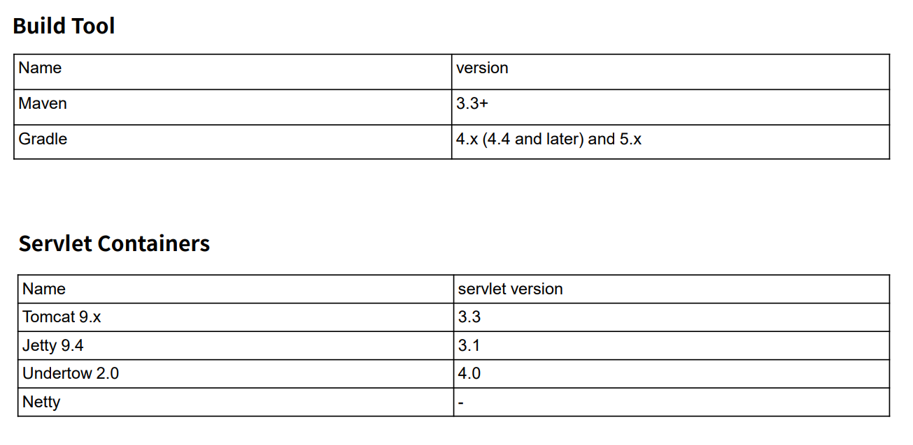

# Spring Boot
- Spring Boot는 단순히(간단히) 실행되며, 프로토타입 수준이 아닌 사용자에게 제공될 수 있는 프로덕션 제품 수준의 스프링 기반 어플리케이션을 쉽게 만들 수 있다.
- Spring Boot 어플리케이션에는 Spring 구성이 거의 필요하지 않다.
  - Spring 핵심은 Spring Boot Dependency가 설정되어 있다.
- Spring Boot java -jar로 실행하는 Java 어플리케이션을 만들 수 있다. (실행시 웹서비스가 구동 - Tomcat을 내장하고 있다.)
    
  

### 주요 목표

>-  Spring 개발에 대해 빠르고 광범위하게 적용할 수 있는 환경
>-  기본값 설정이 있지만 설정을 바꿀 수 있다. (기본 설정만으로도 구동 가능)
>-  대규모 프로젝트에 공통적인 비 기능 제공 ( 보안, 모니터링 등등 )
>-  XML 구성 요구사항이 전혀 없음 (Annotation 기반으로 설정)

 

## Build Tool & Servelt Containers

- Servlet Container 기본은 Tomcat을 사용
- 다른 Container 사용시 Cofigure 설정을 통해 변경 가능
- https://start.spring.id 사이트의 spring initializer를 통해 프로젝트 다운로드 가능 
- IntelliJ Ultimate 버전의 경우 옵션 선택으로 프로젝트 설정 가능

 

## 정리
- 어플리케이션 개발에 필수 요소들만 모아두었다.
- 간단한 설정으로 개발 및 커스텀이 가능하다 ( 어노테이션 기반 )
- 간단하고 빠르게 어플리케이션 실행 및 배포가 가능하다. ( jar 파일 배포 )
- 대규모 프로젝트(운영 환경)에 필요한 비기능적 기능도 제공한다.
- 오랜 경험에서 나오는 안정적인 운영이 가능하다. ( 보안, 디자인 패턴, 패러다임 등 최적화되어 있음 )
- Spring에서 불편한 설정이 없어졌다.( XML 설정 등등 )

