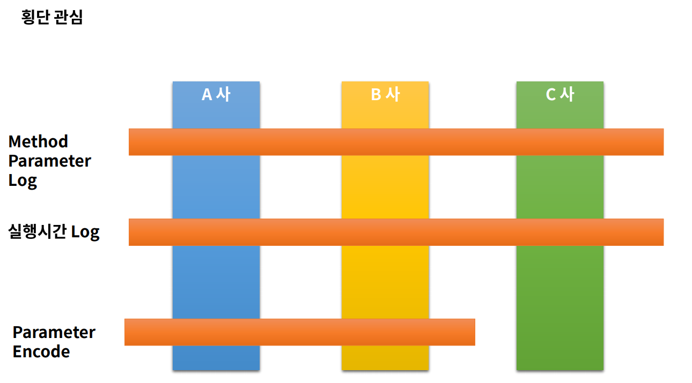
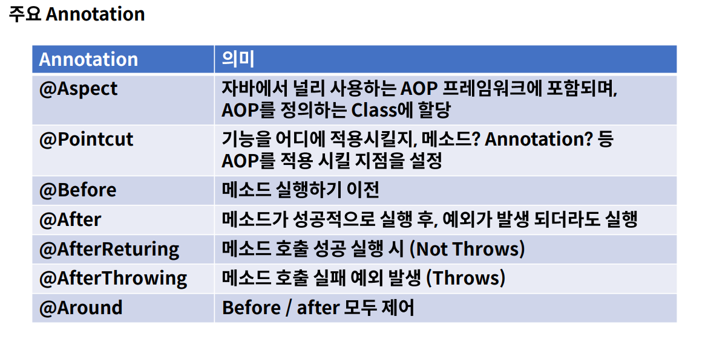

# AOP (Aspect Oriented Programing)
- 관점지향 프로그래밍
- 스프링 어플리케이션은 대부분 특별한 경우를 제외하고는 MVC 웹어플리케이션 형태이며, Web Layer, Business Layer (Service에 해당 ), Data Layer로 정의된다.
  - Web Layer : REST API를 제공하며, Client 중심의 로직 적용
  - Business Layer : 내부 정책에 따른 logic을 개발하며, 주로 해당 부분을 개발
  - Data Layer : 데이터베이스 및 외부와의 연동을 처리

<br><br>

## 횡단 관심



- A사, B사, C사와 공통적인 기능이 들어갈 수 있다.
  - ex) Method parameter Log ( input, output data의 로그 ) , 실행시간 Log , Parameter Encode 등
- AOP가 없다면 공통적인 기능에 대해 반복적인 코딩을 야기한다.
- AOP는 공통 Method, 특정 구역에 반복되는 logic을 한 곳으로 몰아서 코딩할 수 있도록 지원한다.



<br><br>

## AOP 실습
- AOP를 사용하기 위해서 dependency를 추가해야 한다.
```java
// AOP dependiency 추가
dependencies {
	implementation 'org.springframework.boot:spring-boot-starter-aop'
}
```
<br>

## Method Parameter Log
- 무수히 많은 Method들을 Method 별로 log를 모아서 출력할 수 있다.
- 특정 Method의 입력, 출력을 확인하는 예제 코드를 작성한다.
- PointCut은 굉장히 많은 연산, 수식이 있다.

<br>

### RestApiController Class

```java
@RestController
@RequestMapping("/api")
public class RestApiController {

    @GetMapping("/get/{id}")
    public String get(@PathVariable Long id,@RequestParam String name){
        System.out.println("get method");
        System.out.println("get method : "+id);
        System.out.println("get method : " +name);
        return id+" "+name;
    }

    @PostMapping("/post")
    public User post(@RequestBody User user){
        System.out.println("post method:" +user);
        return user;
    }
}
```

<br>

### ParameterAop Class

```java

@Aspect //AOP임을 알려준다.
@Component
public class ParameterAop {

    @Pointcut("execution(* com.example.ch05.aop.controller..*.*(..))")
    private void cut(){}

    @Before("cut()") 
    public void before(JoinPoint joinPoint){ 

         //메소드 이름 출력
        MethodSignature methodSignature=(MethodSignature) joinPoint.getSignature();
        Method method=methodSignature.getMethod();
        System.out.println(method.getName());

        Object[] args=joinPoint.getArgs(); //메소드의 매개변수 배열을 리턴한다.

        for(Object obj:args){
            System.out.println("type : "+obj.getClass().getSimpleName());
            System.out.println("value : "+obj);
        }
    }

    @AfterReturning(value = "cut()",returning = "returnObj") //cut이 정상 실행 후 반환했을 때 실행
    public void afterReturn(JoinPoint joinPoint,Object returnObj){ 
        System.out.println("return obj");
        System.out.println(returnObj);
    }
}

```
- @Aspect : AOP임을 알려준다.
- @Pointcut("execution(* com.example.ch05.aop.controller..*.*(..))") : com.example.ch05.aop.controller 하위 모든 것을 선택한다.
- @Before("cut()") : cut()이 실행되기 전에 실행
- @AfterReturning(value = "cut()",returning = "returnObj") : cut이 정상 실행 후 반환했을 때 실행
- @AfterReturning : 정상 실행후 반환되는 객체를 인자로 받을 수 있으며 이때 returning 속성과 AfterReturning의 매개변수 Object 이름과 매칭되어야 한다. 

<br><br>

### JSON Data
```json
{
  "id":"steve",
  "pw":"1234",
  "email":"steve@gmail.com"
}
```
<br>

### Console 결과
- 요청 : `http://localhost:8080/api/post`
```
post
type : User
value : User{id='steve', pw='1234', email='steve@gmail.com'}
post method:User{id='steve', pw='1234', email='steve@gmail.com'}
return obj
User{id='steve', pw='1234', email='steve@gmail.com'}
```

- 요청: `http://localhost:8080/api/get/100?name=steve`
```
get
type : Long
value : 100
type : String
value : steve
get method
get method : 100
get method : steve

return obj
100 steve

```

<br><br>

## 실행시간 Log
- Method의 실행시간을 통해 서버의 부하, 상태 등을 로깅으로 남겨 체크할 수 있다.
- Costom Annotation을 만들고 해당 Annotation이 설정된 Method만 기록하도록 예제를 작성한다.
- AOP를 사용하지 않으면 Method의 실행시간을 측정하고자 할때 실제 Business를 처리하기 위한 logic과 전혀 상관없는 시간을 측정하기 위한 로직이 Method 마다 추가되어야 한다.
- 여러 method에 Business Logic과 상관없는 같은 기능이 반복되는 작업을 바깥 쪽의 AOP과 관리하도록 하여 해당 Method가 그 기능에만 집중하도록 한다.


<br>


### RestApiController class

```java
@RestController
@RequestMapping("/api")
public class RestApiController {
    @Timer
    @DeleteMapping("/delete")
    public void delete(){
        try {
            Thread.sleep(2000);
        } catch (InterruptedException e) {
            e.printStackTrace();
        }
    }
}
```

<br>


### Timer Annotation 생성 (Cuntom Annotation)

```java
@Target({ElementType.TYPE,ElementType.METHOD})
@Retention(RetentionPolicy.RUNTIME)
public @interface Timer {
}
```

<br>


### TimerAop class

```java

@Aspect
@Component
public class TimerAop {
    @Pointcut("execution(* com.example.ch05.aop.controller..*.*(..))")
    private void cut(){}

    @Pointcut("@annotation(com.example.ch05.aop.annotation.Timer)") //Timer 어노테이션이 설정된 메소드에 적용
    private void enableTimer(){}

    @Around("cut() && enableTimer()") //두가지 조건을 같이 쓴다
    public void arround(ProceedingJoinPoint joinPoint) throws Throwable {

        //method 실행 전
        StopWatch stopWatch=new StopWatch();
        stopWatch.start();
        //method 실행
        Object result=joinPoint.proceed();

        //method 실행 후/
        stopWatch.stop();
        System.out.println("total time: "+ stopWatch.getTotalTimeSeconds());
    }
}

```

<br>

### Console 결과
- 요청 : `http://localhost:8080/api/delete`
```
total time: 2.0125607
```
<br><br>

## Parameter Encode
- 값의 변환, 암호화 혹은 filter, intercepter 에서 활용할 수 있다.
- 자주 사용되지 않지만 AOP에서 값을 변환하거나 특정 데이터를 넣을 수 있도록 할 수 있다.


<br>


### RestApiController class

```java
@RestController
@RequestMapping("/api")
public class RestApiController {
    @Decode
    @PutMapping("/put")
    public User put(@RequestBody User user){
        System.out.println("put method:" +user);
        return user;
    }
}
}
```

<br>


### Decode Annotation 생성 (Cuntom Annotation)

```java
@Target({ElementType.TYPE,ElementType.METHOD})
@Retention(RetentionPolicy.RUNTIME)
public @interface Decode {
}
```

<br>


### DecodeAop class

```java
@Aspect
@Component
public class DecodeAop {

    @Pointcut("execution(* com.example.ch05.aop.controller..*.*(..))")
    private void cut(){}

    @Pointcut("@annotation(com.example.ch05.aop.annotation.Decode)") //Decode 어노테이션이 설정된 메소드에 적용
    private void enableDecoder(){}

    @Before("cut() && enableDecoder()")
    public void before(JoinPoint joinPoint) throws UnsupportedEncodingException {
        Object[] args=joinPoint.getArgs();
        for(Object arg : args){
            if(arg instanceof User){
                User user=User.class.cast(arg); //형변환
                String base64Email=user.getEmail();
                String email=new String(Base64.getDecoder().decode(base64Email),"UTF-8");
                user.setEmail(email);
            }
        }
    }

    @AfterReturning(value = "cut() && enableDecoder()",returning = "returnObj")
    public void afterReturn(JoinPoint joinPoint, Object returnObj){
        if(returnObj instanceof User){
            User user=User.class.cast(returnObj);
            String email=user.getEmail();
            String base64Email=Base64.getEncoder().encodeToString(email.getBytes());
            user.setEmail(base64Email);
        }
    }
}
```


### Console 결과
- 첫 실행

```
c3RldmVAZ21haWwuY29t
```

- json data

```json
{
  "id":"steve",
  "pw":"1234",
  "email":"c3RldmVAZ21haWwuY29t"
}
```


- 요청 : `http://localhost:8080/api/put`
```
put
type : User
value : User{id='steve', pw='1234', email='steve@gmail.com'}
put method:User{id='steve', pw='1234', email='steve@gmail.com'}
return obj
User{id='steve', pw='1234', email='steve@gmail.com'}
```

