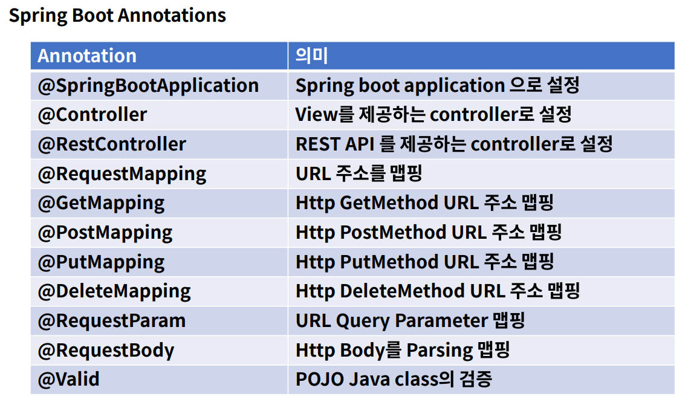

# 여러가지 Annotation 알아보기
- Spring에는 굉장히 많은 Annotation을 지원해준다.

- Controller : view resolver를 사용하는 Controller로 설정. response는 기본적으로 html로 지정된다.
- RestController : 기본적으로 response는 Object Mapper를 통해서 Json 형태로 변경된다.
- RequestMapping은 원하는 http method를 지정해야하며, 지정하지 않을 시 모든 http method가 동작하게 된다.
- RequestMapping을 Http Method 별로 세분화 시킨 것이 GetMapping, PostMapping, PutMapping, DeleteMapping이 있다.

 

  

### TIP> @Bean 과 @Component의 차이
- Bean은 class에 붙일 수 없다. 
- Component로 클래스 단위로 Bean 등록
- Bean은 Method에서 붙일 수 있다. new로 생성하고 붙인다.
- @Configuration은 하나의 클래스에 여러 Bean이 등록된다.