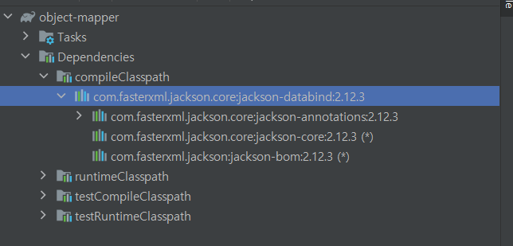
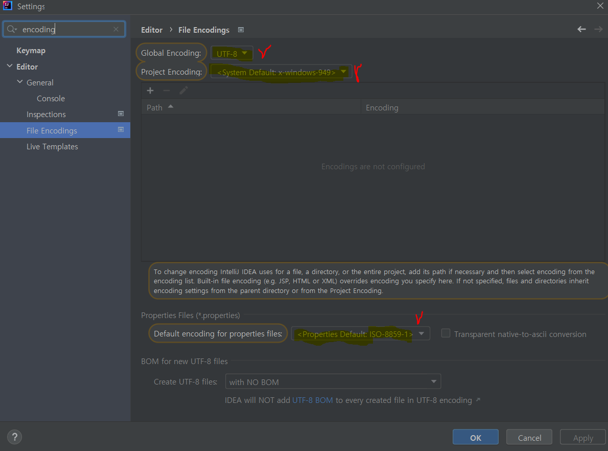
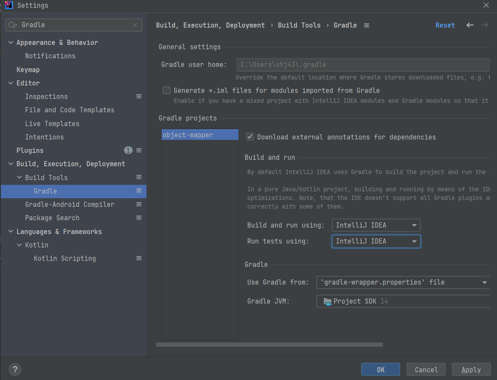

# Object Mapper
- 기존의 Object Mapper의 예제를 볼때 object를 Json으로, json을 Object로 변경했다.
- [Ch04_ObjectMapper](Ch04_ObjectMapper.md) : object Mapper 예제 요약
- [source_code](../../../response) : Source Code
- JSON 내부의 상태 변경, 값 확인을 위해 JSON Node 자체에 접근하여 제어해본다.

# Object Mapper 활용

## Poject Settings
- Spring Project 가 아닌 JAVA Project로 실습 진행
  - Object Mapper는 Spring framework에서 반드시 사용되는 것이 아닌 Spring 에서 사용하는 Java 라이브러리이다.
  - 자바에서 자주 사용하는 JSON 관련 라이브러리는 Object Mapper 외에도 구글에서 만든 GSON도 있다. 
  - Spring은 Object Mapper를 활용한다.
- Gradle Dependency를 사용할 것이기 때문에 Gradle-> JAVA 선택하여 프로젝트 생성
- Maven Repository의 Jackson Databind 라이브러리를 Import 하여 사용하겠다. (jackson.core를 사용하므로 Spring에서 사용하는 것과 동일하기 때문)
  - URL : https://mvnrepository.com/artifact/com.fasterxml.jackson.core/jackson-databind
  - 강의에서는 2.12.1 버전 사용하지만 지금은 2.13버전까지 나와있으므로 안정적이고 많이 사용하는 2.12.3버전을 사용하겠다.
  - Dependency 추가
```java
dependencies {
    // https://mvnrepository.com/artifact/com.fasterxml.jackson.core/jackson-databind
    implementation group: 'com.fasterxml.jackson.core', name: 'jackson-databind', version: '2.12.3'
}
```

- JAVA 프로젝트의 경우 lib 폴더를 생성하여 해당 폴더에 jar파일을 추가하여 Build 시키지만 Gradle, Maven을 이용하여 Project 생성시 Dependency로 추가하여 온라인에서 해당 라이브러리를 찾아서 추가할 수 있다.

<br>



<br><br>


## JSON DATA & Encoding

```json
{
  "name" : "hong",
  "age" : 10,
  "cars" : [
    {
      "name" : "k5",
      "car_number" :"11가 1111",
      "TYPE" : ""
    },{
      "name" : "Q5",
      "car_number" :"22가 1234",
      "TYPE" : ""
    }
  ]
}
```
- cars 를 배열로 만들어 리스트형태로 사용할 예정이다.
- 이때 특이점으로 TYPE은 대문자로 선언되었다.
- Windows Encoding은 기본 MS949이다. 이때 에러가 발생한다.
- <div style="color:red"><strong>error: unmappable character (0x80) for encoding x-windows-949Mst</strong></div>
- Settings - FileEncoding에서 MS949를 UTF-8로 변경한다.
- 
- Help -> Find Action -> edit custom VS Option -> 맨마지막에 -Dfile.encoding=UTF-8로 설정하면 파일을 UTF-8로 설정한다는 의미이다.
```
User{name='hong', age=10, cars=[Car{name='K5', carNumber='11媛� 1111', type='sedan'}, Car{name='Q5', carNumber='22媛� 1234', type='SUV'}]}
```
- 아직도 한글 깨짐 현상이 발생합니다. 



- Settings의 Gradle 탭 내용을 IntelliJ IDEA로 변경합니다.
```
User{name='hong', age=10, cars=[Car{name='K5', carNumber='11가 1111', type='sedan'}, Car{name='Q5', carNumber='22가 1234', type='SUV'}]}
```

- 한글 깨짐 해결!
- Spring Project에서는 기본적으로 UTF-8을 지원해줄 수 있지만 JAVA Project, 혹은 Spring에서 Encoding이 제대로 되어 있지 않은 경우 데이터를 받을 때 error가 발생하므로 Encoding을 정확히 맞추어 줘야 한다.
- JSON의 기본 Encoding은 UTF-8, MAC OS도 UTF-8 , Windows는 MS949가 기본값이므로 Windows를 사용할 때에는 반드시 유이한다.

<br><br>

## Object Mapper 실습
- JSON data에 맞게 DTO를 생성한다. (User.java , Car,java)
- JSON data가 정상적으로 Object로 변환되고, Object가 정상적으로 JSON Text로 변환되는지 확인한다.
### Main class
```java
public class Main {

    public static void main(String[] args) throws JsonProcessingException {
        System.out.println("main");

        ObjectMapper objectMapper=new ObjectMapper();

        User user=new User();
        user.setName("hong");
        user.setAge(10);

        Car car1=new Car();
        car1.setName("K5");
        car1.setCarNumber("11가 1111");
        car1.setType("sedan");

        Car car2=new Car();
        car2.setName("Q5");
        car2.setCarNumber("22가 1234");
        car2.setType("SUV");

        List<Car> carList= Arrays.asList(car1,car2);
        user.setCars(carList);

        System.out.println(user);

        String json=objectMapper.writeValueAsString(user);
        System.out.println(json);
    }
}
```

### Console 출력
```
main
User{name='hong', age=10, cars=[Car{name='K5', carNumber='11가 1111', type='sedan'}, Car{name='Q5', carNumber='22가 1234', type='SUV'}]}
{"name":"hong","age":10,"cars":[{"name":"K5","car_number":"11가 1111","TYPE":"sedan"},{"name":"Q5","car_number":"22가 1234","TYPE":"SUV"}]}
```
- JSON Validator를 검색하면 쉽게 온라인에서 JSON 데이터를 검사해볼 수 있다. INVALID일 시 유효하지 않은 JSON 데이터이므로 에러가 발생하지 않도록 조취를 취한다.
- JsonProperty Annotation을 활용하여 스네이크 케이스로 들어오는 car_number data를 받을 수 있도록 한다.

<br>

### Car class
```java
 @JsonProperty("car_number")
    private String carNumber;

    @JsonProperty("TYPE")
    private String type;

```
- JSON DATA로 변환시 정상적으로 변환되어 출력된다.

### Main
```java
public class Main {
    public static void main(String[] args) throws JsonProcessingException {
        
        // 생략
        
        String json=objectMapper.writeValueAsString(user);
        System.out.println(json);
    }
}
```
### Console 결과
```
{"name":"hong","age":10,"cars":[{"name":"K5","car_number":"11가 1111","TYPE":"sedan"},{"name":"Q5","car_number":"22가 1234","TYPE":"SUV"}]}
```

## JSON Parsing
- JSON Node를 이용한다. 만들어진 JSON Data를 확인하면 JSON Node로 User가 오고 그 안에 값으로 name, age, car 리스트가 올 수 있다.

### Main class
```java
    //json parsing
    JsonNode jsonNode=objectMapper.readTree(json);
    String _name=jsonNode.get("name").asText();
    int _age=jsonNode.get("age").asInt();
    System.out.println("name : "+_name);
    System.out.println("age : "+_age);
    
    String _list=jsonNode.get("cars").asText();
    System.out.println(_list);
```

### Console
```
name : hong
age : 10

```
- name과 age는 값을 찾아 (get) 각각의 형태로 정상 출력된다.  (asText(),asInt())
- cars는 정상 출력되지 않는 것을 볼 수 있다.
  - name과 age는 key:value 형태로 되어 있지만 Cars는 객체 배열로 cars는 배열의 jsonNode를 가져와야 한다. 
  
### Main
```java
    JsonNode cars=jsonNode.get("cars");
    ArrayNode arrayNode=(ArrayNode)cars;
    List<Car> _cars = objectMapper.convertValue(arrayNode, new TypeReference<List<Car>>() {}); 
    System.out.println(_cars);
```
- 배열의 JsonNode를 받을 것이므로 cars를 JSONNode로 찾은것을 ArrayNode로 변환한다.
- objectMapper.convertValue() : MAP을 객체로 바꾸는 등 여러가지 Object를 json이 아닌 클래스로 매핑시킬수 있다.
  - Typerefernece에는 받고자 하는 Generic Type을 넣는다.
  - 받고자 하는 Objeect 인 arrayNode를 받고, 원하는 List`<Car>` type으로 변환된다.
- 단 이렇게 사용할 시에 JSON의 형태(표준 스펙)를 미리 알고 있어야 한다.

### console 출력
```
[Car{name='K5', carNumber='11가 1111', type='sedan'}, Car{name='Q5', carNumber='22가 1234', type='SUV'}]
```

<br><br>

## JSON DATA 변경하기
- Object Mapper를 통해 JSON을 Parsing하게 되면 Json 안의 값을 변경할 수 있다.
- jsonNode class에서는 set을 할 수 없지만 ObjectNode class를 이용하면 각각의 노드에 대해 값을 변경할수 있도록 되어있다.
- objectNode의 put 메소드를 이용하여 값을 변경할 수 있다. set메소드도 있으며 사용법은 유사하나 set의 2번째 인자로 JsonNode를 할당한다는 차이가 있다.
- AOP, Filter, Interceptor등 Body 내용을 특정 값을 각각의 Node에 대해 변경시킬 때 에 활용가능하다.

### Main
```java
        ObjectNode objectNode=(ObjectNode) jsonNode;
        objectNode.put("name","steve");
        objectNode.put("age",20);

        System.out.println(objectNode.toPrettyString()); //json처럼 출력되도록 함
```
- toPrettyString() : json처럼 출력되도록 함

### Console
```
{
  "name" : "steve",
  "age" : 20,
  "cars" : [ {
    "name" : "K5",
    "car_number" : "11가 1111",
    "TYPE" : "sedan"
  }, {
    "name" : "Q5",
    "car_number" : "22가 1234",
    "TYPE" : "SUV"
  } ]
}
```
- 기존의 name 값 "hong" 이 "steve"로 변경되었다.
- 기존의 age 값 10이 20으로 변경되었다.