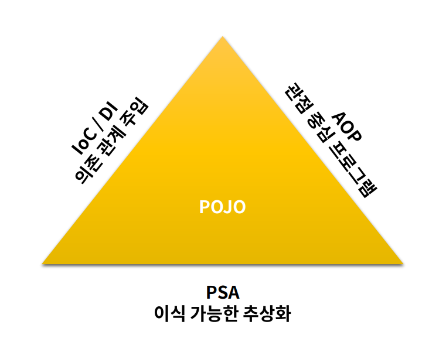

# Spring 핵심
## Spring
- spring framework 구성은 20가지로 구성(https://spring.io/projects/spring-framework)
- 이러한 모듈들은 스프링의 핵심기능 (DI,AOP 등)을 제공해주며, 필요한 모듈만 "선택"하여 사용 가능
- 여러가지 모듈 중 스프링 부트(web server 구동할 때), 스프링 클라우드, 스프링 데이터(jdbc,mybatis,jpa를 사용할 때), 스프링 배치(데이터를 모아서 대용량 처리를 할때), 스프링 시큐리티(권한 관련)에 중점을 둔다.
- 현재 단일 아키텍처(모놀리스) 마이크로 서비스 아키텍처로 변환중
- spring의 과제는 "테스트의 용이성", "느슨한 결합"에 중점을 두고 개발
- 2000년대 초의 Java EE 애플리케이션은 느슨한 결합이 된 애플리케이션 개발이 힘든 상태였고, DB와 같이 외부에 의존성을 두는 경우 단위테스트가 불가능했다.
- 스피링이 다른 프레임워크와 가장 큰 차이점은 IOC를 통한 개발을 진행한다는 것이다.
- Spring은 AOP를 사용하여 로깅,트랜잭션 관리, 시큐리티에서의 적용 등 AspectJ와 같이 완벽하게 구현된 AOP와 통합하여 사용가능하다.

  

## spring 삼각형

- 가운데 POJO 객체를 두고 의존관계 주입, AOP, PSA로 둘러싼 spring 삼각형이 spring의 특징을 가장 잘 나타내준다!
- cf) PSA : class를 추상적으로 잘 작성했는가 , interface가 다른 곳에서 잘 활용되는가 , 기능의 변화가 될 때 핵심기능을 건들이지 않고 추상화된 부분만 변경되도록 잘 작성했는가를 고려한다.