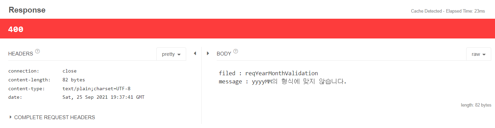
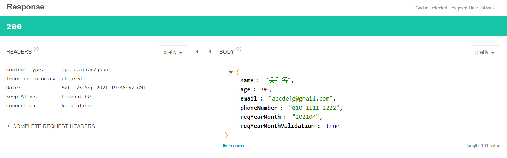
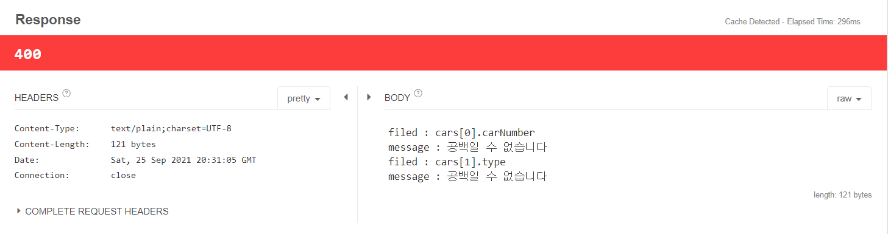

# Custom Validation
- Spring에서 제공하는 Validation 외에 Custom Validation을 만들 수 있다.
- request 뿐만 아니라 DTO 객체에 대해서도 cutom validation을 통해 validation 할 수 있다.
- AssertTrue / False와 같은 method 지정을 통해서 Custom Login 적용 가능하다.
- CustomValidator를 적용하여 재사용이 가능한 Custom Logic 적용 가능하다.
- 가장 대표적인 예로 날짜가 있다.

## Custom Validation 실습
- 이전 실습과 이어서 진행된다.
- [Chapter06_SpringBootValidation](Ch06_SpringBootValidation.md)

### User class 추가
```java
    // 이외 생략
    @Size(min = 6,max = 6)
    private String reqYearMonth; // yyyyMM

    public String getReqYearMonth() {
        return reqYearMonth;
    }

    public void setReqYearMonth(String reqYearMonth) {
        this.reqYearMonth = reqYearMonth;
    }

    @Override
    public String toString() {
        return "User{" +
                "name='" + name + '\'' +
                ", age=" + age +
                ", email='" + email + '\'' +
                ", phoneNumber='" + phoneNumber + '\'' +
                ", reqYearMonth='" + reqYearMonth + '\'' +
                '}';
    }
```

### JSON Data
```json
{
  "name" :"홍길동",
  "age" :90,
  "email":"abcdefg@gmail.com",
  "phoneNumber":"010-1111-2222",
  "reqYearMonth" :"999999"
}
```
- 999999는 유효하지 않은 값이지만 정상 출력된다. ( 상태 코드 : 200 )

<br>

## Custom Validation 추가
### User Class
```java
@AssertTrue(message = "yyyyMM의 형식에 맞지 않습니다.")
    public boolean isReqYearMonthValidation(){ 
        try{
            LocalDate localDate=LocalDate.parse(getReqYearMonth()+"01", DateTimeFormatter.ofPattern("yyyyMMdd"));
        }catch (Exception e){
            return false;
        }
        return true; // ture면 정상, false면 parsing이 제대로 안된것
    }
```
- isReqYearMonthValidation() : boolean을 리턴하도록 is를 붙여서 method이름을 작성해야 정상적으로 찾아 들어온다.
- AssertTrue Validation을 사용하는 Method는 is로 시작하는 Method를 만들어야 한다.
- @AssertTrue(message = "yyyyMM의 형식에 맞지 않습니다.") : AssertTrue도 마찬가지로 messege 속성을 지정할 수 있다.
- this.reqYearMonth = getReqYearMonth()+"01" : 기본적으로 LocalDate이기 때문에 yyyyMMdd의 형태로 들어가기 때문에 전처리가 필요하다.
- 단 위의 코드를 추가하고, LocalDate.parse(this.reqYearMonth, DateTimeFormatter.ofPattern("yyyyMMdd")) 을 하게 되면 this.reqYearMonth 값을 직접 변경하게 되므로 @MAX Validation에서 max 6 을 넘어가기 때문에 유효하지 않은 값이 된다.

<br>

### Response 
- 부적절한 데이터 ("reqYearMonth":"999999")



- 올바른 데이터 ("reqYearMonth":"202104")



- Custom Valid는 재사용이 불가능하다. 
- 다른 DTO에서도 동일한 Custom Validation을 사용한다면 코드의 중복이 발생한다.
- Annotation을 생성하여 이를 해결할 수 있다.

<br>

## CustomValidator를 통한 재사용 가능한 Annotation 생성

### YearMonth Annoation (기본 Annoation 틀)
```java
import javax.validation.Constraint;
import javax.validation.Payload;
import java.lang.annotation.Retention;
import java.lang.annotation.Target;

import static java.lang.annotation.ElementType.*;
import static java.lang.annotation.ElementType.TYPE_USE;
import static java.lang.annotation.RetentionPolicy.RUNTIME;

@Constraint(validatedBy = { })
@Target({ METHOD, FIELD, ANNOTATION_TYPE, CONSTRUCTOR, PARAMETER, TYPE_USE })
@Retention(RUNTIME)
public @interface YearMonth {
    String message() default "{javax.validation.constraints.Email.message}";

    Class<?>[] groups() default { };

    Class<? extends Payload>[] payload() default { };

    String pattern(); //regexp() 대신 - 기존 : 정규표현식
}
```

<br>

### defalut 패턴 등록, defalut message 등록

```java
public @interface YearMonth {
    String message() default "yyyyMM 형식에 맞지 않습니다.";

    Class<?>[] groups() default { };

    Class<? extends Payload>[] payload() default { };

    String pattern() default "yyyyMM"; //값을 넣지 않는다면 deafault로 설정
}
```

### User Class 추가
```java
    @YearMonth
    private String reqYearMonth;
```

### YearMonthValidator class
```java
public class YearMonthValidator implements ConstraintValidator<YearMonth,String> {
    private String pattern;

    @Override
    public void initialize(YearMonth constraintAnnotation) {
        this.pattern=constraintAnnotation.pattern();
    }

    @Override
    public boolean isValid(String value, ConstraintValidatorContext context) {
        //yyyyMM01
        try{
            LocalDate localDate=LocalDate.parse(value+"01", DateTimeFormatter.ofPattern("yyyyMMdd"));
        }catch (Exception e){
            return false;
        }
        return true;
    }
}
```
- ConstraintValidator<`YearMonth,String`> : 첫번째 인자에 원하는 Annoation 지정, 두번째 인자에 들어갈 값의 타입 지정

### User Class
```java
@Constraint(validatedBy = {YearMonthValidator.class}) 
```
- YearMonthValidator class를 통해 검사가 일어난다.
- @AssertTrue와 똑같이 동작하지만 @AssertTrue는 Annotation을 사용한 특정 클래스 내에서만 사용할 수 있다.
- 반면에 Custom Annotation을 만들면 여러 클래스에서 재사용할 수 있다.

<br>

## @Valid를 통한 class 안의 객체 Validation 지정

### 잘못된 JSON DATA 
```json
{
  "name" : "hong",
  "age" : 10,
  "cars" : [
    {
      "name" : "k5",
      "car_number" :"",
      "TYPE" : "sedan"
    },{
      "name" : "Q5",
      "car_number" :"22가 1234",
      "TYPE" : ""
    }
  ]
}
```
### User2 class
```java
public class User {
    @NotBlank
    private String name;

    @Max(value = 90)
    private int age;

    @Valid
    private List<Car> cars;

    public List<Car> getCars() {
        return cars;
    }

    public void setCars(List<Car> cars) {
        this.cars = cars;
    }

    //생략
}
``` 

### Car class
```java
@NotBlank
    private String name;

    @NotBlank
    @JsonProperty("car_number")
    private String carNumber;

    @NotBlank
    @JsonProperty("TYPE")
    private String type;
```
- name, age, cars 3가지 필드를 갖는다.
- class 안에 다른 객체가 있다면 @Valid를 붙여야 해당 객체의 Validation을 정상 실행한다.
- @Valid : Car class 안에 Validation이 설정되어 있더라도 이 클래스의 cars를 Validation 한다면 꼭 @Valid를 붙여야 한다.

<br>

### console
```
field : cars[0].carNumber
공백일 수 없습니다
field : cars[1].type
공백일 수 없습니다
```

### Response (Talend API Teseter)

