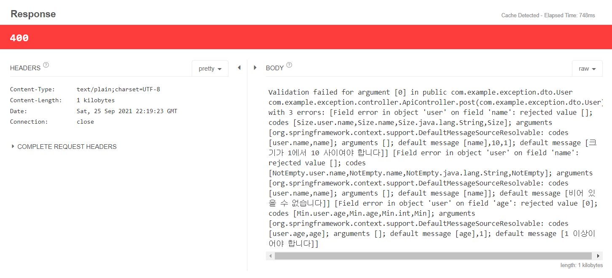

# Spring Boot Exception 처리
- Web Application의 입장에서 에러가 났을 때 내려줄 수 있는 방법 (딱히 많지 않다.)
1. 에러 페이지
2. 4XX Error 또는 5XX Error
3. Client가 200 외에 처리를 하지 못할 때는 200을 내려주고 별도의 에러 Message 전달

- try-catch로 묶는 것보다 throws로 Exception을 던져서 한번에 묶어서 처리하는 것이 효과적이다.
- Spring에서는 예외 처리하는 Annotation을 지원한다.


- ControllerAdvice (RestControllerAdvice) : paging 처리하는 view Resolver가 들어있는 쪽의 controllerAdvice는 view resolver(white label page) 등 에러페이지를 global하게 처리할 수 있다.
- ExceptionHandler : 특정 Controller의 예외를 catch하도록 하여 처리할 수 있다.

## Exception 처리하기
- Error 발생시 Client에서는 400,500 등 상태 코드를 통해 문제가 발생했음을 알 수 있다.
- 하지만 어떠한 Exception인지 Client의 문제인지 Server의 문제인지 외에 구체적으로 알 수 없다.

### JSON Data
```json
{
  "name":"",
  "age":0
}
```

### User class
```java

public class User {
    @NotEmpty
    @Size(min = 1,max = 10)
    private String name;

    @Min(1)
    @NotNull
    private Integer age;

    //getter setter 생략
}
```

### ApiContoller class
```java
@RestController
@RequestMapping("/api/user")
public class ApiController {

    @GetMapping("")
    public User get(@RequestParam(required = false) String name,@RequestParam(required = false) Integer age){
        user.setName(name);
        user.setAge(age);

        int a=10+age; // NullPointException 발생 
        return user;
    }

    @PostMapping("")
    public User post(@Valid @RequestBody User user){
        System.out.println(user);
        return user;
    }
}
```
- @RequestParam(required = false) Integer age) :
required=false는 해당 request param이 없어도 동작하지만 해당 내용은 null이 된다.

### GlobalControllerAdvice class
```java

@RestControllerAdvice
public class GlobalControllerAdvice {
    @ExceptionHandler(value = Exception.class)
    public ResponseEntity exception(Exception e){
        System.out.println(e.getClass().getName());
        System.out.println("-------------------");
        System.out.println(e.getLocalizedMessage());
        System.out.println("-------------------");
        return ResponseEntity.status(HttpStatus.INTERNAL_SERVER_ERROR).body("");
    }

}
```

### Console 
```
-------------------
org.springframework.web.bind.MethodArgumentNotValidException
-------------------
Validation failed for argument [0] in public com.example.exception.dto.User com.example.exception.controller.ApiController.post(com.example.exception.dto.User) with 3 errors: [Field error in object 'user' on field 'name': rejected value []; codes [Size.user.name,Size.name,Size.java.lang.String,Size]; arguments [org.springframework.context.support.DefaultMessageSourceResolvable: codes [user.name,name]; arguments []; default message [name],10,1]; default message [크기가 1에서 10 사이여야 합니다]] [Field error in object 'user' on field 'age': rejected value [0]; codes [Min.user.age,Min.age,Min.int,Min]; arguments [org.springframework.context.support.DefaultMessageSourceResolvable: codes [user.age,age]; arguments []; default message [age],1]; default message [1 이상이어야 합니다]] [Field error in object 'user' on field 'name': rejected value []; codes [NotEmpty.user.name,NotEmpty.name,NotEmpty.java.lang.String,NotEmpty]; arguments [org.springframework.context.support.DefaultMessageSourceResolvable: codes [user.name,name]; arguments []; default message [name]]; default message [비어 있을 수 없습니다]] 
-------------------

-------------------
```
- 짝대기 안에 있는 내가 만든 에러 출력!
- MethodArgumentNotValidException 발생

### GlobalControllerAdvice class 추가
- 발생한 예외 MethodArgumentNotValidException를 처리한다.
- Client 요청에 따른 응답을 Talend API Tester로 확인 가능하게 된다.
- console에 예외가 출력되지 않게 된다.
```java 
    @ExceptionHandler(value = MethodArgumentNotValidException.class)
    public ResponseEntity methodArgumentNotValidException(MethodArgumentNotValidException e){
        return ResponseEntity.status(HttpStatus.BAD_REQUEST).body(e.getMessage());
    }
```
-  @ExceptionHandler(value = MethodArgumentNotValidException.class) : 특정 메소드의 global 예외를 catch한다.
### Response (Talend API Tester)



- @RestControllerAdvice(basePackages = "com.example.exception.controller") 처럼 basePackages 속성을 추가하여 지정한 basePackages 하위 모든 에러를 catch하도록 설정할 수 있다.
- @RestControllerAdvice 는 여러 Contoller가 추가되더라도 특정 클래스가 아닌 global하게 추가될 수 있다.
- 여러 Contoller가 아닌 특정 Controller에서 동작하게 하려면 @ExceptionHandler 에 해당하는 내용을 원하는 위치에서 사용하면 된다.

### ApiController class( 이 class에서만 사용하고 싶은 예외라면)
```java
@RestController
@RequestMapping("/api/user")
public class ApiController {
    // 생략

    @ExceptionHandler(value = MethodArgumentNotValidException.class)
    public ResponseEntity methodArgumentNotValidException(MethodArgumentNotValidException e){
        System.out.println("api controller");
        return ResponseEntity.status(HttpStatus.BAD_REQUEST).body(e.getMessage());
    }
}
```

### Console
```
api controller
```
- GlobalControllerAdvice에 동일한 Exception에 대한 처리가 들어가 있더라도 우선순위는 controller에 지정한 ExcetionHandler가 높다.
