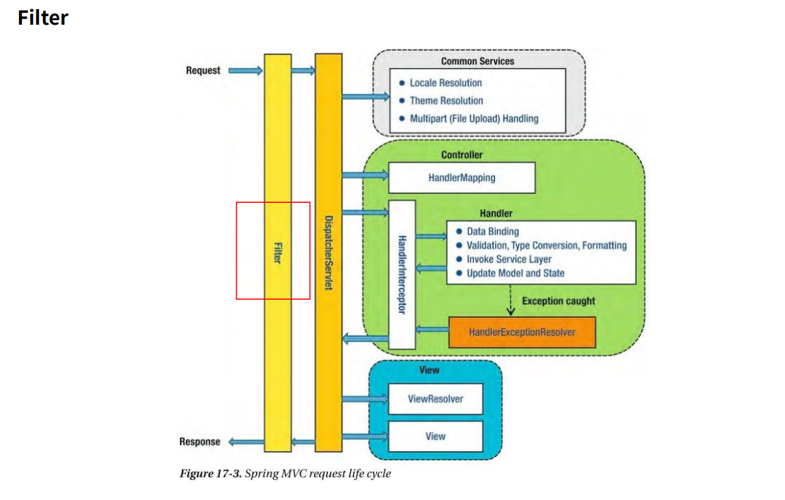
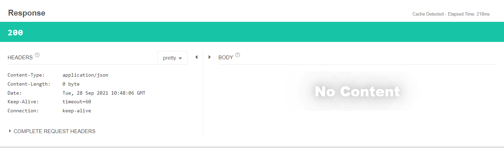
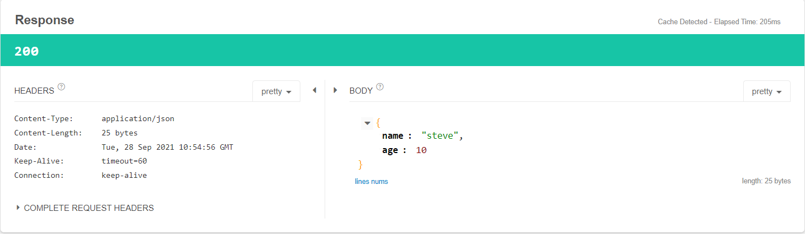

# Filter
- Filter란 Web Application에서 관리되는 영역으로써 Spring Boot Framework에서 Client로부터 오는 요청/응답에 대해서 최초/최종 단계의 위치에 존재하며, 이를 통해서 요청/응답의 정보를 변경하거나, Spring에 의해서 데이터가 변환되기 전의 순수한 Client의 요청/응답 값을 확인할 수 있다.
- 유일하게 ServletRequest,ServletResponse의 객체를 반환할 수 있다.
- 주로 Spring Framework에서는 request/response의 Logging 용도(백오피스, admin에서 모든 요청의 기록에 대해 AOP등에서는 객체로 매핑한 상태이기 때문에 순수한 상태가 아니다) 로 활용하거나 인증(interceptor를 타기전에 session의 유무를 보고 reject등을 발생시킬 수 있다) 과 관련된 Logic들을 해당 Filter에서 처리한다.
- 이를 선/후 처리함으로써 Service Business Logic과 분리시킨다.



- Filter는 제일 앞단에 존재
- AOP는 HandlerInterceptor 뒤에 Handler로 보내지는 타이밍에 동작하게 된다.
- Fiter -> Interceptor -> AOP 순으로 진행
  
  <br><br>

## lombok
- 이번 실습에서는 lombok을 사용한다.
- lombok을 사용하면 getter,setter,toString,생성자 등 다양한 메소드에 대한 메소드 오버라이드를 지원하여 편리하게 활용 가능하다.


### build.gradle
```
dependencies {
	implementation 'org.springframework.boot:spring-boot-starter-web'
	compileOnly 'org.projectlombok:lombok'
	annotationProcessor 'org.projectlombok:lombok'
	testImplementation 'org.springframework.boot:spring-boot-starter-test'
}
```
- compileOnly : 컴파일 시에 같이 실행되는 형식으로 lombok을 사용한다. 프로그램이 직접 실행될 때 사용할 필요 없다.
- annotationProcessor : comile시 같이 동작하여 lombok을 사용할 수 있게 해준다.

### User class
```java
@Data 
@NoArgsConstructor
@AllArgsConstructor
public class User {
    private String name;
    private int age;
}
```
- @Getter : 멤버 변수에 대해 getter를 만들어준다
- @Setter : 멤버 변수에 대해 setter를 만들어준다
- @Data :getter,setter를 포함해서 equals,hashcode,toString 등 모두 관리해준다.
- @NoArgsConstructor : 기본 생성자 생성
- @AllArgsConstructor : 전체 Argument를 받는 생성자 

<br><br>

- 지금까지 Systm.out.println 으로 로그를 남겼지만 Sprnig에서 logging을 할때 lombok을 사용하면 @Slf4j 를 추가할 수 있고 이를 통해 log를 사용할 수 있다.

### 예시
```java
@Slf4j
@RestController
@RequestMapping("/api/user")
public class ApiController {

    @PostMapping("")
    public User user(@RequestBody User user){
        log.info("User : {}",user);
        return user;
    }

}
```
- log.info("User : {}, {}",user,user); 처럼 사용할 때 {}의 내용은 뒤에 오는 user와 매칭된다.

<br><br>

## Filter에서 Request Body가 순수한 상태로 기록되는 예제
- lombok을 사용한 User.java 와 ApiController를 함께 사용한다.

### 
```java

@Slf4j
@Component //Spring에 의해 Bean으로 관리
public class GlobalFilter implements Filter {
    @Override
    public void doFilter(ServletRequest request, ServletResponse response, FilterChain chain) throws IOException, ServletException {
        //전처리
        HttpServletRequest httpServletRequest=(HttpServletRequest)request;
        HttpServletResponse httpServletResponse=(HttpServletResponse)response;

        String url=httpServletRequest.getRequestURI();
        BufferedReader br = httpServletRequest.getReader();
        br.lines().forEach(line->{
            log.info("url : {} , line : {} ",url,line);
        });

        //기준
        chain.doFilter(httpServletRequest,httpServletResponse);

        //후처리
    }
}
```
- chain.doFilter(httpServletRequest,httpServletResponse) 를 기준으로 전의 로직은 전처리, 후의 로직은 후처리를 담당한다.

<br>

### 요청 : `http://localhost:8080/api/user`

### JSON
```json
{
  "name":"steve",
  "age":10
}
```

### Console 결과
```
2021-09-28 17:41:09.558  INFO 24872 --- [nio-8080-exec-1] com.example.filter.filter.GlobalFilter   : url : /api/user , line : { 
2021-09-28 17:41:09.560  INFO 24872 --- [nio-8080-exec-1] com.example.filter.filter.GlobalFilter   : url : /api/user , line :   "name":"steve", 
2021-09-28 17:41:09.560  INFO 24872 --- [nio-8080-exec-1] com.example.filter.filter.GlobalFilter   : url : /api/user , line :   "age":10 
2021-09-28 17:41:09.560  INFO 24872 --- [nio-8080-exec-1] com.example.filter.filter.GlobalFilter   : url : /api/user , line : } 
```
- url과 line이 정상 출력되는 것을 확인할 수 있다.
- 하지만 java.lang.IllegalStateException 예외가 발생한다.
  - BufferedReader를 사용하면서 lambda 함수에서 Reqeueest로 온 내용을 cursor 단위로 모두 읽은 상태가 되었다.
  - 전처리 후 메인 logic , 즉 Controller의 user() 메소드가 실행될 때 매개변수로 받는 RequestBody에서 모두 읽은 상태로 들어오기 때문에 더이상 읽을 수 없는 상태가 되었고 이로 인해 예외가 발생한 것이다.
  - read로 한번 읽으면 더이상 읽을 수 없는 문제이기 때문에 이를 해결하기 위해 Readable, Cashable 를 상속받기도 하지만 Spring에서는 캐싱을 할 수 있는 ContentCachingRequestWrapper,ContentCachingResponseWrapper를 제공한다.


<br><br>

### GlobalFilter class 수정
```java
@Slf4j
@Component 
public class GlobalFilter implements Filter {
    @Override
    public void doFilter(ServletRequest request, ServletResponse response, FilterChain chain) throws IOException, ServletException {
        //전처리
        ContentCachingRequestWrapper httpServletRequest=new ContentCachingRequestWrapper((HttpServletRequest)request);
        ContentCachingResponseWrapper httpServletResponse=new ContentCachingResponseWrapper((HttpServletResponse)response);

        //기준
        chain.doFilter(httpServletRequest,httpServletResponse);

        //후처리
        String url=httpServletRequest.getRequestURI();
        String reqContent = new String(httpServletRequest.getContentAsByteArray());
        log.info("reqeust");
        String resContent=new String(httpServletResponse.getContentAsByteArray());
        int httpStatus=httpServletResponse.getStatus();

        log.info("response status : {} , responseBody : {}",httpStatus,reqContent);

    }
}

```
- ContentCachingRequestWrapper, ContentCachingResponseWrapper를 사용하여 길이는 캐시했지만 안의 내용은 복사해놓지 않은 상황이다. -> 후처리에서 처리해야 한다.
- ContentCachingRequestWrapper에 구현된 writeToCahce() 가 호출되어야  cashedContent에 담긴다.
- doFilter 이후에 호출되어야 내용을 읽을 수 있으므로 후처리에서 내용을 읽도록 로직을 수정한다.


### Console 결과
```
2021-09-28 19:48:06.729  INFO 31708 --- [nio-8080-exec-1] c.e.filter.cotroller.ApiController       : User : User(name=steve, age=10)
2021-09-28 19:48:06.756  INFO 31708 --- [nio-8080-exec-1] com.example.filter.filter.GlobalFilter   : reqeust
2021-09-28 19:48:06.756  INFO 31708 --- [nio-8080-exec-1] com.example.filter.filter.GlobalFilter   : response status : 200 , responseBody : {
  "name":"steve",
  "age":10
```
- 에러 없이 정상적으로 출력된다.




- 이 또한 ResponseBody를 이미 읽었으므로 Client에서 보여지지 않는다.
- ResponseBody를 복제하여 보여지도록 수정한다.

<br><br>

### GlobalFilter class
```java
    httpServletResponse.copyBodyToResponse(); 
```


### Response 



- Filter에서 Request와 Response를 읽고자 한다면 ContentCachingRequestWrapper, ContentCachingResponseWrapper class를 사용하고 doFilter 후에 Response 를 copyBodyToResponse()메소드로 복사해야 Client에서 정상적으로 응답을 받을 수 있다.

<br><br>

## 특정 부분에만 Filter 적용하기
- 특정 Class, 특정 Conotroller에 적용시키고 싶을때 urlPattern을 지정하여 사용한다.

### ApiUserController class
```java
@Slf4j
@RestController
@RequestMapping("/api/temp")
public class ApiUserController {

    @PostMapping("")
    public User user(@RequestBody User user){
        log.info("Temp : {}",user);
        return user;
    }
}
```

### GlobalFilter
```java
@Slf4j
@WebFilter(urlPatterns = "/api/user/*")
public class GlobalFilter implements Filter {
//생략
}
```
- @Component Annotation에서 WebFilter Annotation으로 변경
- @WebFilter의 urlPatterns에 /api/user/* 를 설정하여 api/user 하위 모든 요청에 Filter 적용


### Main - FilterApplication class
```java
@SpringBootApplication
@ServletComponentScan
public class FilterApplication {
    
}
```

- @ServletComponentScan Annotation 추가

### 요청 : `http://localhost:8080/api/user`

### Console 결과
```
021-09-28 22:46:03.817  INFO 14728 --- [nio-8080-exec-1] c.e.filter.cotroller.ApiController       : User : User(name=steve, age=10)
2021-09-28 22:46:03.848  INFO 14728 --- [nio-8080-exec-1] com.example.filter.filter.GlobalFilter   : reqeust
2021-09-28 22:46:03.850  INFO 14728 --- [nio-8080-exec-1] com.example.filter.filter.GlobalFilter   : response status : 200 , responseBody : {
  "name":"steve",
  "age":10
}
```

<br><br>

### 요청 : `http://localhost:8080/api/temp`

### Console 결과
```
2021-09-28 22:46:11.167  INFO 14728 --- [nio-8080-exec-2] c.e.filter.cotroller.ApiUserController   : Temp : User(name=steve, age=10)
```