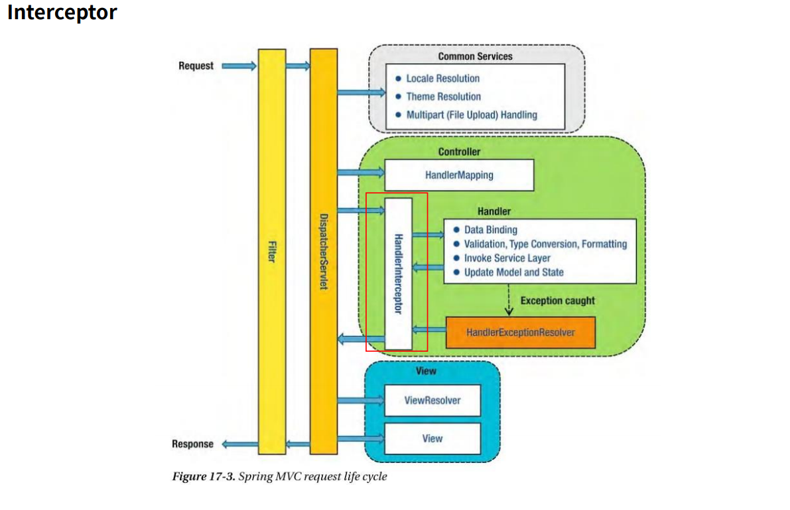
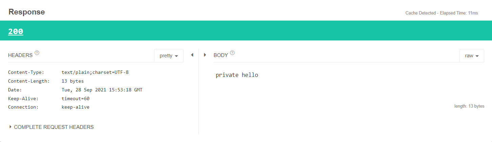
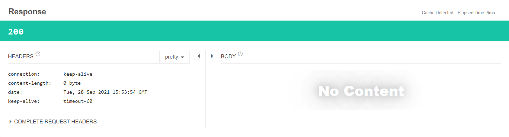
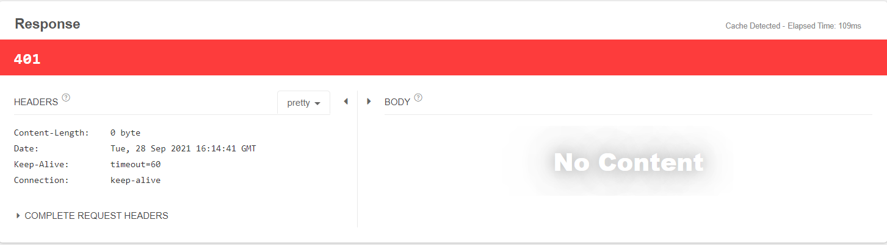

# Interceptor

- Interceptor란 Filter와 매우 유사한 형태로 존재하지만, 차이점은 Spring Context에 등록된다.
- Spring Context에 등록되어 Spring 기능을 활용할 수 있으며 이미 Controller 매핑이 이루어져 있기 때문에 다음에 사용하는 메소드의 정보도 알 수 있다.
  - Filter는 Web Application에 등록되기 때문에 Spring Context에 해당하는 부분은 사용할 수 없다.
- AOP와 유사한 기능을 제공할 수 있으며, 주로 인증 단계를 처리하거나 Logging 하는 데에 사용한다. 
- 이를 선/후 처리함으로써 Service Business Logic과 분리시킨다.



- DispatcherServlet을 지나 Controller와 같은 영역에 있다!
- 어떠한 Controller에 Handler Mapping이 되었는지 알 수 있기 때문에 Handler를 통해 권한을 확인해볼 수도 있다.
- Filter에서 전처리 과정을 통해 reqeust,response를 형변환하여 doFilter에 넣고 실습을 진행했었다.
- 지금은 Filter와 Interceptor 프로젝트 따로 만들어 구현하고 있지만 함께 사용할 때 doFilter에 변경한 것을 넣어주지 않으면 error가 발생한다.
- 그림을 보면 Filter에서 Request를 안쪽으로 넣어주는데, Filter에서 ContentCachingRequestWrapper 로 형변환을 하고 Interceptor로 넘겨준다면 형변환이 가능한데 ServletRequest로 넘겨주면 형변환이 불가능하다.

<br><br>

## Inteceptor 실습
- Interceptor에서 다음 Method,Controller에 @Auth Annotation이 붙어 있으면 session을 검사해서 있을때는 통과시키고 없을때는 통과시키지 않도록 구현해본다.

<br>

### PublicController class
- 모든 사용자가 사용할 수 있다
```java
@RestController
@RequestMapping("/api/public")
public class PublicController {
    @GetMapping("/hello")
    public String hello(){
        return "public hello";
    }
}
```

### PrivateController class
- 특정 사용자만 사용할 수 있다.
```java
@RestController
@RequestMapping("/api/private")
@Auth
@Slf4j
public class PrivateController {
    @GetMapping("/hello")
    public String hello(){
        log.info("log private hello");
        return "private hello";
    }
}
```

### Auth Annotation
```java
@Documented
@Retention(RetentionPolicy.RUNTIME)
@Target({ElementType.TYPE,ElementType.METHOD})
public @interface Auth {
}
```

### AuthInterceptor class - Interceptor
```java
@Slf4j
@Component
public class AuthInterceptor implements HandlerInterceptor {

    @Override
    public boolean preHandle(HttpServletRequest request, HttpServletResponse response, Object handler) throws Exception {

        String url=request.getRequestURI();

        log.info("request url : {}",url);
        boolean hasAnnotation = checkAnnotation(handler, Auth.class);
        log.info("has annotation : {}",hasAnnotation);
        return true; //false로 면 Interceptor 통과하지 못해서 Controller까지 들어갈 수 없다.
    }

    public boolean checkAnnotation(Object handler,Class clazz){

        //resource 에 대한 요청 : javascript, html etc..
        if(handler instanceof ResourceHttpRequestHandler){
            return true;
        }

        //anntation check
        HandlerMethod handlerMethod=(HandlerMethod) handler;
        if(handlerMethod.getMethodAnnotation(clazz)!=null || handlerMethod.getBeanType().getAnnotation(clazz)!=null){
            //Auth annotation이 있을 때는 true
            return true;
        }
        return false;
    }
}
```

### MVCConfig class
- inteceptor 등록하기
```java
@Configuration
@RequiredArgsConstructor
public class MVCConfig implements WebMvcConfigurer {

    //@Autowired : 순환 참조의 위험이 있기 때문에 생성자로 받는다.
     private final AuthInterceptor authInterceptor;

    @Override
    public void addInterceptors(InterceptorRegistry registry) {
        registry.addInterceptor(authInterceptor);
    }
}
```

### 요청 : `http://localhost:8080/api/private/hello`

### Console 결과
```
2021-09-29 00:35:08.193  INFO 15748 --- [nio-8080-exec-1] c.e.i.interceptor.AuthInterceptor        : request url : /api/private/hello
2021-09-29 00:35:08.196  INFO 15748 --- [nio-8080-exec-1] c.e.i.interceptor.AuthInterceptor        : has annotation : true
2021-09-29 00:35:08.203  INFO 15748 --- [nio-8080-exec-1] c.e.i.controller.PrivateController       : log private hello
```


### 요청 : `http://localhost:8080/api/public/hello`

### Console 결과
```
2021-09-29 00:35:21.513  INFO 15748 --- [nio-8080-exec-2] c.e.i.interceptor.AuthInterceptor        : request url : /api/public/hello
2021-09-29 00:35:21.513  INFO 15748 --- [nio-8080-exec-2] c.e.i.interceptor.AuthInterceptor        : has annotation : false
```

## 권한 체크 코드 추가하기
- 나의 서버는 모두 public으로 동작한다.
-  단, Auth 권한을 가진 요청에 대해서는 세션, 쿠키, RequestParam 등을 확인하는 정책을 사용하겠다.

### AuthInterceptor 코드 추가
```java
 @Override
    public boolean preHandle(HttpServletRequest request, HttpServletResponse response, Object handler) throws Exception {

        String url=request.getRequestURI();

        // request uri 를 통해 query param을 받아온다.
        URI uri = UriComponentsBuilder.fromUriString(request.getRequestURI()).query(request.getQueryString()).build().toUri();

        log.info("request url : {}",url);
        boolean hasAnnotation = checkAnnotation(handler, Auth.class);
        log.info("has annotation : {}",hasAnnotation);

        if(hasAnnotation){
            //권한체크
            String query=uri.getQuery();
            log.info("query : {}",query);
            if(query.equals("name=steve")){
                return true;
            }
            return false;
        }

        return true; 
    }
```

### 요청 : `http://localhost:8080/api/private/hello?name=steve`

### Console 결과
```
2021-09-29 00:53:18.349  INFO 32860 --- [nio-8080-exec-4] c.e.i.interceptor.AuthInterceptor        : request url : /api/private/hello
2021-09-29 00:53:18.349  INFO 32860 --- [nio-8080-exec-4] c.e.i.interceptor.AuthInterceptor        : has annotation : true
2021-09-29 00:53:18.349  INFO 32860 --- [nio-8080-exec-4] c.e.i.interceptor.AuthInterceptor        : query : name=steve
2021-09-29 00:53:18.350  INFO 32860 --- [nio-8080-exec-4] c.e.i.controller.PrivateController       : log private hello
```

### Response



<br><br>


### 요청 : `http://localhost:8080/api/private/hello?name=aaa`

### Console 결과

```
2021-09-29 00:53:54.506  INFO 32860 --- [nio-8080-exec-5] c.e.i.interceptor.AuthInterceptor        : request url : /api/private/hello
2021-09-29 00:53:54.506  INFO 32860 --- [nio-8080-exec-5] c.e.i.interceptor.AuthInterceptor        : has annotation : true
2021-09-29 00:53:54.506  INFO 32860 --- [nio-8080-exec-5] c.e.i.interceptor.AuthInterceptor        : query : name=aaa
```

### Response



- 정상 동작하지 않습니다! 이때 예외를 발생시켜 Client에게 알릴 수 있도록 처리해야 한다.

<br><br>

## 특정 URL 을 제외한 권한체크를 할 때

### MVCConfig class
```java
@Configuration
@RequiredArgsConstructor 
public class MVCConfig implements WebMvcConfigurer {

     private final AuthInterceptor authInterceptor;

    @Override
    public void addInterceptors(InterceptorRegistry registry) {
        registry.addInterceptor(authInterceptor).addPathPatterns("/api/private/*");
    }
}
```
- addPathPatterns 에 원하는 형식을 지정하여 api/private 하위의 내용들에 Interceptor를 설정했다.
- addPathPatterns("원하는 주소", "원하는 주소" , ...) 형태로 여러개 추가하여 작성할 수 있다.
- addPathPatterns와 상반되게 excludePathPatterns("제외하고 싶은 주소")를 작성하여 해당 주소는 Inteceptor 대상에서 제외시킬 수 있다.

<br>

### 요청 : `http://localhost:8080/api/public/hello?name=aaa`

### Console 
- Interceptor 동작하지 않는다. ( console 결과 없음. )

### 요청 : `http://localhost:8080/api/private/hello?name=aaa`

### Console 
```
2021-09-29 01:01:29.073  INFO 33804 --- [nio-8080-exec-3] c.e.i.interceptor.AuthInterceptor        : request url : /api/private/hello
2021-09-29 01:01:29.075  INFO 33804 --- [nio-8080-exec-3] c.e.i.interceptor.AuthInterceptor        : has annotation : true
2021-09-29 01:01:29.075  INFO 33804 --- [nio-8080-exec-3] c.e.i.interceptor.AuthInterceptor        : query : name=aaa
```
- method, url 매칭, class 에 Interceptor를 적용할 수 있지만 method에 적용하는 것은 유지보수가 힘드므로 추천하지 않는 방식이다.

<br><br>

### 예외 처리 추가하기
- steve가 아닐 경우 예외가 발생하도록 한다. (권한이 없는 경우)
  - Inteceptor 에서 권한이 없는 경우 Throw Exception
  - ExceptionHandler에서 예외에 따른 코드를 응답한다.

### AuthException class
```java
public class AuthException extends RuntimeException{
}
```
### GlobalExceptionHandler
```java
@RestControllerAdvice
public class  GlobalExceptionHandler {
    @ExceptionHandler(AuthException.class)
    public ResponseEntity authException(){
        return ResponseEntity.status(HttpStatus.UNAUTHORIZED).build();
    }
}
```
### AuthInterceptor class 
```java
    @Override
    public boolean preHandle(HttpServletRequest request, HttpServletResponse response, Object handler) throws Exception {
        
        //생략

        if(hasAnnotation){
            //권한체크
            String query=uri.getQuery();
            if(query.equals("name=steve")){
                return true;
            }
            //return false;
            throw new AuthException(); //throw로 변경
        }
        return true; 
    }
```

### 요청 : `http://localhost:8080/api/private/hello?name=aaa`

### Response 



<br><br>

## Inteceptor Config
- Interceptor 는 Spring Context에서 관리되고 있기 때문에 어떠한 Controller, class로 가는지 Annotation을 통해서도 제어가 가능하다.
- Interceptor는 여러가지가 있을 수 있다. 이때 순서대로 진행된다. 
- 이를 활용하여 인증의 과정도 단계 별로 진행할 수 있다.

### MVCConfig
```java
@Configuration
@RequiredArgsConstructor
public class MVCConfig implements WebMvcConfigurer {
     private final AuthInterceptor authInterceptor;

    @Override
    public void addInterceptors(InterceptorRegistry registry) {
        registry.addInterceptor(authInterceptor).addPathPatterns("/api/private/*");
        registry.addInterceptor(다음 Inteceptor);
    }
}
```