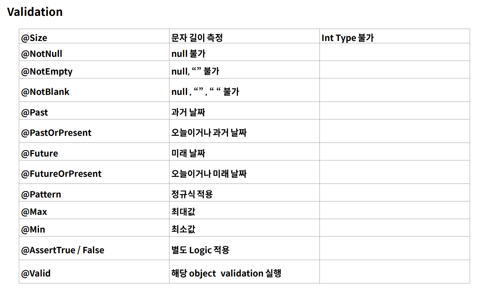
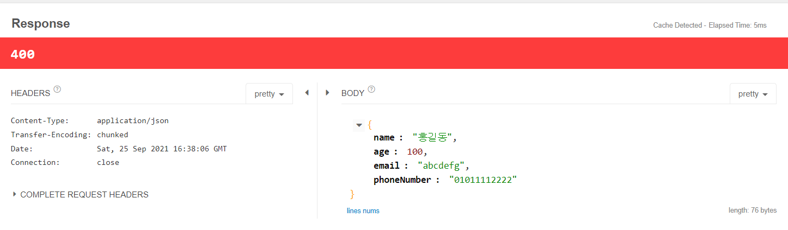
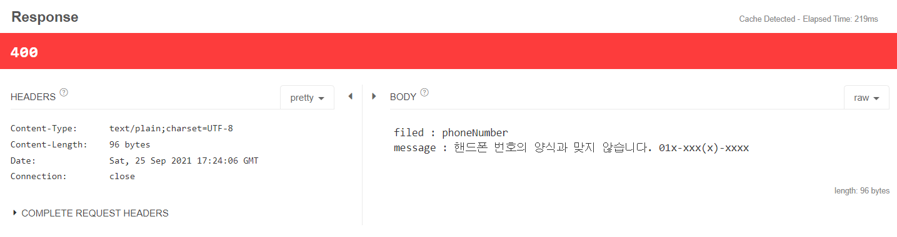
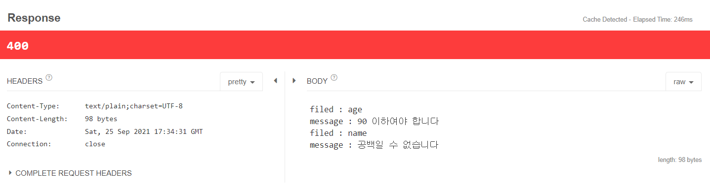

# Spring Boot Validation

## Validation
- JAVA에서는 null 값에 대해서 접근하려고 할때 NullPointerException이 발생하므로 이러한 부분을 방지하기 위해서 미리 검증하는 과정을 Validation이라고 합니다.
- 단순하게는 아래와 같은 코드들입니다.
```java
public void run(String account, String pw, int age)){
    if(account==null|| pw==null){
        return
    }
    if(age == 0) return

    //정상 logic
}
```
- 만약 위의 코드처럼 단순한 형태의 매개변수가 아닌 객체, 10개 이상의 데이터 등이 들어오게 된다면 반복되는 코드의 형태를 만들어야 합니다.
- 이 때 코드가 불필요하게 길어지고, 특정 기능을 수행하는 것이 아닌 Business Logic과 무관한 코드가 작성되는 경우가 발생합니다.
- 하지만 잘못된 input으로 전체적인 프로그램에 영향을 줄 수 있기 때문에 반드시 필요한 부분입니다.

<br>

## Validation을 사용하지 않았을 경우 발생하는 문제점

1. 검증해야 할 값이 많은 경우 코드의 길이가 길어진다.
2. 구현에 따라서 달라질 수 있지만 Service Logic과의 분리가 필요하다.
3. 흩어져 있는 경우 어디에서 검증을 하는지 알기 어려우며 재사용의 한계가 있다.
4. 구현에 따라 달라질 수 있지만 검증 Logic이 변경되는 경우 테스트 코드 등 참조하는 클래스에 Logic이 변경되어야 하는 부분이 발생할 수 있다.

## Validation Annotation
- Spring에서는 Annotation 기반으로 Validation을 지원한다.



- Size : 문자열 길이 판단, 만약 날짜를 받을때 년,월만 받고 싶다면 길이를 6으로 설정한다. (202106 처럼)
- NotNull은 null 불가, NotEmpty는 null과 빈문자열 모두 불가, NotBlank는 null,빈문자열,공백만 있는 문자열 모두 불가
- Pattern : 정규표현식 작성
- AssertTrue/False : custom Validation 설정을 위함


## Validation 실습
- gradle Dependency 추가
  - implementation("org.springframework.boot:spring-boot-starter-validation")
- bean validation spec ( Hibernate Validation 클릭 )
  - https://beanvalidation.org/2.0-jsr380/
  - 제공되는 Annotation, Sample 등이 나와있다.

### JSON DATA
```json
{
  "name" :"홍길동",
  "age" :100,
  "email":"abcdefg",
  "phoneNumber":"01011112222"
}
```
- 다음과 같이 JSON data를 전송한다고 할때 email과 phoneNumber는 형식에 맞지 않는다. (잘못된 request)

<br>

## Annotation을 쓰지 않는 방식

### ApiController Class
```java
@RestController
@RequestMapping("/api")
public class ApiController {
    @PostMapping("/user")
    public ResponseEntity user(@RequestBody User user){
        System.out.println(user);

        if(user.getAge()>=90){
            return ResponseEntity.status(HttpStatus.BAD_REQUEST).body(user);
        }
        return ResponseEntity.ok(user);
    }
}
```
<br>

### Console
```
User{name='홍길동', age=100, email='abcdefg', phoneNumber='01011112222'}
```

### Response (Talend API Tester)
<br>



- 만약 가입시 data를 10개 이상 받는다면 굉장히 힘들어진다.

<br><br>

## Annotation을 사용하는 방식

### User class(DTO)
```java
public class User {
    private String name;
    private int age;

    @Email 
    private String email;

    @Pattern(regexp = "^\\d{2,3}-\\d{3,4}-\\d{4}$")
    private String phoneNumber;

    //생략
}
```
- @Email : email 양식에 맞지 않다면 에러 발생
- @Pattern(regexp = "^\\d{2,3}-\\d{3,4}-\\d{4}$") : 핸드폰 정규표현식과 맞지 않다면 에러발생

### ApiController class
```java
@RestController
@RequestMapping("/api")
public class ApiController {
    @PostMapping("/user")
    public ResponseEntity user(@Valid @RequestBody User user){ 
        System.out.println(user);

        if(user.getAge()>=90){
            return ResponseEntity.status(HttpStatus.BAD_REQUEST).body(user);
        }
        return ResponseEntity.ok(user);
    }
}
```
- @Valid : 객체에 Validation이 필요할때 붙여서 사용, 헤당 객체 안의 Validation에 해당하는 Annotation을 검사한다.

<br>

```
.w.s.m.s.DefaultHandlerExceptionResolver : Resolved [org.springframework.web.bind.MethodArgumentNotValidException: Validation failed for argument [0] in public org.springframework.http.ResponseEntity com.example.validation.controller.ApiController.user(com.example.validation.dto.User): [Field error in object 'user' on field 'email': rejected value [abcdefg]; codes [Email.user.email,Email.email,Email.java.lang.String,Email]; arguments [org.springframework.context.support.DefaultMessageSourceResolvable: codes [user.email,email]; arguments []; default message [email],[Ljavax.validation.constraints.Pattern$Flag;@67815e5,.*]; default message [올바른 형식의 이메일 주소여야 합니다]] ]
```
- 위의 Exception은 'email': rejected value [abcdefg];, email의 value가 올바르지 않기 때문에 발생했다.

<br>

```
 .w.s.m.s.DefaultHandlerExceptionResolver : Resolved [org.springframework.web.bind.MethodArgumentNotValidException: Validation failed for argument [0] in public org.springframework.http.ResponseEntity com.example.validation.controller.ApiController.user(com.example.validation.dto.User): [Field error in object 'user' on field 'phoneNumber': rejected value [01011112222]; codes [Pattern.user.phoneNumber,Pattern.phoneNumber,Pattern.java.lang.String,Pattern]; arguments [org.springframework.context.support.DefaultMessageSourceResolvable: codes [user.phoneNumber,phoneNumber]; arguments []; default message [phoneNumber],[Ljavax.validation.constraints.Pattern$Flag;@3c40bb9f,^\d{2,3}-\d{3,4}-\d{4}$]; default message ["^\d{2,3}-\d{3,4}-\d{4}$"와 일치해야 합니다]] ]
```
- 위의 Exception은 'phoneNumber': rejected value [01011112222];, phoneNumber의 value가 정규표현식과 일치하지 않기 때문에 발생했다.

<br>

### 올바른 JSON 입력
```json
{
  "name" :"홍길동",
  "age" :10,
  "email":"abcdefg@gmail.com",
  "phoneNumber":"010-1111-2222"
}
```
### console 결과
```
User{name='홍길동', age=10, email='abcdefg@gmail.com', phoneNumber='010-1111-2222'}
```
- 이후 다음과 같이 Validation한 결과를 Exception 처리할 수 있다.
- 이번 예제에서는 BindingResult를 활용하여 응답의 코드를 리턴한다.
 
<br><br>

## BindingResult

### ApiController class
```java
    @PostMapping("/user")
    public ResponseEntity user(@Valid @RequestBody User user, BindingResult bindingResult){
        if(bindingResult.hasErrors()){
            StringBuilder sb=new StringBuilder();
            bindingResult.getAllErrors().forEach(objectError -> {
                FieldError field=(FieldError) objectError;
                String message=objectError.getDefaultMessage();

                System.out.println("field : "+field.getField());
                System.out.println(message);

                sb.append("filed : "+field.getField()+"\n");
                sb.append("message : "+message);

            });

            return ResponseEntity.status(HttpStatus.BAD_REQUEST).body(sb.toString());
        }
```
- BindingResult : valid의 결과를 받는다.

### User class
```java
     @Pattern(regexp = "^\\d{2,3}-\\d{3,4}-\\d{4}$",message = "핸드폰 번호의 양식과 맞지 않습니다. 01x-xxx(x)-xxxx")
    private String phoneNumber;
```
- message 속성을 변경하여 error 메세지 출력의 Default 값을 변경할 수 있다.

<br>

### console
```
field : phoneNumber
핸드폰 번호의 양식과 맞지 않습니다. 01x-xxx(x)-xxxx
```

### Response (Talend API Tester)
<br>



## NotBlank & Max
### User class
```java
    @NotBlank
    private String name;

    @Max(value = 90)
    private int age;
```
- 앞선 phoneNumber와 마찬가지로 default message를 message 속성을 이용하여 변경할 수 있다.


<br>

### console
```
field : age
90 이하여야 합니다
field : name
공백일 수 없습니다
```

### Response (Talend API Tester)
<br>




