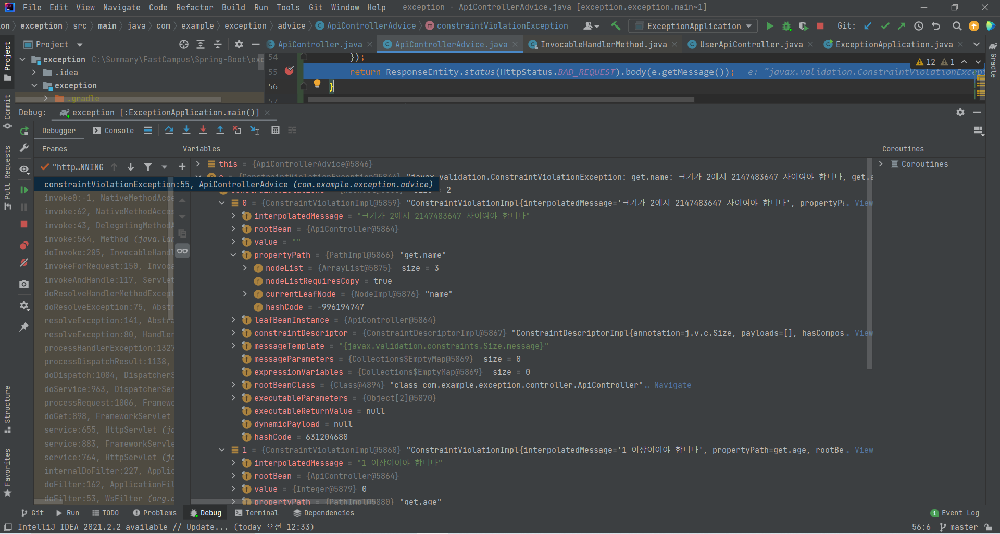
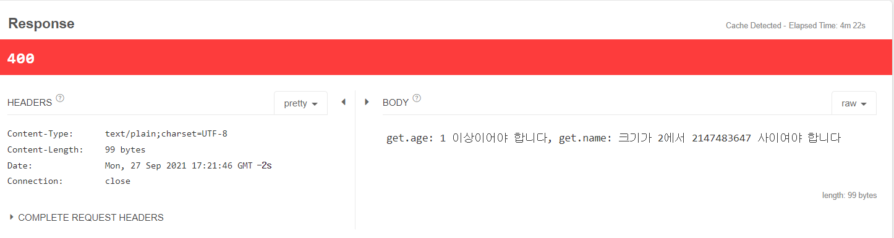
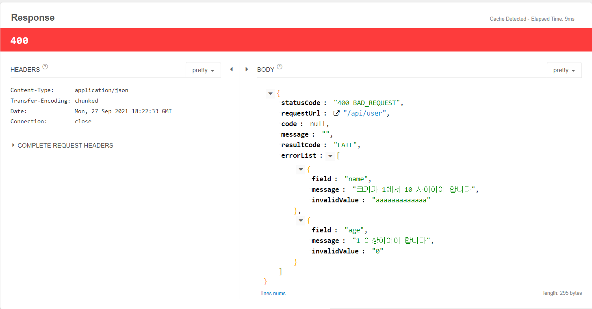
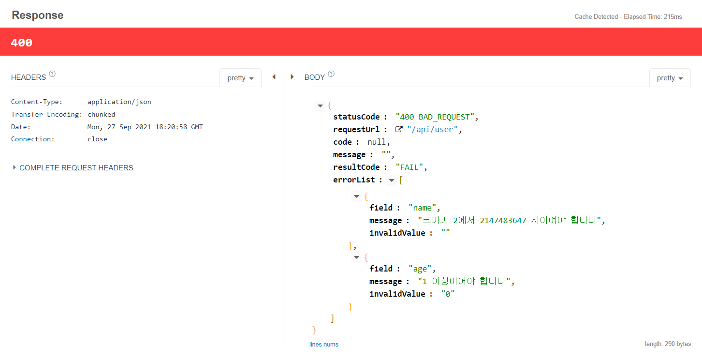

# Spring Boot Validation 모범 사례
- 앞선 예제를 통해 Response가 Client에 보여지는 정보가 적었다.
- Validation과 Exception 처리를 통해 Client 에서 잘 활용되어질 수 있도록 한다.
- exception Project로 실습을 이어서 진행한다. [exception_summary](Ch06_Exception.md)
- Exception 처리를 위해 전역으로 처리하는 방식과 특정 API에 처리하는 방식 두가지를 배웠다. 분리된 상황에서도 마찬가지로 두가지 처리방법을 적용할 수 있다.

```java
@RestControllerAdvice(basePackageClasses = ApiController.class)
public class GlobalControllerAdvice {

}
```
- 이처럼 @RestControllerAdvice Annotation에 basePackageClasses 속성을 사용하면 특정 클래스( 위 예제에서는 ApiController)에서만 적용되도록 변경할 수 있다.
- global 처리가 아닌 ApiController로 한정되었으므로 이름을 ApiControllerAdvice로 변경한다.


## Spring Boot Validation 과 Exception을 이용한 모범사례

- 기존 코드에 추가시키며 내용을 발전해 나간다.

<br>

## 기존 코드

### ApiControllerAdvice class
```java
@RestControllerAdvice(basePackageClasses = ApiController.class)
public class ApiControllerAdvice {
    @ExceptionHandler(value = Exception.class)
    public ResponseEntity exception(Exception e){
        System.out.println(e.getClass().getName());
        return ResponseEntity.status(HttpStatus.INTERNAL_SERVER_ERROR).body("");
    }

    @ExceptionHandler(value = MethodArgumentNotValidException.class)
    public ResponseEntity methodArgumentNotValidException(MethodArgumentNotValidException e){
        System.out.println("advice");
        return ResponseEntity.status(HttpStatus.BAD_REQUEST).body(e.getMessage());
    }
}

```

### ApiController Class
```java
@RestController
@RequestMapping("/api/user")
public class ApiController {
    @GetMapping("")
    public User get(@RequestParam(required = false) String name,@RequestParam(required = false) Integer age){
        //required=false는 해당 request param이 없어도 동작하지만 해당 내용은 null이 된다.
        User user=new User();
        user.setName(name);
        user.setAge(age);

        int a=10+age; //NullPonintException 발생

        return user;
    }
    
    //생략
}
```


### 요청 : `http://localhost:8080/api/user?name&age`

<br>

### Console 결과
```
java.lang.NullPointerException
```
- Controller 단위에  @Validated Annotation을 추가하고 Request Param으로 받는 값에 validation을 추가하면 해결할 수 있다.
- @Valited에 의해 @RequestParam으로 들어오는 값도 검증할 수 있게 된다.

<br><br>

### ApiController Class 수정
```java
@RestController
@RequestMapping("/api/user")
@Validated
public class ApiController {

    @GetMapping("")
    public User get(
            @Size(min=1)
            @RequestParam String name,

            @NotNull
            @RequestParam Integer age){

        User user=new User();
        user.setName(name);
        user.setAge(age);

        int a=10+age;

        return user;
    }

```

### 요청 : `http://localhost:8080/api/user?name&age`

<br>

### Console 결과
```
org.springframework.web.bind.MissingServletRequestParameterException
```
- Request Parameter 를 Validation 했기 때문에 RequestParam을 찾을 수 없다는 에러로 변경되었다.
- 이때 ApiControllerAdvice class의 methodArgumentNotValidException()이 아닌 exception() 메소드가 실행된 것이다.

<br>

### ApiController - get() Annotation 추가
```java
    @GetMapping("")
    public User get(
            @Size(min=2)
            @RequestParam String name,

            @NotNull
            @Min(1)
            @RequestParam Integer age){
    }
```
요청 : `http://localhost:8080/api/user?name=a&age=0`


### Console 결과
```
javax.validation.ConstraintViolationException
```

<br><br>


## Exception 처리 - Get 요청

### ApiControllerAdvice class

```java
@RestControllerAdvice(basePackageClasses = ApiController.class)
public class ApiControllerAdvice {
    @ExceptionHandler(value = ConstraintViolationException.class)
    public ResponseEntity ConstraintViolationException(ConstraintViolationException e){
        //ConstraintViolationException 은 어떠한 필드가 잘못되었는지에 대한 정보를 담고 있다.
        e.getConstraintViolations().forEach(error->{

            Stream<Path.Node> stream= StreamSupport.stream(error.getPropertyPath().spliterator(),false);
            List<Path.Node> list=stream.collect(Collectors.toList());

            String field=list.get(list.size()-1).getName();
            String message=error.getMessage();
            String invalidValue=error.getInvalidValue().toString();

            System.out.println("----------------");
            System.out.println(field);
            System.out.println(message);
            System.out.println(invalidValue);

        });
        return ResponseEntity.status(HttpStatus.BAD_REQUEST).body(e.getMessage());
    }
    
    @ExceptionHandler(value = MissingServletRequestParameterException.class)
    public ResponseEntity MissingServletRequestParameterException(MissingServletRequestParameterException e){
        String fieldName=e.getParameterName();
        String fieldType=e.getParameterType();
        String invalidValue=e.getMessage();

        System.out.println(fieldName);
        System.out.println(fieldType);
        System.out.println(invalidValue);

        return ResponseEntity.status(HttpStatus.BAD_REQUEST).body(e.getMessage());
    }
}
```
- 앞서 결과를 확인한 Exception에 대해 처리하도록 추가한다.


### 요청 : `http://localhost:8080/api/user?name&age`

<br>

### Console 결과 
```
age
Integer
Required request parameter 'age' for method parameter type Integer is present but converted to null
```

### 요청 : `http://localhost:8080/api/user?name&age=0`

<br>

### Console 결과 
```
----------------
name
크기가 2에서 2147483647 사이여야 합니다

----------------
age
1 이상이어야 합니다
0

```

<br><br>

## 참고 : IntelliJ - Break Point



- Break Point를 설정하여 에러의 상세한 정보를 확인할 수 있다.
- ConstraintViolation 내용을 통해 name 크기가 2 이상이어야 하고, age가 1이상이어야 한다는 것을 알 수 있다!



- defalutMessage에 해당하는 내용을 확인할 수 있다.

<br><br>


## Exception 처리 - Post 요청

### ApiController class - post()
```java
    @PostMapping("")
    public User post(@Valid @RequestBody User user){
        System.out.println(user);
        return user;
    }
```

### User class
```java

public class User {
    @NotEmpty
    @Size(min = 1,max = 10)
    private String name;

    @Min(1)
    @NotNull
    private Integer age;

    //생략
}
```

### POST 요청
URL : `http://localhost:8080/api/user `

### JSON
```json
{
  "name":"",
  "age":0
}
```

### Console 결과 - User.java validation에서 체크된 것
```
----------------
name
크기가 1에서 10 사이여야 합니다

----------------
name
비어 있을 수 없습니다

----------------
age
1 이상이어야 합니다
0

```


<br><br>

## Client가 활용할 수 있도록 변경

### ApiControllerAdvice class
```java
@RestControllerAdvice(basePackageClasses = ApiController.class)
public class ApiControllerAdvice {
    
    //생략

    @ExceptionHandler(value = MethodArgumentNotValidException.class)
    public ResponseEntity methodArgumentNotValidException(MethodArgumentNotValidException e, HttpServletRequest httpServletRequest){
        List<Error> errorList = new ArrayList<>();

        BindingResult bindingResult=e.getBindingResult();
        bindingResult.getAllErrors().forEach(error->{
            FieldError field=(FieldError)error;
            String fieldName=field.getField();
            String message=field.getDefaultMessage();
            String value=field.getRejectedValue().toString();  //어떠한 값이 잘못되었는지 알려준다.

            Error errorMessage = new Error();
            errorMessage.setField(fieldName);
            errorMessage.setMessage(message);
            errorMessage.setInvalidValue(value);

            errorList.add(errorMessage);

        });

        ErrorResponse errorResponse = new ErrorResponse();
        errorResponse.setErrorList(errorList);
        errorResponse.setMessage("");
        errorResponse.setRequestUrl(httpServletRequest.getRequestURI());
        errorResponse.setStatusCode(HttpStatus.BAD_REQUEST.toString());
        errorResponse.setResultCode("FAIL");


        return ResponseEntity.status(HttpStatus.BAD_REQUEST).body(errorResponse);
    }

    @ExceptionHandler(value = ConstraintViolationException.class)
    public ResponseEntity constraintViolationException(ConstraintViolationException e,HttpServletRequest httpServletRequest){
        List<Error> errorList = new ArrayList<>();

        e.getConstraintViolations().forEach(error->{

            Stream<Path.Node> stream= StreamSupport.stream(error.getPropertyPath().spliterator(),false);
            List<Path.Node> list=stream.collect(Collectors.toList());

            String field=list.get(list.size()-1).getName();
            String message=error.getMessage();
            String invalidValue=error.getInvalidValue().toString();

            Error errorMessage = new Error();
            errorMessage.setField(field);
            errorMessage.setMessage(message);
            errorMessage.setInvalidValue(invalidValue);

            errorList.add(errorMessage);

        });

        ErrorResponse errorResponse = new ErrorResponse();
        errorResponse.setErrorList(errorList);
        errorResponse.setMessage("");
        errorResponse.setRequestUrl(httpServletRequest.getRequestURI());
        errorResponse.setStatusCode(HttpStatus.BAD_REQUEST.toString());
        errorResponse.setResultCode("FAIL");

        return ResponseEntity.status(HttpStatus.BAD_REQUEST).body(errorResponse);
    }

    @ExceptionHandler(value = MissingServletRequestParameterException.class)
    public ResponseEntity missingServletRequestParameterException(MissingServletRequestParameterException e,HttpServletRequest httpServletRequest){
        List<Error> errorList = new ArrayList<>();

        String fieldName=e.getParameterName();
        String fieldType=e.getParameterType();
        String invalidValue=e.getMessage();

        Error errorMessage = new Error();
        errorMessage.setField(fieldName);
        errorMessage.setMessage(e.getMessage());

        errorList.add(errorMessage);

        ErrorResponse errorResponse = new ErrorResponse();
        errorResponse.setErrorList(errorList);
        errorResponse.setMessage("");
        errorResponse.setRequestUrl(httpServletRequest.getRequestURI());
        errorResponse.setStatusCode(HttpStatus.BAD_REQUEST.toString());
        errorResponse.setResultCode("FAIL");

        return ResponseEntity.status(HttpStatus.BAD_REQUEST).body(errorResponse);
    }
}
```
- 중복되는 로직에 대해서 리팩토링할 수 있다!


### Error class
```java
public class Error {
    private String field;
    private String message;
    private String invalidValue;

    //getter,setter
}
```

### ErrorResponse class

```java
public class ErrorResponse {
    String statusCode;
    String requestUrl;
    String code;
    String message;
    String resultCode;

    List<Error> errorList;

    //getter,setter
}
```

<br><Br>

### POST 요청
URL : `http://localhost:8080/api/user `

### JSON
```json
{
  "name":"aaaaaaaaaaaaa",
  "age":0
}
```

### Response ( Talend API Tester )



<br><br>

### GET 요청
URL : `http://localhost:8080/api/user?name&age=0`


### Response ( Talend API Tester )


<br><br>


- client 입장에서도 response를 기반으로 request 요청의 잘못된 정보를 쉽게 확인할 수 있다.
- 위 예제와 같이 Post,Get Mapping이 각각 하나씩 있는 간단한 예제라면 advice 나눌 필요 없이 해당 클래스에서 if문으로 구현하는 것이 더 효과적이다.
- 하지만 Spring은 Enterprise Framework이다. 방대한 양의 서버 프레임워크이기 때문에 API Controller가 4~5개 되는 경우, 주소가 10개이상 적용되는 경우 등 일관되게 적용되게 하기 위해 Validation과 Global Exception을 통해 예외에 대해 친절한 메시지를 보낼 수 있다.
