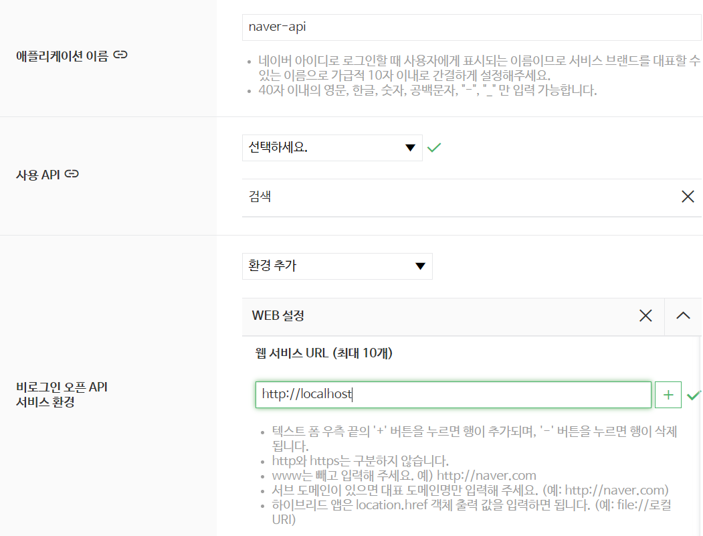
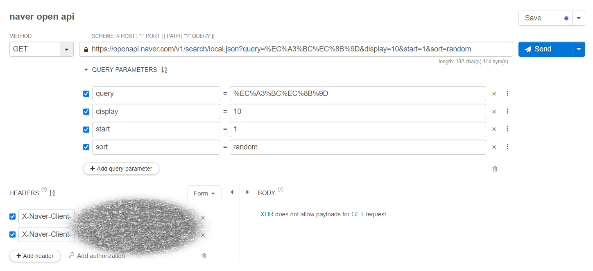
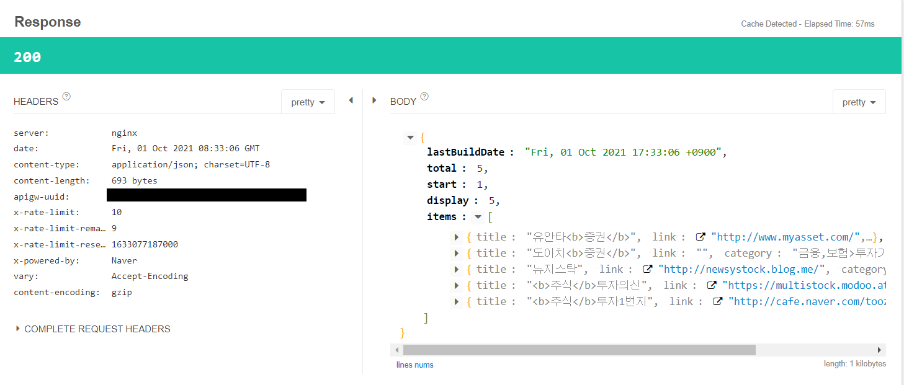
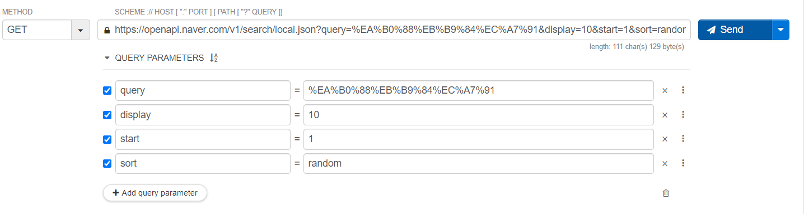
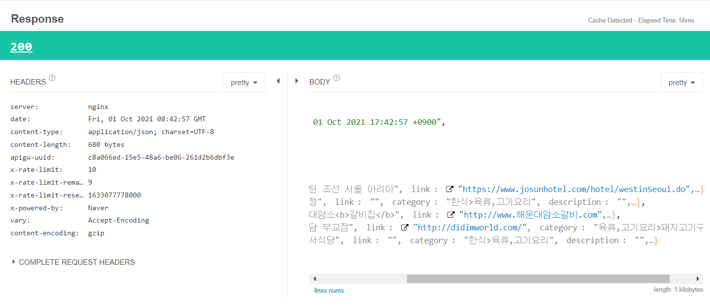
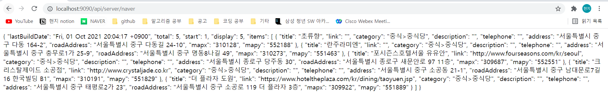

# Naver 지역 검색 API 연동해보기
- https://developers.naver.com/docs/serviceapi/search/local/local.md#%EC%A7%80%EC%97%AD : naver open api - 지역검색
- Document - ServiceAPI -> 검색
- 네이버 지역 서비스에 등록된 각 지역별 업체 및 상호 검색 결과를 출력해주는 REST API입니다. 
- 비로그인 오픈 API이므로 GET으로 호출할 때 HTTP Header에 애플리케이션 등록 시 발급받은 Client ID와 Client Secret 값을 같이 전송해 주시면 활용 가능합니다.

## Application 등록 ( Open API 신청하기 )
 

### Test - Request
 

### Test - Response
 

<br><br>

## qeury 변경 Test
- API 설명을 보면 query는 필수여야 하며 검색을 원하는 문자열로서 UTF-8로 인코딩해야한다.
- 예를 들어 갈비집을 utf-8로 인코딩한다 "%EA%B0%88%EB%B9%84%EC%A7%91" (utf-8 encoding online 검색)
  - https://perishablepress.com/tools/utf8-hex/

### Test - Request
 

### Test - Response
 


<br><br>

## NAVER API 연동 실습
- [Chapter07](./Ch07_RestTemplate_Post.md). server, clinet project에 이어서 실습을 진행한다.


### Server - ServerApiController
```java
@Slf4j
@RestController
@RequestMapping("/api/server")
public class ServerApiController {
    @GetMapping("/naver")
    public String naver(){
        //uri 만들기
        //https://openapi.naver.com/v1/search/local.json
        // ?query=%EC%A3%BC%EC%8B%9D
        // &display=10
        // &start=1
        // &sort=random
        URI uri= UriComponentsBuilder.fromUriString("https://openapi.naver.com")
                .path("/v1/search/local.json")
                .queryParam("query","중국집")
                .queryParam("display",10)
                .queryParam("start",1)
                .queryParam("sort","random")
                .encode(Charset.forName("UTF-8"))
                .build()
                .toUri();

        log.info("uri : {} ",uri);
        RestTemplate restTemplate=new RestTemplate();

        //header 만들기
        RequestEntity<Void> req=RequestEntity.get(uri)
                .header("X-Naver-Client-Id","발급받은 ID")
                .header("X-Naver-Client-Secret","발급받은 Secret")
                .build();

        ResponseEntity<String> result = restTemplate.exchange(req,String.class);

        return result.getBody();
    }
}
```
- encode(Charset.forName("UTF-8")) : utf-8 인코딩된 문자열을 받는다고 명시되어있으므로 utf-8로 인코딩해서 전달한다!

### 요청 : `http://localhost:9090/api/server/naver`

### Browser 결과


### Json validator online 이용
- https://jsonlint.com/
```json
{
	"lastBuildDate": "Fri, 01 Oct 2021 20:04:17 +0900",
	"total": 5,
	"start": 1,
	"display": 5,
	"items": [{
		"title": "초류향",
		"link": "",
		"category": "중식>중식당",
		"description": "",
		"telephone": "",
		"address": "서울특별시 중구 다동 164-2",
		"roadAddress": "서울특별시 중구 다동길 24-10",
		"mapx": "310128",
		"mapy": "552188"
	}, {
		"title": "란주라미엔",
		"link": "",
		"category": "중식>중식당",
		"description": "",
		"telephone": "",
		"address": "서울특별시 중구 충무로1가 25-9",
		"roadAddress": "서울특별시 중구 명동8나길 49",
		"mapx": "310273",
		"mapy": "551463"
	}, {
		"title": "포시즌스호텔서울 유유안",
		"link": "http://www.fourseasons.com/kr/seoul",
		"category": "중식>중식당",
		"description": "",
		"telephone": "",
		"address": "서울특별시 종로구 당주동 30",
		"roadAddress": "서울특별시 종로구 새문안로 97 11층",
		"mapx": "309687",
		"mapy": "552551"
	}, {
		"title": "크리스탈제이드 소공점",
		"link": "http://www.crystaljade.co.kr",
		"category": "중식>중식당",
		"description": "",
		"telephone": "",
		"address": "서울특별시 중구 소공동 21-1",
		"roadAddress": "서울특별시 중구 남대문로7길 16 한국빌딩 B1",
		"mapx": "310191",
		"mapy": "551829"
	}, {
		"title": "더 플라자 도원",
		"link": "https://www.hoteltheplaza.com/kr/dining/taoyuen.jsp",
		"category": "중식>중식당",
		"description": "",
		"telephone": "",
		"address": "서울특별시 중구 태평로2가 23",
		"roadAddress": "서울특별시 중구 소공로 119 더 플라자 3층",
		"mapx": "309922",
		"mapy": "551889"
	}]
}
```