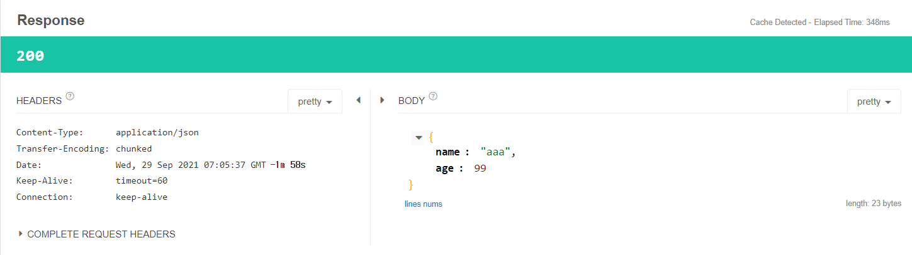

# Rest Template 사용하기
- [Chapter07](./Ch07_ServerToServer.md). Server To Server 통신을 위한 server, clinet project에 이어서 실습을 진행한다.


## Rest Template

## Get 실습

### RestTempleteService - restTemplate.getForObject()
```java
@Service
public class RestTempleteService {
    public String hello(){
        //요청 URI 만들기
        URI uri= UriComponentsBuilder.fromUriString("http://localhost:9090").path("/api/server/hello").encode().build().toUri();
        System.out.println(uri.toString());

        //RESTTemplet 만들기
        RestTemplate restTemplate=new RestTemplate();
        String result=restTemplate.getForObject(uri,String.class);

        return result;
    }
}
```

- restTemplate.getForObject() : Generic Type을 지정하여 Return 하는 타입을 결정할 수 있다.
- restTemplate.getForObject(uri,String.class) 에서 String으로 지정했으므로 String이 리턴된다.

<br>

### RestTempleteService - restTemplate.getForEntity()
```java
@Service
public class RestTempleteService {
    public String hello(){
        //요청 URI 만들기
        URI uri= UriComponentsBuilder.fromUriString("http://localhost:9090").path("/api/server/hello").encode().build().toUri();
        System.out.println(uri.toString());

        //RESTTemplet 만들기
        RestTemplate restTemplate=new RestTemplate();
        
        ResponseEntity<String> result=restTemplate.getForEntity(uri,String.class);

        System.out.println(result.getStatusCode());
        System.out.println(result.getBody());

        return result.getBody();
    }
}
```
- 요청에 대해 동일한 결과를 return 하지만 ResponseEntity를 리턴 타입으로 갖게 되면서 ResponseBody의 값을 가져올 수 있는 다양한 메소드를 활용할 수 있게 된다.

### restTemplate.getForEntity() - Console 결과
```
http://localhost:9090/api/server/hello
200 OK
hello server
```
- getForObject(), getForEntity() 의 get은 가져오다의 get이 아닌 http 메소드 GET 요청을 의미한다.

<br><br>

## JSON 받기


### Client - UserResponse (DTO)
```java
public class UserResponse {
    private String name;
    private int age;

    //생략
}

```

### Client - RestTempleteService 
```java
@Service
public class RestTempleteService {
    public UserResponse hello(){
        //요청 URI 만들기
        URI uri= UriComponentsBuilder.fromUriString("http://localhost:9090").path("/api/server/hello").encode().build().toUri();
        System.out.println(uri.toString());

        //RESTTemplet 만들기
        RestTemplate restTemplate=new RestTemplate();

        ResponseEntity<UserResponse> result=restTemplate.getForEntity(uri,UserResponse.class);

        System.out.println(result.getStatusCode());
        System.out.println(result.getBody());
        return result.getBody();
    }
}
```

### Client - ApiController
```java
@RestController
@RequestMapping("/api/client")
public class ApiController {

    //생략

    @GetMapping("/hello")
    public UserResponse hello(){
        return restTempleteService.hello();
    }
}
```

### Server - User(DTO)
- lombok 활용
```java
@Data
@NoArgsConstructor
@AllArgsConstructor
public class User {
    private String name;
    private int age;
}
```


### Server -ServerApiController
```java
@RestController
@RequestMapping("/api/server")
public class ServerApiController {

    @GetMapping("/hello")
    public User hello(){
        User user=new User();
        user.setName("steve");
        user.setAge(10);
        return user;
    }
}
```

### 요청 : `http://localhost:8080/api/client/hello`

### Response
```json
{
    "name":"steve",
    "age":10
}
```

### Clinet Console
```
http://localhost:9090/api/server/hello
200 OK
UserResponse{name='steve', age=10}
```

## Query Parameter 추가
- `http://localhost:9090/api/server/hello?name=steve&age=10` 형태로 query parameter 를 추가해서 URI를 만들고자할 때 UriComponentsBuilder 에서 queryParam() 메소드를 지원한다.

### Cleint - RestTempleteService
```java
@Service
public class RestTempleteService {
    public UserResponse hello(){
        //요청 URI 만들기
        URI uri= UriComponentsBuilder.fromUriString("http://localhost:9090")
                .path("/api/server/hello")
                .queryParam("name","steve")
                .queryParam("age",10)
                .encode()
                .build()
                .toUri();

        // 생략
    }
}
```


- 결과는 동일하지만 query parameter 가 추가된 요청이 넘어간다.

### Console의 URI 결과
```
http://localhost:9090/api/server/hello?name=steve&age=10
```

<br><br>

### Server - ServerApiController
```java
@RestController
@RequestMapping("/api/server")
public class ServerApiController {

    @GetMapping("/hello")
    public User hello(@RequestParam String name, @RequestParam int age){
        User user=new User();
        user.setName(name);
        user.setAge(age);
        return user;
    }
}
```

- Query Parameter를 전달했으므로 @RequestParam을 통해 전달된 data를 받을 수 있다.

### Respnose



- client 서버에서 테스트를 위해 데이터를 변경하여 보냈다.
- `http://localhost:9090/api/server/hello?name=aaa&age=99`

<br><br>

## POST 실습

### Client - ApiController class
```java
public class ApiController {

    //생략

    @GetMapping("/hello")
    public UserResponse hello(){
        return restTempleteService.post();
    }
}
```

### Client - RestTempleteService class

```java
@Service
public class RestTempleteService {

    public UserResponse post(){
        //URI 만들기
        //http://localhost:9090/api/server/user/{userId}/name/{userName}
        URI uri=UriComponentsBuilder
                .fromUriString("http://localhost:9090")
                .path("/api/server/user/{userId}/name/{userName}")
                .encode()
                .build()
                .expand(100,"steve")
                .toUri();
        
        System.out.println(uri);

        // http body -> object -> object mapper -> json ->rest tempalte ->http body json
        UserRequest req=new UserRequest();
        req.setName("steve");
        req.setAge(10);

        RestTemplate restTemplate = new RestTemplate();
        ResponseEntity<UserResponse> response = restTemplate.postForEntity(uri,req,UserResponse.class);
        
        System.out.println(response.getStatusCode());
        System.out.println(response.getHeaders());
        System.out.println(response.getBody());

        return response.getBody();
    }
}
```
- UriComponentsBuilder의 expand()에 들어가는 값이 중괄호를 사용한 {userId},{userName}에 순차적으로 (,)로 구분되어 맞춰 들어간다.
- buildAndExpand() 메소드도 있다.
- Post는 http body를 필요로 하는데, 요청을 Object 형태로 받고, Object Mapper가 내부적으로 Json Text로 변경시키고 그것을 Rest Templete에 가져다 쓸 수 있다. 
  - http body -> object -> object mapper -> json ->rest tempalte ->http body json
- ResponseEntity<String> response = restTemplate.postForEntity(uri,req,String.class)
  - Generic Type으로 String을 사용할 수 있는데 ,응답이 무엇인지 모를 때 String으로 확인하는 것도 가능하다! 응답을 확인하고 class를 디자인해도 좋다.

### Server - ServerApiController

```java
@Slf4j
@RestController
@RequestMapping("/api/server")
public class ServerApiController {
    @PostMapping("user/{userId}/name/{userName}")
    public User post(@RequestBody User user, @PathVariable int userId, @PathVariable String userName){

        log.info("userId : {} , userName : {} ",userId,userName);
        log.info("client req : {}",user);

        return user;
    }
}
```

### 요청 : `http://localhost:8080/api/client/hello`

### Client - Console 결과
```
http://localhost:9090/api/server/user/100/name/steve
200 OK
[Content-Type:"application/json", Transfer-Encoding:"chunked", Date:"Wed, 29 Sep 2021 08:13:05 GMT", Keep-Alive:"timeout=60", Connection:"keep-alive"]
UserResponse{name='steve', age=10}
```

### Server - Console 결과 log 일부
```
INFO 6136 --- [nio-9090-exec-1] c.e.s.controller.ServerApiController     : userId : 100 , userName : steve 
INFO 6136 --- [nio-9090-exec-1] c.e.s.controller.ServerApiController     : client req : User(name=steve, age=10)
```