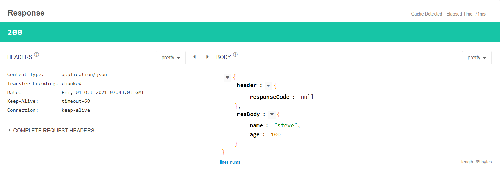

# Rest Template 사용하기 -POST 예제
- [Chapter07](./Ch07_RestTemplate.md). server, clinet project에 이어서 실습을 진행한다.


## Rest Template

## POST 실습

### Client - ApiController class
```java
public class ApiController {
    //생략
    @GetMapping("/hello")
    public UserResponse hello(){
        return restTempleteService.post();
    }
}
```

### Client - RestTempleteService class

```java
@Service
public class RestTempleteService {
    public UserResponse post(){
        //URI 만들기
        //http://localhost:9090/api/server/user/{userId}/name/{userName}
        URI uri=UriComponentsBuilder
                .fromUriString("http://localhost:9090")
                .path("/api/server/user/{userId}/name/{userName}")
                .encode()
                .build()
                .expand(100,"steve")
                .toUri();
        
        System.out.println(uri);
        // http body -> object -> object mapper -> json ->rest tempalte ->http body json
        UserRequest req=new UserRequest();
        req.setName("steve");
        req.setAge(10);
        RestTemplate restTemplate = new RestTemplate();
        ResponseEntity<UserResponse> response = restTemplate.postForEntity(uri,req,UserResponse.class);
        
        System.out.println(response.getStatusCode());
        System.out.println(response.getHeaders());
        System.out.println(response.getBody());
        return response.getBody();
    }
}
```
- UriComponentsBuilder의 expand()에 들어가는 값이 중괄호를 사용한 {userId},{userName}에 순차적으로 (,)로 구분되어 맞춰 들어간다.
- buildAndExpand() 메소드도 있다.
- Post는 http body를 필요로 하는데, 요청을 Object 형태로 받고, Object Mapper가 내부적으로 Json Text로 변경시키고 그것을 Rest Templete에 가져다 쓸 수 있다. 
  - http body -> object -> object mapper -> json ->rest tempalte ->http body json
- ResponseEntity<String> response = restTemplate.postForEntity(uri,req,String.class)
  - Generic Type으로 String을 사용할 수 있는데 ,응답이 무엇인지 모를 때 String으로 확인하는 것도 가능하다! 응답을 확인하고 class를 디자인해도 좋다.

### Server - ServerApiController

```java
@Slf4j
@RestController
@RequestMapping("/api/server")
public class ServerApiController {
    @PostMapping("user/{userId}/name/{userName}")
    public User post(@RequestBody User user, @PathVariable int userId, @PathVariable String userName){
        log.info("userId : {} , userName : {} ",userId,userName);
        log.info("client req : {}",user);
        return user;
    }
}
```

### 요청 : `http://localhost:8080/api/client/hello`

### Client - Console 결과
```
http://localhost:9090/api/server/user/100/name/steve
200 OK
[Content-Type:"application/json", Transfer-Encoding:"chunked", Date:"Wed, 29 Sep 2021 08:13:05 GMT", Keep-Alive:"timeout=60", Connection:"keep-alive"]
UserResponse{name='steve', age=10}
```

### Server - Console 결과 log 일부
```
INFO 6136 --- [nio-9090-exec-1] c.e.s.controller.ServerApiController     : userId : 100 , userName : steve 
INFO 6136 --- [nio-9090-exec-1] c.e.s.controller.ServerApiController     : client req : User(name=steve, age=10)
```


<br><br>


## Header 값 추가하기
- 실제로 현업에서는 보통 header값을 추가하여 사용한다.
- 요청보낼 때는 RequestEntity, 응답 받기 위해서는 ResponseEntity를 사용한다.

### Client - RestTempleteService class
```java
@Service
public class RestTempleteService {

    public UserResponse exchange(){
        //URI 만들기
        //http://localhost:9090/api/server/user/{userId}/name/{userName}
        URI uri=UriComponentsBuilder
                .fromUriString("http://localhost:9090")
                .path("/api/server/user/{userId}/name/{userName}")
                .encode()
                .build()
                .expand(100,"steve")
                .toUri();
        System.out.println(uri);

        // http body -> object -> object mapper -> json ->rest tempalte ->http body json
        UserRequest req=new UserRequest();
        req.setName("steve");
        req.setAge(10);

        //요청을 보낼때 RequestEntity를 보낸다.
        RequestEntity<UserRequest> requestEntity= RequestEntity.post(uri).contentType(MediaType.APPLICATION_JSON)
                .header("x-authorization","abcd")
                .header("custom-header","ffff")
                .body(req);


        RestTemplate restTemplate = new RestTemplate();
        ResponseEntity<UserResponse> response=restTemplate.exchange(requestEntity,UserResponse.class);
        return response.getBody();
    }
}
```
- header() 메소드를 뒤에 연결하면서 사용하며 header를 추가할 수 있다. (내부적으로 add로 구현되어 있음)
- restTemplate.exchange(requestEntity,UserResponse.class)를 통해 RequestEntity로 보낸 요청을 UserResponse.class 타입으로 받는다. 
- exchage() 메소드는 다양한 인자를 받을 수 있도록 다양한 오버라이딩 메소드를 지원한다.


### Client - ApiController class
```java
@RestController
@RequestMapping("/api/client")
public class ApiController {
    @GetMapping("/hello")
    public UserResponse hello(){
        //return restTempleteService.hello();
        //return restTempleteService.post();
        restTempleteService.exchange();
        return new UserResponse();
    }
}
```

### Server - ServerApiController class
```java
@Slf4j
@RestController
@RequestMapping("/api/server")
public class ServerApiController {
    @PostMapping("user/{userId}/name/{userName}")
    public User post(@RequestBody User user, @PathVariable int userId, @PathVariable String userName,
                        @RequestHeader("x-authorization") String authorization, @RequestHeader("custom-header") String costomHeader){

        log.info("userId : {} , userName : {} ",userId,userName);
        log.info("authorization : {} , customheader : {} ",authorization,costomHeader);
        log.info("client req : {}",user);

        return user;
    }
}
```
- @RequestHeader Annotation을 통해 header값을 받아온다.
- () 안에 지정한 이름과 매칭시킬 수 있도록 설정해줬다.

### 요청 : `http://localhost:8080/api/client/hello`

### Server - Console 결과
```
2021-10-01 14:01:48.097  INFO 12708 --- [nio-9090-exec-1] c.e.s.controller.ServerApiController     : userId : 100 , userName : steve 
2021-10-01 14:01:48.099  INFO 12708 --- [nio-9090-exec-1] c.e.s.controller.ServerApiController     : authorization : abcd , customheader ffff 
2021-10-01 14:01:48.099  INFO 12708 --- [nio-9090-exec-1] c.e.s.controller.ServerApiController     : client req : User(name=steve, age=10)
```


<br><br>

## 다양한 JSON 형태 받기

### JSON
```json
{
    "header" : {
        "response_code":"OK"
    },
    "body":{
        "book":"spring boot",
        "page":1024
    }
}
```
- JSON은 무수히 다양한 형태로 들어올 수 있다.
- body인데 header가 들어올 수 있고, body로 들어오는 값이 매번 값이 바뀌는 경우가 있다.

```json
{
    "header" : {
        "response_code":"OK"
    },
    "body":{
        "name":"hyeonji",
        "age":24
    }
}
```
- 위 JSON은 body,page이지만 다음 요청에서는 name,age가 들어올 수 있다!

### Request를 받기 위한 DTO 생성
- server, client 모두 받을 것이기 때문에 둘다 생성해준다.
```java
@Data
@AllArgsConstructor
@NoArgsConstructor
public class Req<T> {

    private Header header;
    private T resBody;

    @Data
    @AllArgsConstructor
    @NoArgsConstructor
    public static class Header{
        private String responseCode;
    }
}
```

### Client - RestTempleteService class
```java
@Service
public class RestTempleteService {

    public Req<UserResponse> genericExchage(){
        //URI 만들기
        //http://localhost:9090/api/server/user/{userId}/name/{userName}
        URI uri=UriComponentsBuilder
                .fromUriString("http://localhost:9090")
                .path("/api/server/user/{userId}/name/{userName}")
                .encode()
                .build()
                .expand(100,"steve")
                .toUri();
        System.out.println(uri);

        UserRequest userRequest=new UserRequest();
        userRequest.setName("steve");
        userRequest.setAge(100);

        // http body -> object -> object mapper -> json ->rest tempalte ->http body json
        Req<UserRequest> req=new Req<UserRequest>();
        req.setHeader(
                new Req.Header()
        );
        req.setResBody(
                userRequest
        );

        //요청을 보낼때 RequestEntity를 보낸다.
        RequestEntity<Req<UserRequest>> requestEntity= RequestEntity.post(uri).contentType(MediaType.APPLICATION_JSON)
                .header("x-authorization","abcd")
                .header("custom-header","ffff")
                .body(req);

        RestTemplate restTemplate=new RestTemplate();
        
        ResponseEntity<Req<UserResponse>> response=restTemplate.exchange(requestEntity , new ParameterizedTypeReference<>(){});
        System.out.println(response);

        return response.getBody();
        
    }
}
```
- Generic 에는 .class를 붙일수가 없다.
  - 잘못된 방식 : ResponseEntity<Req<UserRequest>> response=restTemplate.exchange(requestEntity,Req<UserResponse>.class)
- ParameterizedTypeReference 에 원하는 제네릭 타입을 넣어서 받을 수 있다. 
  - 올바른 방식 : ResponseEntity<Req<UserResponse>> response =restTemplate.exchange(requestEntity,new ParameterizedTypeReference<Req<UserResponse>>(){})
  - 리턴 타입으로 정했기 때문에 뒤에 제네릭은 생략 가능
  - 올바른 방식 : ResponseEntity<Req<UserResponse>> response =restTemplate.exchange(requestEntity,new ParameterizedTypeReference<>(){})
- return response.getBody().getResBody()
    - response.getBody()는 ResponseEntity의 getBody를 의미 
    -  response.getBody().getrBody()는 UserRespnose에 지정해둔 resBody이다.


### Client - ApiController class
```java
@RestController
@RequestMapping("/api/client")
public class ApiController {
    @GetMapping("/hello")
    public Req<UserResponse> hello(){
        return restTempleteService.genericExchage();
    }
}
```

### Server - ServerApiController class
```java
@Slf4j
@RestController
@RequestMapping("/api/server")
public class ServerApiController {
        //다양한 JSON 타입 연습
    @PostMapping("user/{userId}/name/{userName}")
    public Req<User> post( //HttpEntity<String> entity, 
                           @RequestBody Req<User> user,
                           @PathVariable int userId, @PathVariable String userName,
                          @RequestHeader("x-authorization") String authorization, @RequestHeader("custom-header") String costomHeader){

        //log.info("req : {} ", entity.getBody());
        log.info("userId : {} , userName : {} ",userId,userName);
        log.info("authorization : {} , customheader : {} ",authorization,costomHeader);
        log.info("client req : {}",user);

        Req<User> response = new Req<>();
        response.setHeader(
                new Req.Header() //빈 객체 테스트를 위함
        );

//        response.setResBody(null);
        response.setResBody(user.getResBody());
        return response;
    }
}
```
- @RequestHeader Annotation을 통해 header값을 받아온다.
- () 안에 지정한 이름과 매칭시킬 수 있도록 설정해줬다.

### 요청 : `http://localhost:8080/api/client/hello`

### Client - Console 결과
```
http://localhost:9090/api/server/user/100/name/steve
<200,Req{header=Header{responseCode='null'}, body=UserResponse{name='steve', age=100}},[Content-Type:"application/json", Transfer-Encoding:"chunked", Date:"Fri, 01 Oct 2021 07:43:03 GMT", Keep-Alive:"timeout=60", Connection:"keep-alive"]>

```

### Server - Console 결과
```
2021-10-01 16:54:20.237  INFO 6316 --- [nio-9090-exec-5] c.e.s.controller.ServerApiController     : userId : 100 , userName : steve 
2021-10-01 16:54:20.237  INFO 6316 --- [nio-9090-exec-5] c.e.s.controller.ServerApiController     : authorization : abcd , customheader : ffff 
2021-10-01 16:54:20.237  INFO 6316 --- [nio-9090-exec-5] c.e.s.controller.ServerApiController     : client req : Req(header=Req.Header(responseCode=null), resBody=User(name=steve, age=100))
```


- body의 class만 변경해주면 되므로 재사용성이 향상되는 효과를 볼 수 있다.
- JSON 형태가 재사용되는 구조라면 Generic을 활용한다.
- 내가 원하는 형식으로 값이 들어오는 지 확인하기 위해서 HttpEntity를 활용할 수 있다. (debuging 방법 중 하나!)
- Debug 확인 후 PostMapping에 대해 HttpEntity를 지워주지 않으면 읽을 수 없다는 error가 발생했다! 꼭 확인 후 지워주자.
- Entity하나를 client에서 보내주는 requestEntity, @RequestBody User user 모두에서 받으려고 했기 때문에 발생하는 에러로 보인다. ( 400 잘못된 요청 error )

<br>

### Response


<br><br>


## 참고Http Entity 확인>
### Server - ServerApiController class
```java
@Slf4j
@RestController
@RequestMapping("/api/server")
public class ServerApiController {
        //다양한 JSON 타입 연습
    @PostMapping("user/{userId}/name/{userName}")
    public Req<User> post( HttpEntity<String> entity, 
                           @PathVariable int userId, @PathVariable String userName,
                          @RequestHeader("x-authorization") String authorization, @RequestHeader("custom-header") String costomHeader){

        log.info("req : {} ", entity.getBody());
        log.info("userId : {} , userName : {} ",userId,userName);
        log.info("authorization : {} , customheader : {} ",authorization,costomHeader);

        Req<User> response = new Req<>();
        response.setHeader(
                new Req.Header() //빈 객체 테스트를 위함
        );

        response.setResBody(null);
        return response;
    }
}
```
