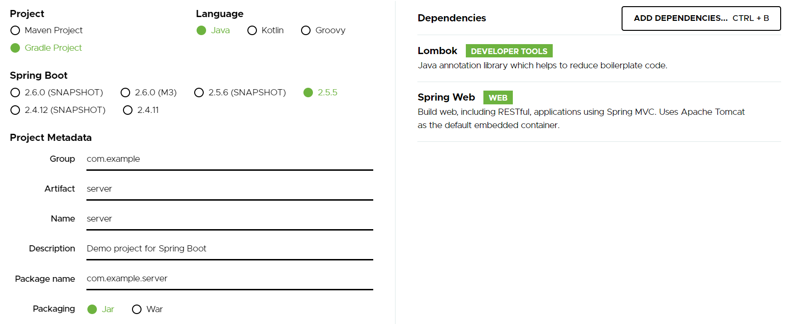
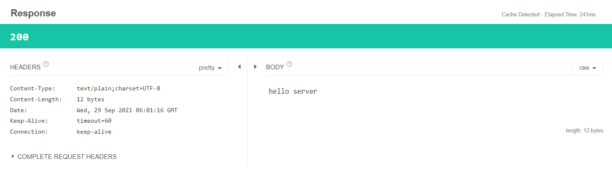

# Server(Client) to Server 연결
- 지금까지 살펴본 예제는 항상 Server(Web Browser, Talend API Tester, Phonoe )의 입장에서 API를 제공하는 방법


- Back-end에서 Client로 다른 Server와의 연결은 필수!


- Spring에서는 RestTemplate 를 가장 많이 사용해 왔으며, Client로 WebClient,Apache Client, RestTemplete 등 을 둘 수 있다.

# Cleint 역할 Server 와 Server 역할 Server 구축

- https://start.spring.io/ 를 통해 server,client이름의 project를 생성한다.

 

- src/main/resources/application.properties

### client 8080 포트 이용
```
server.port=8080 
```
### server 9090 포트 이용
```
server.port=9090 
```

<br><br>

## Client에서 Servr로 요청보내기


### Client - ApiController
```java
@RestController
@RequestMapping("/api/client")
public class ApiController {
    private final RestTempleteService restTempleteService;

    public ApiController(RestTempleteService restTempleteService) {
        this.restTempleteService = restTempleteService;
    }

    @GetMapping("/hello")
    public String hello(){
        return restTempleteService.hello();
    }
}
```
### Client - RestTempleteService
- `http://localhost:9090/api/server/hello` 요청해서 Server를 통해 response를 받아 올 것이다.
```java
@Service
public class RestTempleteService {
    public String hello(){
        //요청 URI 만들기
        URI uri= UriComponentsBuilder.fromUriString("http://localhost:9090").path("/api/server/hello").encode().build().toUri();
        System.out.println(uri.toString());

        //RESTTemplet 만들기
        RestTemplate restTemplate=new RestTemplate();
        String result=restTemplate.getForObject(uri,String.class);

        return result;
    }
}
```
- getForObject가 실행되는 순간이 Client에서 http server로 붙는 순간
- 원래는 RestTemplete pool을 만들고 사용한다.
- restTemplate는 http mehtod (get, post, put, delete)을 기본적으로 제공한다.
- restTemplate는 getForObject restTemplate.getForEntity()는 리턴 타입이 다른 차이점이 있다.


<br><br>

### Server - ServerApiController
```java
@RestController
@RequestMapping("/api/server")
public class ServerApiController {

    @GetMapping("/hello")
    public String hello(){
        return "hello server";
    }

}
```

### 요청 : `http://localhost:8080/api/client/hello`

### Response



<br>

### 요청 URL 생성 결과 - client Console
```
http://localhost:9090/api/server/hello
```