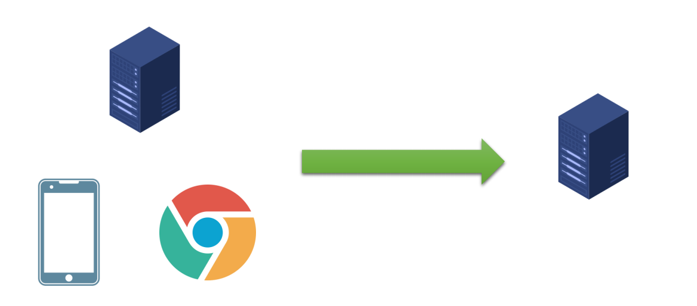
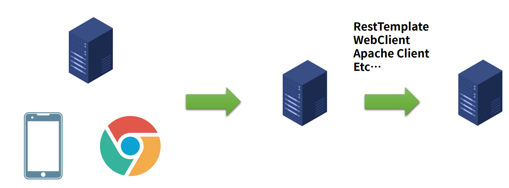

# Server(Client) to Server 연결
- 지금까지 살펴본 예제는 항상 Server(Web Browser, Talend API Tester, Phonoe )의 입장에서 API를 제공하는 방법

- Back-end에서 Client로 다른 Server와의 연결은 필수!

- Spring에서는 RestTemplate 를 가장 많이 사용해 왔으며, Client로 WebClient,Apache Client, RestTemplete 등 을 둘 수 있다.

# Rest Template 사용하기
