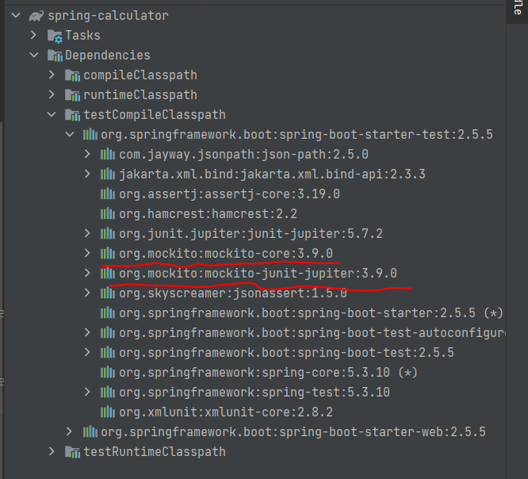
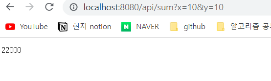

# REST API CRUD 테스트 코드 작성하기

- 특정값이 입력되었을 때 기대하는 값이 정확하게 출력되는지 확인하는 과정을 갖는다.
- Spring Project 생성 (Spring 버전이 업그레이드 되며 mockito가 dependency에 내장되어 있다.)
  
 

<br><br>

## Test 실행해보기

- 기존의 코드를 Spring Boot Project로 만들어 테스트하면 Browser 상으로 결과를 확인할 수 있다.
- <kbd>Spring-Boot</kbd> [Chapter08 JUnit 이란?](./springboot-summary/README/Ch8_JUnit.md) <br>
### 요청 : `http://localhost:8080/api/sum?x=10&y=10`


### 결과


- Test 코드를 작성해두면 내가 작성한 controller를 굳이 서버를 실행시키지 않고 테스트할 수 있다.
- test 패키지가 실제 코드의 패키지와 동일해야한다.
- SpringCalculatorApplication과 SpringCalculatorApplicationTests 처럼 하위 위치가 동일해야 인식이 된다.
- @SpringBootTest Annotation이 추가되면 Spring Continer가 로드될 때 전체적인 테스트가 가능하게 된다.

<br><br>

## @SpringBootTest - 통합테스트

### DollarCalculatorTest
```java
@SpringBootTest 
public class DollarCalculatorTest {

    @MockBean
    private MarketApi marketApi;

    @Autowired
    private Calculator calculator;

    @Test
    public void dollarCalculatorTest(){
        Mockito.when(marketApi.connect()).thenReturn(3000);

        int sum= calculator.sum(10,10);
        int minus= calculator.minus(10,10);

        Assertions.assertEquals(60000,sum);
        Assertions.assertEquals(0,minus);

    }
}
```
- @SpringBootTest : Spring Container가 로드될 때 모든 Bean이 등록이 되므로 import 하지 않아도 된다. (통합테스트 방식)
- @Import({MarketApi.class,DollarCalculator.class}) : 원하는 클래스를 등록하여 테스트를 진행한다.
  - MarketApi와 DolloarCalculator class만 import하는 것이다.
- @MockBean : spring에서는 Mock 처리하기 위해 Bean으로 관리되므로 MockBean 어노테이션을 사용한다.
- Mockito.when(marketApi.connect()).thenReturn(3000) : 목으로 관리되는 marketAPi의 connect함수가 실행될때 3000을 리턴한다.

<br><br>


## @WebMvcTest - 단위테스트 
## Get Test
### CalculatorApiController class (Test 대상)
```java
@RestController
@RequestMapping("/api")
@RequiredArgsConstructor
public class CalculatorApiController {


    private final Calculator calculator;

    @GetMapping("/sum")
    public int sum(@RequestParam int x, @RequestParam int y){
        return calculator.sum(x, y);
    }

    @GetMapping("/minus")
    public int misus(@RequestParam int x, @RequestParam int y){
        return calculator.minus(x, y);

    }
}
```

### CalculatorApiControllerTest
```java
@WebMvcTest(CalculatorApiController.class) 
@AutoConfigureWebMvc
@Import({Calculator.class, DollarCalculator.class})
public class CalculatorApiControllerTest {

    @MockBean
    private MarketApi marketApi;

    @Autowired
    private MockMvc mockMvc; //MVC를 목킹으로 하여 테스트하겠다.

    @BeforeEach //test init시 마다 초기화
    public void init(){
        Mockito.when(marketApi.connect()).thenReturn(3000);
    }

    @Test
    public void sumTest() throws Exception {
        //http://localhost:8080/api/sum

        mockMvc.perform(
                MockMvcRequestBuilders.get("http://localhost:8080/api/sum")
                        .queryParam("x","10")
                        .queryParam("y","10")
        ).andExpect(
                MockMvcResultMatchers.status().isOk()
        ).andExpect(
                MockMvcResultMatchers.content().string("60000")
        ).andDo(MockMvcResultHandlers.print());
    }
}
```
- @WebMvcTest("Test할 클래스") : 웹에 특화된 필요한 것들만 로딩시키므로 낭비하는 자원을 아낄수 있다.
- MockMvcRequestBuilders.get() 메소드 처럼 MockMvcRequestBuilders는 get,post,put,delete 등 http메소드를 지원한다.

<br>

### Console 결과 - CalculatorApiControllerTest.sumTest()
```

MockHttpServletRequest:
      HTTP Method = GET
      Request URI = /api/sum
       Parameters = {x=[10], y=[10]}
          Headers = []
             Body = null
    Session Attrs = {}

Handler:
             Type = com.example.springcalculator.controller.CalculatorApiController
           Method = com.example.springcalculator.controller.CalculatorApiController#sum(int, int)

Async:
    Async started = false
     Async result = null

Resolved Exception:
             Type = null

ModelAndView:
        View name = null
             View = null
            Model = null

FlashMap:
       Attributes = null

MockHttpServletResponse:
           Status = 200
    Error message = null
          Headers = [Content-Type:"application/json"]
     Content type = application/json
             Body = 60000
    Forwarded URL = null
   Redirected URL = null
          Cookies = []

Process finished with exit code 0
```

<br><br>

## POST Test

### CalculatorApiController
```java

@RestController
@RequestMapping("/api")
@RequiredArgsConstructor
public class CalculatorApiController {

    private final Calculator calculator;

    @PostMapping("/minus")
    public Res misus(@RequestBody Req req){
        int result = calculator.minus(req.getX(), req.getY());

        Res res=new Res();
        res.setResult(result);
        res.setResponse(new Res.Body());
        return res;

    }
}
```

### CalculatorApiControllerTest 
```java
@WebMvcTest(CalculatorApiController.class) 
@AutoConfigureWebMvc
@Import({Calculator.class, DollarCalculator.class})
public class CalculatorApiControllerTest {
    @Test
    public void minusTest() throws Exception {
        Req req=new Req();
        req.setX(10);
        req.setY(10);

        String json=new ObjectMapper().writeValueAsString(req);

        mockMvc.perform(
                MockMvcRequestBuilders.post("http://localhost:8080/api/minus")
                        .contentType(MediaType.APPLICATION_JSON)
                        .content(json)
        ).andExpect(
                MockMvcResultMatchers.status().isOk()
        ).andExpect(
                MockMvcResultMatchers.jsonPath("$.result").value("0")
        ).andExpect(
                MockMvcResultMatchers.jsonPath("$.response.resultCode").value("OK") //JSONDepth가 들어갔을 때 확인하는 법
        ).andDo(MockMvcResultHandlers.print());
    }
}
```


<br>

### Console 결과 - CalculatorApiControllerTest.sumTest()
```
MockHttpServletRequest:
      HTTP Method = POST
      Request URI = /api/minus
       Parameters = {}
          Headers = [Content-Type:"application/json;charset=UTF-8", Content-Length:"15"]
             Body = {"x":10,"y":10}
    Session Attrs = {}

Handler:
             Type = com.example.springcalculator.controller.CalculatorApiController
           Method = com.example.springcalculator.controller.CalculatorApiController#misus(Req)

Async:
    Async started = false
     Async result = null

Resolved Exception:
             Type = null

ModelAndView:
        View name = null
             View = null
            Model = null

FlashMap:
       Attributes = null

MockHttpServletResponse:
           Status = 200
    Error message = null
          Headers = [Content-Type:"application/json"]
     Content type = application/json
             Body = {"result":0,"response":{"resultCode":"OK"}}
    Forwarded URL = null
   Redirected URL = null
          Cookies = []

```