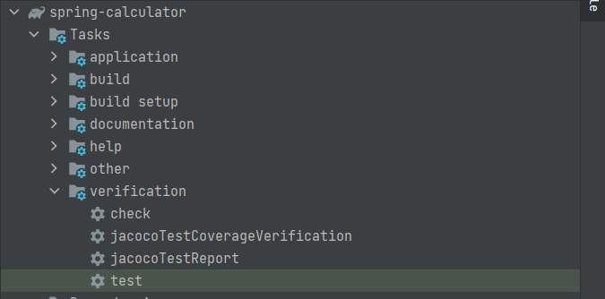
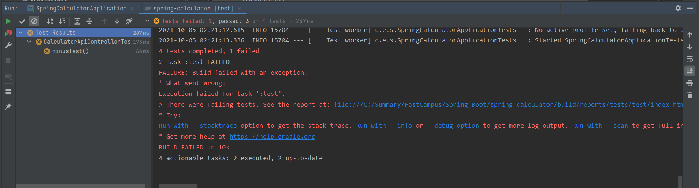
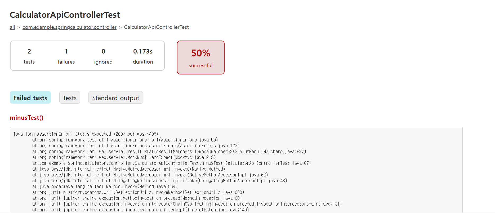
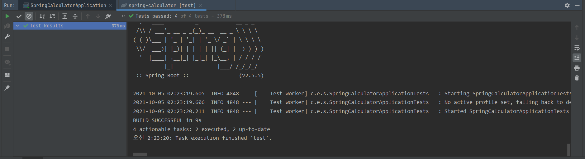
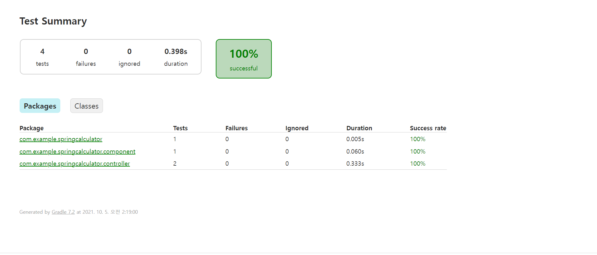
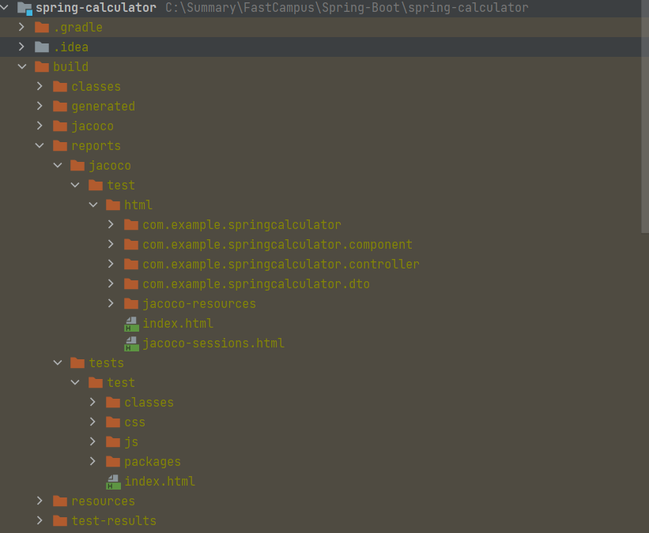
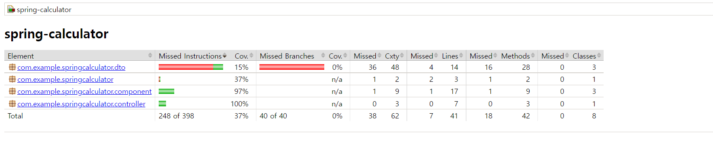
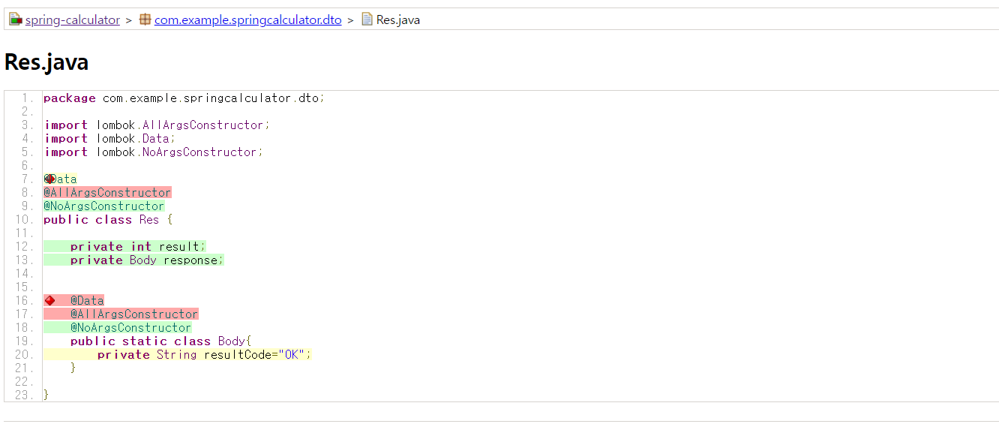

# 테스트 커버리지 확인하기

## Jacoco
- Java 코드의 코드 커버리지를 체크하는 라이브러리
- 내가 만든 코드가 어디까지 커버하고 있는지를 확인한다.
- 결과를 html, xml, csv로 확인이 가능하다.

## Jacoco 설정

### build.gradle
```gradle
plugins {
	// 생략
	id 'jacoco'
}
```

- 새로고침을 하면 jacoco가 추가된다.



- test를 더블클릭시 test가 실행되며, build 하위에 테스트를 실행한 jacoco 관련 파일이 생성된다

<br><br>

### Test가 실패했을 때 - Console


<br><br>

### Test가 실패했을 때 - project 하위 bulid/test/index.html


<br><br>

### Test가 성공했을 때 - Console



<br><br>

### Test가 성공했을 때 - project 하위 bulid/test/index.html



<br><br>

## Jacoco Report
- Test가 모두 성공하면 gradle 탭의 jacocoTestReport를 클릭한다.

### jacocoreports 생성


## JacocoTestReport - project 하위 build/reports/jacoco/test/html/index.html

### 첫 화면


## 특정 클래스를 눌렀을 때

- 테스트 되지 않은 부분은 빨갛게 보여진다.
- Test에 필요없는 부분은 제외하는 옵션을 설정할 수 있다.
- CI/CD tool 등 관리 툴을 활용하여 Build 시마다 확인 가능하다.