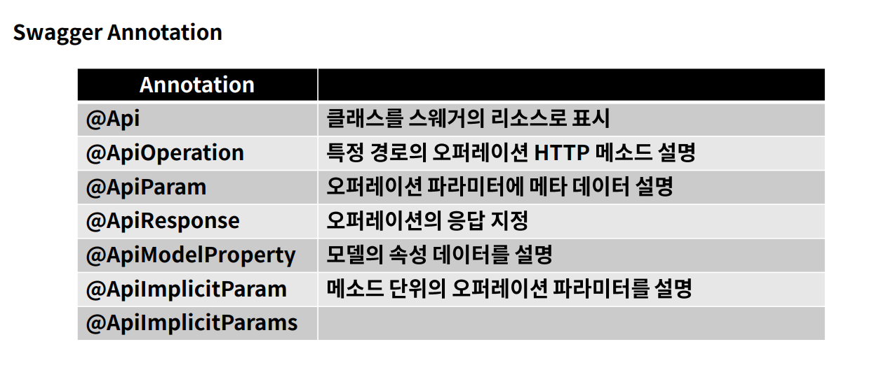

# Swagger
- swagger란 개발한 REST API를 편리하게 문서화해주고, 이를 통해서 관리 및 제 3의 사용자가 편리하게 API를 호출해보고 테스트할 수 있는 프로젝트이다.
- Spring외 다른 언어로 개발된 web framework에서 동일하게 구성할 수 있다.
- Spring Boot에서는 간단하게 springfox-boot-starter를 grdle dependencies에 추가함으로 사용할 수 있다.
- Spring에서는 Annotation 기반으로 controller를 모두 공개, 숨기는 등 Annotation을 통해 detail한 설명을 추가할 수 있다.
- 운영환경과 같은 외부에 노출되면 안되는 곳에 사용할 땐 주의해야 한다.

  

### Swagger Annotation
