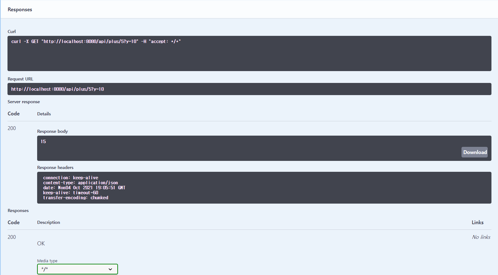

# Swagger 설정하기
- swagger dependency를 maven repository에서 찾아온다.
- 기존에는 springfox swagger2와 Springfox Swqgger UI 두개를 추가해서 사용했었다.
- 최근에는 Springfox Boot Starter를 사용한다.
- https://mvnrepository.com/artifact/io.springfox/springfox-boot-starter

### build.gradle
```gradle
dependencies {
	// 생략
	// https://mvnrepository.com/artifact/io.springfox/springfox-boot-starter
	implementation group: 'io.springfox', name: 'springfox-boot-starter', version: '3.0.0'
}
```

- 이후 작성하는 모든 Controller가 기본적으로 공개된다.

<br><br>

## Swagger 실습

### ApiController
```java
@RestController
@RequestMapping("/api")
public class ApiController {

    @GetMapping("/hello")
    public String hello(){
        return "hello";
    }
```

### `http://localhost:8080/swagger-ui/`


- Project에 추가한 ApiController가 노출된다.
- Basic-error-controller는 swagger에서 제공하는 기본 controller이다.

<br><br>

## ApiController excute 시키기


- talend API Tester, Browser 실행과 마찬가지로 Swagger를 통해 요청과 응답 (header,status code 등)을 확인할 수 있다.
- 내외부 사용자에게 swagger-ui를 제공함으로써 테스트를 확인할 수 있다.


<br><br>

## ApiController - @Api
```java
@Api(tags = {"API 정보를 제공하는 Controller"})
```
- @Api 어노테이션을 추가하여 이름을 지정할 수 있다.


<br><br>

## ApiController -@ApiParam

```java
@Api(tags = {"API 정보를 제공하는 Controller"})
@RestController
@RequestMapping("/api")
public class ApiController {

    @GetMapping("/plus/{x}")
    public int plus(
            @ApiParam(value = "x값")
            @PathVariable int x,
            @ApiParam(value = "y값")
            @RequestParam int y){
        return x+y;
    }
}
```
- @ApiParam(value = "x값") : 이름을 붙여줄 수 있다.
- pathVarable과 RequestParam값에 대해서도 테스트를 지원한다.

<br>

### @ApiImplicitParams
```java
    @ApiImplicitParams( 
            {
                    @ApiImplicitParam(name="x",value = "x 값",required = true, dataType = "int",paramType = "path"),
                    @ApiImplicitParam(name="y",value="y 값",required = true, dataType = "int",paramType = "query")
            }
    )
    @GetMapping("/plus/{x}")
    public int plus(
            @PathVariable int x,
            @RequestParam int y){
        return x+y;
    }
```
- @ApiImplicitParams와 ApiImplicitParam Annotation을 이용하면 @Apiparam을 붙이지 않고 method 바깥쪽에 지정하여 가독성을 높일 수 있다.

<br>




<br><br>

## @ApiModelProperty

### UserRes (UserReq도 동일)
```java
@Data
@NoArgsConstructor
@AllArgsConstructor
public class UserRes {

    @ApiModelProperty(value = "사용자의 이름",example = "steve", required = true)
    private String name;

    @ApiModelProperty(value = "사용자의 나이",example = "10", required = true)
    private int age;
}
```
- @ApiModelProperty 를 추가하여 설명을 붙일 수 있다.
- example 속성은 reponse의 Example Value의 내용을 변경시킨다.

### @ApiModelProperty


### example


<br><br>

## ApiController - @ApiOperation,@ApiResponse
```java
@Api(tags = {"API 정보를 제공하는 Controller"})
@RestController
@RequestMapping("/api")
public class ApiController {
    @ApiResponse(code = 502,message = "사용자의 나이가 10살 이하일 때")
    @ApiOperation(value = "사용자의 이름과 나이를 리턴하는 메소드")
    @GetMapping("/user")
    public UserRes user(UserReq userReq){
        return new UserRes(userReq.getName(), userReq.getAge());
    }
}
```
<br>

### ApiController - @ApiOperation


<br><br>

### ApiController - @ApiResponse


<br><br>

## ApiController - Post
```java
@Api(tags = {"API 정보를 제공하는 Controller"})
@RestController
@RequestMapping("/api")
public class ApiController {

    @PostMapping("/user")
    public UserRes userPost(@RequestBody UserReq req){
        return new UserRes(req.getName(), req.getAge());

    }
}

```

### POST


<br><br>

### Request Body를 변경한 Test도 가능하다.

