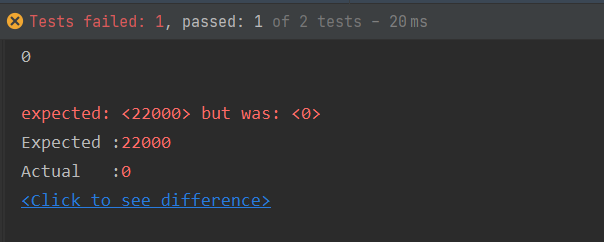
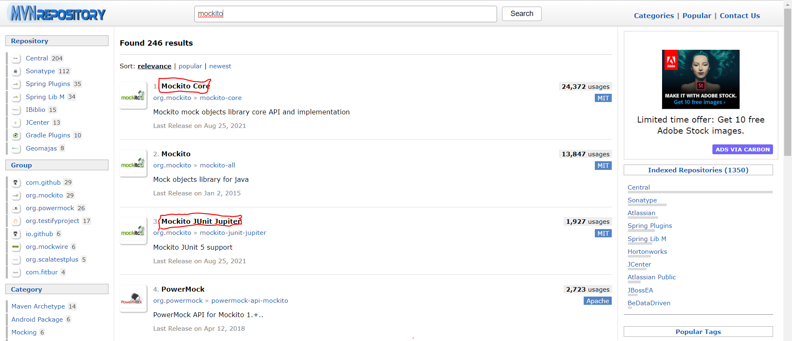

# JUnit

## TDD (Test-driven Deveplopment)
- 테스트 주도 개발에서 사용하지만, 코드의 유지 보수 및 운영환경에서의 에러를 미리 방지하기 위해서 단위 별로 검증하는 테스트 프레임워크

## 단위 테스트
- 작성한 코드가 기대하는대로 동작을 하는지 검증하는 절차

## JUnit
- Java 기반의 단위 테스트를위한 프레임워크
- Annotation 기반으로 테스트를 지원하며, Assert를 통하여 ( 예상 , 실제 ) 를 통해 검증


## JAVA Project 실습


### build.gradle 
```
dependencies {
    testImplementation 'org.junit.jupiter:junit-jupiter-api:5.7.0'
    testRuntimeOnly 'org.junit.jupiter:junit-jupiter-engine:5.7.0'
}
```
- defualt로 dependency에 junit이 추가되어 있다

<br>

## Test 코드 작성하기
- @Test Annotation을 추가한다.
- Main에 계속 로직을 추가하여 log를 찍고, 출력을 해보며 테스트를 할 필요가 없다!
- Test 대상과 기대하는 값을 정하여 테스트를 실행한다.
  - Assertions.assertEquals(기대값, 테스트 대상)

### test/java/DollarCalculatorTest class
```java
public class DollarCalculatorTest {
    @Test
    public void testHello(){
        System.out.println("hello");
    }

    @Test
    public void dollarTest(){
        System.out.println("hello JUnit");
        MarketApi marketApi=new MarketApi();
        DollarCalculator dollarCalculator=new DollarCalculator(marketApi);
        dollarCalculator.init();

        Calculator calculator=new Calculator(dollarCalculator);

        System.out.println(calculator.sum(10,10));

        Assertions.assertEquals(22000,calculator.sum(10,10));
    }
}
```


<br>

### DollarCalculator class
```java
    @Override
    public int sum(int x, int y) {
        return 0;
    }
```
- sum method의 내부 로직을 구현하지 않았기 때문에 기대한 값과 다른 결과가 출력된다.

<br>

### Console 결과



<br><br>

### DollarCalculator - 정상 Override 
```java
    @Override
    public int sum(int x, int y) {
        x*=price;
        y*=price;
        return x+y;
    }
```
<br>

### Console 결과 일부
```
> Task :test
hello JUnit
22000
hello
BUILD SUCCESSFUL in 1s
```

### 
```java
public class MarketApi {

    public int connect(){
        return 1100;
    }
}
```
- 실제로 dollar는 실시간으로 항상 변할 것이다.
- 이때 목킹 처리를 해야한다.


### build.gradle - mokito dependency 추가
```
dependencies {
    testImplementation 'org.junit.jupiter:junit-jupiter-api:5.7.0'
    testRuntimeOnly 'org.junit.jupiter:junit-jupiter-engine:5.7.0'
    // https://mvnrepository.com/artifact/org.mockito/mockito-core
    testImplementation group: 'org.mockito', name: 'mockito-core', version: '3.11.2'
    // https://mvnrepository.com/artifact/org.mockito/mockito-junit-jupiter
    testImplementation group: 'org.mockito', name: 'mockito-junit-jupiter', version: '3.11.2'
}
```




### DollarCalculatorTest
```java
@ExtendWith(MockitoExtension.class) 
public class DollarCalculatorTest {

    @Mock
    public MarketApi marketApi;

    @BeforeEach //test가 실행되기 이전에
    public void init(){
        Mockito.lenient().when(marketApi.connect()).thenReturn(3000);
    }

    @Test
    public void mockTest(){
        DollarCalculator dollarCalculator=new DollarCalculator(marketApi);
        dollarCalculator.init();

        Calculator calculator=new Calculator(dollarCalculator);

        System.out.println(calculator.sum(10,10));

        Assertions.assertEquals(60000,calculator.sum(10,10));
        Assertions.assertEquals(0,calculator.minus(10,10));
    }
}
```
- 목처리를 하기위해서 Mockito를 사용한다.
- mocking이 가능한 환경이 구성된 것이다.
- @BeforeEach : test가 실행되기 이전에 실행될 로직을 정의한다.
- @Mock : mock 객체로 사용할 것을 지정한다.

<br>

### Console 결과
```
60000
```